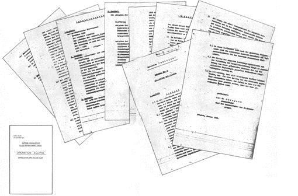

# Chương 5

Cách đó 50 dặm, bản gốc của tấm bản đồ và các tài liệu đi kèm của nó nằm ở một chỗ an toàn ở Auf dem Grat 1, Dahlem, Berlin – sở chỉ huy khẩn cấp của Thượng tướng Alfred Jodl, Tư lệnh Hành quân của OKW \(Bộ Tư lệnh Cấp cao của Các lực lượng Vũ trang\). Và trong số tất cả các bí mật ngoài sức tưởng tượng từng lọt vào tay Cục Tình báo Đức trong cuộc chiến, tập hồ sơ bìa đỏ này là tài liệu tiết lộ bí mật tàn khốc nhất mà tướng Jodl từng đọc.

Tập hồ sơ chứa một lá thư và một bản ghi nhớ về các thông tin cơ bản khoảng 70 trang; cùng hai tấm bản đồ in rời đính vào bìa sau, mỗi tấm vào cỡ 18x20 inch và vẽ theo thước đo 1 inch tương ứng với 29 dặm. Tướng Jodl tự hỏi không biết quân Đồng minh đã biết việc một bản sao của lời mở đầu cho một trong những chỉ đạo chiến tranh tối mật của họ đã bị thất lạc hay chưa. Tập hố sơ này lấy được từ quân Anh hồi cuối tháng 1, trong những ngày cuối cùng của cuộc tấn công ở cao nguyên Ardennes.

Kế hoạch của quân Đồng minh được Hitler cho là quá dễ gây kích động tới mức chỉ có một số ít người ở sở chỉ huy OKW được phép xem. Vào tuần đầu tiên của tháng 2, sau khi dành nguyên một buổi tối nghiên cứu tập hồ sơ, Quốc trưởng đã xếp tài liệu này vào loại “Trạng thái Tối mật.” Các cố vấn quân sự của ông ta và những sĩ quan tham mưu của bọn họ có thể nghiên cứu kế hoạch, ngoài ra thì không còn ai khác. Ngay cả các thành viên trong nội các của ông ta cũng không được cho biết. Nhưng, bất chấp những hạn chế đó, một thường dân đã được xem tài liệu và bản đồ: đó là bà Luise Jodl, vợ mới cưới được vài tuần của tướng Jodl.

Vào một buổi tối, ngay trước hôn lễ của bọn họ, tướng Jodl quyết định cho vị hôn thê của mình xem qua tài liệu này. Nói cho cùng, bà là người nhận của nhiều bí mật quân sự: bà từng là một thư ký đáng tin cậy của Bộ Tư lệnh cấp cao của Đức. Bỏ toàn bộ hồ sơ vào trong chiếc cặp tài liệu, tướng Jodl đem nó tới căn hộ của bà, cách sở chỉ huy của ông một khối nhà. Gần như ngay khi cánh cửa trước được khép lại an toàn đằng sau, ông đưa tập tài liệu ra và nói với vị hôn thê của mình: “Đây là những gì quân Đồng minh định làm với nước Đức.”

Bà Luise cầm lấy tập hồ sơ bìa đỏ đặt lên bàn và bắt đầu đọc. Từ lâu bà đã học cách đọc tài liệu và bản đồ quân sự, nhưng trong trường hợp này thì kỹ năng đó không cần thiết lắm – tài liệu này đã quá rõ ràng. Tim bà chùng xuống. Thứ bà đang cầm trong tay là kế hoạch chi tiết cho sự chiếm đóng tổ quốc của bà sau khi nước Đức thất bại. Bà nghĩ, một số người ở sở chỉ huy của Eisenhower có khuynh hướng đầy thù hận khi chọn các mật danh. Trên bìa tập hồ sơ là tựa đề ớn lạnh, “Chiến dịch Nhật thực.”

Bản dịch Chiến dịch Nhật thực từ bản gốc của Anh của sở chỉ huy của tướng Jodl. Hình này là lá thư đi kèm, do Tham mưu trưởng của Montgomery, Ngài Francis de Guingand ký tên. Nó được đưa tới bàn làm việc của tướng Jodl không đầy ba tháng sau khi nó được lưu hành tới các sĩ quan cấp cao nhất của quân Đồng minh, và thậm chí là một tháng trước đó nó còn được thông qua tại Yalta, vào tháng 2/1945. Bên trái là bìa của một trong những bản sao Chiến dịch Nhật thực của SHAEF \(Sở chỉ huy Tối cao của Lực lượng Viễn chinh Đồng minh\). Chú ý ngày tháng.

Lấy lại tập hồ sơ, tướng Jodl giở mấy tấm bản đồ ra và trải lên bàn. Ông cay đắng nói, “Em xem đi, nhìn mấy đường biên giới xem.”

Bà Luise im lặng nghiên cứu những đường biên giới in đậm vẽ ngang dọc trên tấm bản đồ. Vùng phía bắc và tây bắc có dòng chữ “U.K.” Phía nam, xứ Bavaria mang dòng chữ “U.S.A.,” và phần còn lại của đế chế Đức, đại khái là toàn bộ vùng trung tâm và từ đó tới miền đông, có nhãn “U.S.S.R.” Bà mất tinh thần nhận thấy ngay cả Berlin, cũng được ba ông lớn chia chác. Nằm giữa khu vực của người Nga, Berlin được khoanh tròn riêng biệt và được phe Đồng minh chia làm ba: Mỹ có phần phía nam; Anh được phía bắc và tây bắc; còn Liên Xô thì có phần phía đông và đông bắc. Vậy ra đây là cái giá của thất bại, bà nghĩ. Bà Luise nhìn vị hôn phu. Bà nói, “Chuyện này giống như một cơn ác mộng.”

Dù biết tấm bản đồ này là thật, bà Luise vẫn thấy nó khó chấp nhận được. Bà hỏi, hồ sơ Nhật thực này từ đâu ra? Dù bà đã biết tướng Jodl nhiều năm, bà biết ông có thể rất kín miệng về nhiều chuyện. Bà luôn nghĩ rằng ông Alfred “là người lãnh đạm, giấu mình sau mặt nạ, ngay cả với tôi.” Bây giờ, câu trả lời của ông cũng đầy lảng tránh. Dù khẳng định các tài liệu và bản đồ là thật, ông không nói làm sao lấy được chúng, trừ lời lưu ý rằng “chúng ta lấy được chúng từ một sở chỉ huy của Anh.”

Khá lâu sau, sau khi tướng Jodl đã quay lại sở chỉ huy của mình, bà Luise chợt nhận ra một khía cạnh đáng sợ khác của Chiến dịch Nhật thực. Nếu Đức thua, những người bà con của bà ở dãy Harz sẽ sống trong vùng bị Nga chiếm đóng. Dù bà yêu Alfred Jodl và hoàn toàn trung thành với đất nước mình, bà Luise đã có một quyết định mang đậm tình người. Vào lúc này, bà sẽ bất chấp lời cảnh báo của ông rằng không bao giờ được tiết lộ bất kỳ điều gì bà đã thấy, đọc hay nghe thấy. Bà không thể để chị dâu và bốn đứa cháu của bà rơi vào tay quân Nga.

Bà Luise quyết định chớp lấy cơ hội. Bà biết số điện thoại mật ưu tiên của tướng Jodl. Cầm lấy điện thoại, bà nói chuyện với nhân viên tổng đài và gọi cho người bà con. Mấy phút sau, đường dây nối thông. Sau một đoạn nói chuyện ngắn gọn và tẻ nhạt với bà chị dâu đang ngạc nhiên, bà Luise lưu ý một cách bình thường khi kết thúc cuộc nói chuyện, “Chị biết đó, mấy này này gió đông rất mạnh. Em thực sự nghĩ là chị và bọn nhỏ nên chuyển về phía tây, sau con sông.”

Bà chầm chậm đặt ống nghe xuống – hi vọng là bà chị dâu có thể hiểu thông điệp mã hóa vụng về của mình. Ở đầu dây bên kia, bà chị dâu nghe thấy tiếng lách cách khi người nhận đã đổi. Bà băn khoăn sao bà Luise lại gọi trễ như vậy. Nghe tin tức của cô ấy thì tốt, nhưng bà không hiểu bà Luise nói cái gì. Bà chẳng buồn suy nghĩ thêm nữa.

Tướng Jodl và bà Luise kết hôn ngày 6/3. Kể từ lúc đó, bà Luise vẫn luôn lo lắng liệu chồng bà có thể phát hiện ra cuộc điện thoại hay không. Bà không cần quan tâm chuyện này. Viên thượng tướng đầy gánh nặng này có nhiều vấn đề cấp bách hơn.

Cho tới giờ, tướng Jodl và các sĩ quan tham mưu của mình đã nghiên cứu và phân tích Chiến dịch Nhật thực kỹ tới mức họ gần như thuộc lòng từng đoạn một. Dù nó không phải là một tài liệu về chiến lược – nó không cảnh báo về những bước đi sắp tới của quân địch để quân Đức có thể đưa ra các biện pháp đối phó – kế hoạch Nhật thực cũng quan trọng tương tự. Có một điều, nó giúp trả lời một chuỗi câu hỏi đã làm tướng Jodl và OKW phiền muộn nhiều năm: họ đã băn khoăn rằng quan hệ đồng minh giữa phương Tây và Liên Xô mạnh đến mức nào? Liệu nó có tan vỡ khi bọn họ ngồi chia chiến lợi phẩm? Giờ đây, quân Nga đang nắm giữ phần lớn Trung Âu, liệu tuyên bố “đầu hàng vô điều kiện” của Churchill và Roosevelt sau Hội nghị Casablanca 1943 có còn hiệu lực? Và liệu quân Đồng minh có định nghiêm túc bắt một nước Đức thất bại phải chấp nhận những điều khoản đó? Khi tướng Jodl và Bộ Tư lệnh Cấp cao nghiên cứu hồ sơ Nhật thực, tất cả những câu hỏi như thế về ý định của phe Đồng minh đã biến mất. Tài liệu này của phe Đồng minh đã trả lời vấn đề bằng những điều khoản không thể nào lầm lẫn.

Tuy nhiên, phải đến tuần thứ hai của tháng 2, tướng Jodl mới nhận ra toàn bộ tầm quan trọng của hồ sơ này - đặc biệt là, của những tấm bản đồ của nó. Vào ngày 9/2 và trong ba ngày sau đó, Roosevelt, Churchill và Stalin đã gặp gỡ trong một hội nghị bí mật tại Yalta. Mặc cho những nỗ lực tình báo nhằm tìm hiểu chính xác chuyện gì đã diễn ra tại hội nghị, nhưng tất cả những gì tướng Jodl biết được là từ bản thông cáo chính thức được đưa ra tại buổi họp báo quốc tế nhày 12/2 – nhưng thế là đủ. Bản thông báo khá mơ hồ và rất kín kẽ về mặt thông tin, nhưng không còn nghi ngờ gì nữa, các tài liệu và bản đồ của Nhật thực là mấu chốt trong những ý định đã thông báo của phe Đồng minh. Có một đoạn trong bản thông cáo chính thức khẳng định: “Chúng tôi đã đồng thuận về nhiều chính sách và kế hoạch nhằm thúc đẩy các điều khoản đầu hàng vô điều kiện mà chúng tôi sẽ cùng đưa ra… Các điều khoản này sẽ không được thực hiện chừng nào chưa tới thất bại cuối cùng của nước Đức… Theo kế hoạch đã được nhất trí, mỗi bên lực lượng của Tam Quyền sẽ chiếm một phần nước Đức riêng biệt…” Phe Đồng minh không cần nêu ra các “điều khoản” nữa – tướng Jodl đã đọc qua trong hồ sơ Nhật thực rồi. Và dù bản thông cáo Yalta không tiết lộ các khu vực chiếm đóng dự định, tướng Jodl cũng đã biết rồi nốt. Vị trí và ranh giới chính xác của mỗi vùng đều có trên tấm bản đồ của Chiến dịch Nhật thực.

Có thể suy ra nhiều kết luận khác, nhưng có một cái đặc biệt cay đắng đối với tướng Jodl. Rõ ràng là dù có chuyện gì khác đã xảy ra ở Yalta, kế hoạch của phe Đồng minh đối với nước Đức đã đơn thuần được thông qua ở cuộc họp của ba ông lớn. Trong khi bản thông cáo Yalta tạo ấn tượng là kế hoạch chi tiết về việc chiếm đóng và chia cắt khởi nguồn từ hội nghị, ngày tháng trên tập tài liệu và bản đồ Chiến dịch Nhật thực chứng minh rằng không cần nghi ngờ, những quyết định cơ bản đã đạt được nhiều tháng trước đó. Lá thư đi kèm với bản ghi nhớ thông tin cơ bản của Chiến dịch Nhật thực được ký vào tháng 1. Mấy tấm bản đồ đã được chuẩn bị trước đó: chúng được in từ cuối năm 1944 và có ngày tháng đề tháng 11. Chiến dịch Nhật thực, được định nghĩa là “kế hoạch và vận hành của cuộc chiếm đóng nước Đức,” đơn giản là không thể nào được đưa ra trừ phi đã có sự nhất trí hoàn toàn trong phe Đồng minh – một sự thật tỉnh táo làm khô héo một trong những niềm hy vọng cuối cùng của nước Đức.

Từ giây phút Hồng quân vượt qua biên giới phía đông của đế chế Đức, Hitler và các cố vấn quân sự của ông ta đã chờ đợi vết mẻ bất đồng đầu tiên giữa phe Đồng minh với nhau xuất hiện. Họ tin là điều này chắc chắn sẽ xảy ra, vì phương Tây sẽ không bao giờ để nước Nga Soviet thống trị Trung Âu. Tướng Jodl cũng có đồng quan điểm. Ông đặc biệt nghiêng về phía người Anh, vì ông cảm thấy rằng họ sẽ không bao giờ chịu nổi tình hình như thế \(\*\). Nhưng đó là trước khi ông xem qua Chiến dịch Nhật thực. Nhật thực cho thấy rõ là quan hệ Đồng minh đó vẫn không suy suyển và Yalta đã chứng thực điều đó.

Hơn thế nữa, ngay đoạn đầu của lá thư đi kèm – một lời nói đầu cho toàn bộ hồ sơ – đã cho thấy sự nhất trí hoàn toàn trong phe Đồng minh. Lá thư viết: “Để thực hiện các điều khoản đầu hàng mà nước Đức phải chịu, chính phủ của Hoa Kỳ, Liên Xô và Vương quốc Anh \(ở Liên Xô là nhân danh nhà nước nắm quyền\) đã đồng ý rằng nước Đức sẽ bị các lực lượng vũ trang của ba thế lực chiếm đóng \(\*\*\). Và không cần bàn cãi gì về độ đáng tin của lá thư nữa. Nó được ký vào tháng 1/1945, tại Sở chỉ huy của Tập đoàn quân 21 của Anh, và tại Bỉ, bởi một người có địa vị không kém Thiếu tướng Sir Francis de Guingand, Tham mưu trưởng của Nguyên soái Montgomery.

Đòn mạnh nhất dành cho tướng Jodl là sự nhấn mạnh lặp đi lặp lại về việc đầu hàng vô điều kiện; nó được nhắc hết lần này tới lần khác. Lúc đầu, người Đức tin chắc là lời tuyên bố đầu hàng vô điều kiện chỉ là hành động tuyên truyền nhằm nâng cao nhuệ khí của hậu phương của phe Đồng minh. Giờ họ đã biết rõ hơn: phe Đồng minh rõ ràng có ý định đó. Chiến dịch Nhật thực nói rằng, “Câu trả lời khả thi duy nhất để có thể cất khúc khải hoàn cho toàn bộ cuộc chiến là đánh bại và chiếm đóng hoàn toàn… Phải làm rõ là người Đức sẽ không được quyền đàm phán, theo nghĩa của từ này.”

Ý định của phe Đồng minh hứa hẹn sẽ không có chút hi vọng, chút tương lai nào cho nước Đức. Rõ ràng là dù Đức có muốn đầu hàng đi nữa thì cũng không có cách nào ngoại trừ đầu hàng vô điều kiện. Với tướng Jodl, điều này có nghĩa là Đức không còn lựa chọn nào khác ngoài chiến đấu đến cùng \(_\*_\).

Trong tuần cuối cùng của tháng 3 – ngày chính xác thì không ai còn nhớ được nữa – Đại tướng Reinhard Gehlen, Trưởng ban tình báo của tướng Guderian, lái xe đến Prenzlau để gặp vị tư lệnh mới của Tập đoàn quân Vistula. Trong cặp tài liệu của ông là một bản sao Chiến dịch Nhật thực. Tướng Gehlen chỉ ra các bố trí mới nhất của quân Nga bên sông Oder mà họ biết được cho tướng Heinrici, rồi ông đưa cho tướng Heinrici tập hồ sơ Chiến dịch Nhật thực và giải thích đó là cái gì. Tướng Heinrici chầm chậm xem qua các trang giấy. Rồi ông giở mấy tấm bản đồ ra. Ông nghiên cứu chúng một lúc lâu. Cuối cùng, Heinrici nhìn Gehlen và tóm tắt lại ý nghĩa của tài liệu này, ý nghĩa mà ai Bộ Tư lệnh Cấp cao cũng biết, bằng một câu duy nhất. “Das ist ein Todesurteil” – Đây là một bản án tử hình. Chú thích:

\(\*\): Ở cuộc họp ngày 27/1/1945, Hitler đã hỏi Goering và Jodl: “Các anh có nghĩ là sâu trong lòng bọn người Anh rất hăng hái trước những diễn biến của Nga không? “ Jodl trả lời mà không hề ngập ngừng. Ông đáp, “Chắc chắn là không. Kế hoạch của họ khá là khác… sau đó… họ sẽ hoàn toàn nhận ra được.” Goering cũng rất tự tin. Ông nói, “Chắc chắn là họ không dự tính được là chúng ta lại cầm chân họ trong khi quân Nga chinh phục khắp nước Đức. Họ không tin là chúng ta… cầm chân họ ở phía tây như mấy thằng điên, trong khi quân Nga tiến vào đất Đức ngày càng sâu.” Jodl hoàn toàn đồng ý, chỉ ra rằng người Anh “đã luôn luôn nghi ngờ người Nga.” Goering thì hết sức chắc chắn là người Anh sẽ cố dàn xếp một số thỏa hiệp với Đức, thay vì thấy trái tim của châu Âu rơi vào vòng quỹ đạo cộng sản, ông nói: “Nếu cái đà này cứ diễn ra, chúng ta sẽ nhận được một bức điện tín \[từ người Anh\] trong vài ngày tới.”

\(\*\*\): Có thể có một số sai khác nhỏ giữa bản dịch này với tài liệu gốc. Khi Chiến dịch Nhật thực rơi vào tay người Đức, nó được dịch ra tiếng Đức và sao chụp lại. Phiên bản trên là một bản dịch của tài liệu bị thất lạc đã được người Anh lấy lại.

\(_\*_\): Ở phiên tòa xét xử của tướng Jodl tại Nurenberg năm 1946, ông được hỏi sao không khuyên Hitler đầu hàng từ đầu năm 1945. Tướng Jodl nói: “Lý do rất đơn giản… đầu hàng vô điều kiện… và dù chúng tôi có chút nghi ngờ về thứ mình phải đối mặt, thì nó cũng đã hoàn toàn biến mất khi chúng tôi lấy được bản Chiến dịch Nhật thực bằng tiếng Anh.” Vào lúc đó, khi đang khai, tướng Jodl nhìn mấy vị sĩ quan Anh đang có mặt tại đó và nói với một nụ cười nửa miệng, “Các quý ông của phái đoàn Anh quốc sẽ biết đó là cái gì.” Sự thật là những người Anh tại phiên tòa không hiểu được lời nói đó: Chiến dịch Nhật thực được giữ bí mật tới mức họ không biết gì về nó. Chính lời ám chỉ bí ẩn đó, cộng thêm vài cuộc phỏng vấn với bà Jodl, đã đưa tác giả đến với Chiến dịch Nhật thực và nội dung của nó, lần đầu công bố tại cuốn sách này.

