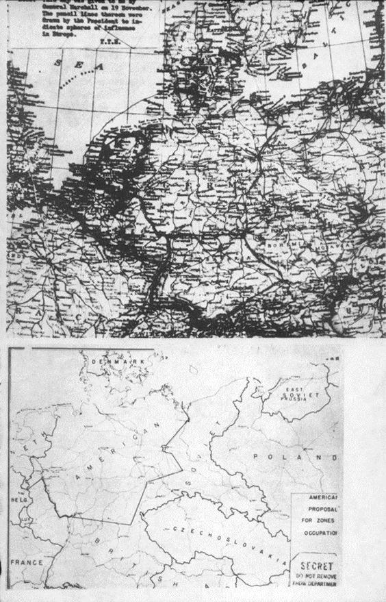

# Chương 3

Trong không khí yên tĩnh của phòng làm việc của mình tại số 10 đường Downing, Winston Churchill ngồi khom xuống trong chiếc ghế da ưa thích, điện thoại khum bên tai. Ngài Thủ tướng đang nghe Tổng tham mưu của mình, Đại tướng Sir Hastings Ismay, đọc một bản sao của thông điệp của Montgomery gửi cho Tư lệnh Tối cao. Lời hứa hẹn của vị nguyên soái về “tốc độ cao nhất và tấn công quyết liệt” thực sự là tin tốt; nhưng lời tuyên bố định tiến về Berlin của ông thậm chí còn tốt hơn. Ngài Thủ tướng nói với tướng Ismay, “Montgomery đang có bước tiến đáng kể.”

Sau nhiều tháng thảo luận sôi nổi giữa các lãnh đạo quân sự của Anh và Mỹ, chiến lược của phe Đồng minh có vẻ như bắt đầu vận hành trơn tru. Kế hoạch của Đại tướng Eisenhower, được phác thảo vào mùa thu năm 1944 và được Hội đồng Tham mưu trưởng ở Malta chấp thuận vào tháng 1/1945, yêu cầu Cụm tập đoàn quân 21 của nguyên soái Montgomery làm mũi tiến công chính ở hạ lưu sông Rhine và bắc sông Ruhr; đây là lộ trình mà Churchill, trong một lá thư gửi cho Roosevelt, đã gọi là “con đường ngắn nhất dẫn tới Berlin.” Ở phía nam, quân Mỹ sẽ vượt sông và tiến về khu vực Frankfurt, thu hút quân địch khỏi Montgomery. Mũi tiến quân hỗ trợ này sẽ thành mũi tấn công chính nếu cuộc tấn công của Montgomery thất bại. Nhưng dù Churchill lo lắng hết mức, chuyện đã được sắp xếp xong. Cuộc “Thập tự chinh Vĩ đại” đã gần đi đến hồi kết, và Churchill cực kỳ hài lòng vì trong số các vị tư lệnh của Đồng minh, có lẽ ý trời đã định cho người hùng của trận El Alamein chiếm được thủ đô của kẻ thù. Cụm tập đoàn quân 21 đã được đặc biệt tăng cường cho cuộc tấn công, được ưu tiên hàng đầu về binh lính, không lực hỗ trợ, đồ tiếp tế và thiết bị. Tổng cộng, trong tay Montgomery có gần một triệu quân thuộc 35 sư đoàn và các đơn vị đi cùng, bao gồm Tập đoàn quân 9 Hoa Kỳ.

Bốn ngày trước, Churchill đã đi cùng Đại tướng Eisenhower sang Đức để chứng kiến giai đoạn mở đầu của cuộc tấn công vào phòng tuyến bên sông. Khi đứng bên bờ sông Rhine quan sát cuộc tấn công lịch sử mở màn, Churchill nói với Eisenhower, “Đại tướng thân mến của tôi ơi, bọn Đức tiêu rồi. Ta đã tóm được chúng. Bọn chúng xong đời rồi.”

Và quả vậy, thật đáng ngạc nhiên là ở hầu hết các nơi, quân địch chống cự rất yếu ớt. Tại quân khu của Tập đoàn quân 9 Hoa Kỳ, nơi 2 sư đoàn – khoảng 34.000 người – đang vai kề vai hành quân với quân Anh, chỉ có 31 thương vong. Giờ, Montgomery dẫn hơn 20 sư đoàn và 1.500 xe tăng vượt sông tiến về sông Elbe. Con đường dẫn đến Berlin – nơi Churchill từng gọi là “mục tiêu đích thực và quan trọng nhất của liên quân Anh-Mỹ” – có vẻ khá rộng mở.

Con đường này còn rộng mở về mặt chính trị nữa. Chưa từng có một cuộc thảo luận nào giữa ba ông lớn xem quân của ai sẽ chiếm thành phố. Berlin là một mục tiêu để mở, nằm đó chờ đội quân Đồng minh đầu tiên tới chiếm.

Tuy nhiên, đã có nhiều cuộc thảo luận về việc chiếm đóng phần còn lại của quốc gia đối địch này – như mấy tấm bản đồ của Chiến dịch Nhật thực đã phân chia. Và các quyết định về việc chiếm đóng nước Đức có ảnh hưởng quan trọng đến việc chiếm Berlin và tương lai chính trị của thành phố. Ít nhất một vị lãnh đạo của phe Đồng minh đã nhận thấy điều này ngay từ đầu. Ông đã nói, “Chắc chắn sẽ có một cuộc đua giành lấy Berlin.” Người đó là Franklin Delano Roosevelt.

Trước đó 17 tháng, vào ngày 19/11/1943, vấn đề này đã được trình bày cho Roosevelt. Lần đó, ngài Tổng thống ngồi chủ tọa trong một phòng họp thuộc dãy buồng của Đô đốc Ernest J. King trên tàu chiến U.S.S. Iowa. Ngồi cạnh ông là các trợ lý và cố vấn, trong đó có Hội đồng Tham mưu trưởng Liên quân Hoa Kỳ. Roosevelt đang trên đường tới Trung Đông để dự hội nghị ở Cairo và Teheran – cuộc họp thứ 5 và thứ 6 trong thời chiến của các lãnh đạo phe Đồng minh.

Đó là những ngày trọng yếu trong cuộc đấu tranh với phe Trục trên toàn cầu. Ở mặt trận Nga, quân Đức đã phải chịu thất bại nặng nề và đẫm máu nhất của chúng: Stalingrad, bị bao vây và cô lập trong 23 ngày, đã sụp đổ, và hơn 300.000 lính Đức bị giết, bị thương hoặc bắt làm tù binh. Ở Thái Bình Dương, nơi hơn một triệu quân Mỹ đang chiến đấu, quân Nhật đang bị đẩy lui trên mọi mặt trận. Ở phương Tây, Rommel bị đánh tan tác tại Bắc Phi. Italy, bị xâm chiếm từ châu Phi qua đường Sicily, đã đầu hàng. Và giờ liên quân Anh-Mỹ đang chuẩn bị kế hoạch cho coup de grâce – Chiến dịch Chúa tể, cuộc xâm chiếm toàn diện châu Âu.

Trên tàu Iowa, Roosevelt đang rất bực bội. Các tài liệu và bản đồ trước mặt ông là phần cốt yếu trong một kế hoạch tên là Chiến dịch Rankin, Phương án C, một trong các nghiên cứu được phát triển có liên quan với cuộc xâm chiếm sắp tới. Rankin C cân nhắc các bước cần thực hiện nếu quân địch bất ngờ sụp đổ hoặc đầu hàng. Trong trường hợp đó, kế hoạch này đề nghị rằng nên chia nước Đức và Berlin thành nhiều phần, mỗi ông lớn chiếm một vùng. Điều khiến ngài Tổng thống thấy khó chịu là khu vực mà những kế hoạch gia người Anh đã chọn cho đất nước ông.

Rankin C được lập ra dưới hoàn cảnh đặc thù và khó khăn. Người chịu ảnh hưởng trực tiếp nhất bởi các điều khoản của nó sẽ là Tư lệnh Tối cao của Đồng minh tại châu Âu. Nhưng vị tư lệnh này còn chưa được chỉ định. Nhiệm vụ khó khăn phải cố lập kế hoạch trước cho Tư lệnh Tối cao – đó là, vừa chuẩn bị cho cuộc tấn công thông qua eo biển Manche, Chiến dịch Chúa tể, vừa chuẩn bị kế hoạch trong trường hợp nước Đức sụp đổ, Chiến dịch Rankin – được giao cho Trung tướng Frederick E. Morgan của Anh \(\*\), được biết đến với mật danh “COSSAC” \(Chief of Staff to the Supreme Allied Commander – Tham mưu trưởng cho Tư lệnh Đồng minh Tối cao, đề cử\). Đó là một công việc bạc bẽo và mệt mỏi. Khi ông được chỉ định làm nhiệm vụ này, Sir Alan Brooke, Tham mưu trưởng của Ban tham mưu Hoàng gia, đã nói với tướng Morgan là: “Thôi thì thế đó; tất nhiên là nó chả đi vào hoạt động đâu, nhưng anh phải làm thật tốt vào!”

Trong lúc chuẩn bị Chiến dịch Rankin C, tướng Morgan đã phải cân nhắc mọi tình huống không lường trước. Chuyện gì sẽ xảy ra nếu quân địch đầu hàng đột ngột tới mức quân Đồng minh bị mất thăng bằng, như họ từng bị hồi Thế chiến thứ nhất khi không đoán trước được Đức sẽ đầu hàng vào tháng 11/1918? Quân của từng bên sẽ đi đâu? Ai sẽ chiếm Berlin? Đó là các câu hỏi cơ bản, và chúng cần được giải quyết một cách quyết đoán và rõ ràng, nếu như quân Đồng minh không muốn bị bất ngờ trước sự sụp đổ bất ngờ của địch.

Vào lúc đó, vẫn chưa có một kế hoạch cụ thể nào về kết cục cuộc chiến được lập ra. Dù ở Mỹ và Anh, nhiều cơ quan chính phủ đã thảo luận các vấn đề sẽ xuất hiện khi đình chiến, nhưng việc lập nên chính sách chung vẫn không mấy tiến triển. Chỉ có một điểm nhất trí duy nhất: cần chiếm đóng đất nước của địch.

Ngược lại, Nga không khó khăn gì trong chuyện đưa ra chính sách. Josef Stalin luôn xem chiếm đóng là chuyện đương nhiên, và ông luôn biết chính xác mình sẽ làm điều đó như thế nào. Hồi tháng 12/1941, ông đã thẳng thắn nói với Bộ trưởng Bộ Ngoại giao Anh, Anthony Eden, về các yêu cầu hậu chiến của mình, chỉ ra các vùng lãnh thổ mà ông định chiếm đóng và thôn tính. Đó là một danh sách ấn tượng: theo gót giày chiến thắng của mình, Stalin muốn được thừa nhận chủ quyền của ông với Latvia, Lithuania và Estonia; một phần của Phần Lan mà ông đã chiếm khi ông tấn công Phần Lan vào năm 1939; tỉnh Bessarabia của Rumania; miền đông Ba Lan, nơi quân Soviet đã tràn qua vào năm 1939 theo thỏa thuận với Nazi; và phần lớn vùng Đông Phổ. Khi ông bình tĩnh đưa ra các điều khoản này, súng nổ cách điện Kremlin có 15 dặm, ở ngoại ô Moscow, nơi quân Đức vẫn đang chiến đấu dữ dội.

Dù người Anh coi các yêu cầu của Stalin năm 1941 là còn quá sớm để nói \(\*\*\), đến năm 1943 thì họ cũng chuẩn bị kế hoạch cho riêng mình. Bộ trưởng Bộ Ngoại giao Anh, Anthony Eden, đã đề xuất là Đức phải bị Đồng minh chiếm đóng hoàn toàn và phân chia thành ba vùng. Ngay sau đó, một cơ quan trong nội các là Ủy ban Đình chiến và Hậu chiến được thành lập, dưới quyền Phó Thủ tướng Clement Attlee, chủ tịch Đảng Lao động. Nhóm Attlee đưa ra một đề xuất công khai, trong đó cũng chủ trương chia ba nước Đức, và Anh sẽ chiếm vùng tây bắc giàu có về thương mại và công nghiệp. Họ cũng đề xuất để cả ba phe cùng chiếm Berlin. Phe Đồng minh duy nhất gần như không có kế hoạch nào với nước Đức bại trận là Mỹ. Quan điểm chính thức của Mỹ là các thỏa thuận hậu chiến nên để đến gần chiến thắng sau cùng rồi hãy tính. Chính sách chiếm đóng chủ yếu liên quan tới quân sự mà thôi.

Nhưng giờ, khi mà sức mạnh kết hợp của Đồng minh bắt đầu rõ rệt trên mọi mặt trận và nhịp độ tấn công của Đồng minh ngày càng tăng cao, yêu cầu cần lập kế hoạch chính trị thống nhất ngày càng cấp bách. Tháng 10/1943, tại Hội nghị Bộ trưởng Ngoại giao tại Moscow, bước thăm dò đầu tiên được thực hiện nhằm định ra chính sách hậu chiến chung của Đồng minh. Các phe Đồng minh chấp nhận ý tưởng cùng chịu trách nhiệm kiểm soát và chiếm đóng nước Đức, và thành lập một cơ quan giữa ba bên, Hội đồng Cố vấn châu Âu \(EAC\), để “nghiên cứu và đưa ra đề xuất cho ba chính phủ về các vấn đề ở châu Âu có liên quan tới sự kết thúc giao tranh.”

Nhưng cùng lúc đó, tướng Morgan đã đưa ra bản kế hoạch của ông – một bản kế hoạch chi tiết sơ thảo về việc chiếm đóng nước Đức – sau này ông giải thích, “chỉ được chuẩn bị sau khi đã bói bằng cầu thủy tinh cả đống lần.” Ban đầu, không có chỉ dẫn chính trị, tướng Morgan chỉ đưa ra bản kế hoạch chiếm đóng có giới hạn. Nhưng kế hoạch Rankin C sau cùng của ông phản ánh kế hoạch do ủy ban của Attlee đưa ra, vốn phức tạp hơn. Tướng Morgan đã chia nước Đức thành ba phần theo toán học trên một tấm bản đồ, “phác thảo sơ qua bằng chì xanh dọc theo ranh giới của các tỉnh có sẵn.” Rõ ràng là người Nga, đến từ phía đông, phải chiếm một phần ở phía đông. Việc chia chác giữa Nga với Anh-Mỹ trong kế hoạch Rankin C \(bản đã được sửa lại\) là một đường chạy từ Lübeck bên bờ biển Baltic đến Eisenach ở miền trung nước Đức và từ đó tới biên giới với Tiệp. Quy mô khu vực của Nga lớn cỡ nào không phải là chuyện Morgan bận tâm. Ông đâu có được ra lệnh phải cân nhắc chuyện đó, vì đó “đương nhiên là chuyện của người Nga, họ đâu có ở trong ban COSSAC của chúng ta. Nhưng Berlin khiến ông phiền não, vì nó sẽ nằm trong khu vực của Nga. Ông tự hỏi, “Liệu chúng ta có tiếp tục xem đó là thủ đô hay là, nói cho cùng, có cần có một thủ đô nữa không? Tính quốc tế của chiến dịch đã đề xuất rằng việc chiếm Berlin hay bất cứ thủ đô nào khác, nếu có, phải được chia đều giữa ba bên, quân Mỹ, Anh và Nga mỗi bên một sư đoàn.”

Chú thích:

\(\*\): Hình thành ban đầu vào năm 1943, Chiến dịch Rankin thực sự có ba phần: Phương án A là trường hợp Đức yếu tới mức chỉ cần một “Chiến dịch Chúa tể mini” là đủ; Phương án B đặt giả thiết Đức sẽ rút lui chiến lược tại một số nơi ở các quốc gia bị chiếm đóng trong khi vẫn để lại lực lượng lớn dọc bờ biển châu Âu nhằm chống xâm lược; và Phương án C đối phó với tình huống Đức đột ngột sụp đổ trước, trong hoặc sau cuộc xâm lăng. Các Phương án A và B đã sớm bị hủy bỏ, và theo tướng Morgan nhớ lại, chỉ nhận được sự cân nhắc ngắn ngủi.

\(\*\*\): Churchill nghe được các yêu cầu của Stalin khi ông đang băng qua Đại Tây Dương trên con tàu chiến H.M.S. Duke of York trên đường gặp Roosevelt. Mỹ vừa mới bước vào cuộc chiến và Churchill băn khoăn liệu có nên đưa ra vấn đề này với đồng minh mới hùng mạnh vào lúc này hay không. Ông đánh điện cho Eden: “Dĩ nhiên, anh không được lỗ mãng với Stalin. Chúng ta không đến Mỹ để ký các hiệp ước đặc biệt và bí mật. Tiếp cận Tổng thống Roosevelt với mấy lời đề nghị đó sẽ chỉ chuốc lấy lời từ chối cộc lốc và có thể gây rắc rối kéo dài… Cho dù có đặt vấn đề một cách không chính thức đi chăng nữa… thì theo ý tôi vẫn là không phù hợp.” Bộ Ngoại giao Mỹ có nghe về cuộc trò chuyện giữa Eden và Stalin, nhưng không có bằng chứng gì cho thấy có ai bận tâm đến việc nói cho ngài Tổng thống Mỹ biết vào lúc đó cả. Nhưng đến tháng 3 năm 1943, Roosevelt được thông báo đầy đủ và theo Eden, người thảo luận vấn đề này với ông, ngài Tổng thống đoán trước là sẽ không có khó khăn lớn gì với Liên Xô. Ông Eden nói: “Câu hỏi lớn đang ngự trị trong đầu Roosevelt là liệu có thể làm việc với Nga vào bây giờ và sau chiến tranh được không.”

Về khu vực của Anh và Mỹ, đối với tướng Morgan, mối liên hệ bắc-nam của chúng có vẻ chỉ được định trước bởi một sự thật nghe thì kỳ cục nhưng lại có liên quan: vị trí các căn cứ của Anh và Mỹ và các sở chỉ huy tại Anh. Từ lúc những lính Mỹ đầu tiên đặt chân lên Vương quốc Anh, đầu tiên họ được cấp chỗ ở Bắc Ireland, rồi sau đó ở nam và tây nam nước Anh. Các lực lượng của Anh đóng ở miền bắc và đông nam. Do đó, sự tập trung binh lính, đồ tiếp tế và thông tin liên lạc cũng tách biệt – quân Mỹ luôn ở bên phải, Anh bên trái đối diện với châu Âu lục địa. Vì Morgan đã đoán trước sẽ có Chiến dịch Chúa tể, bản kế hoạch này tiếp tục băng qua eo biển Manche đến các bờ biển xâm chiếm được ở Normandy – và có lẽ là băng qua châu Âu để đến trung tâm nước Đức. Anh sẽ đến miền bắc nước Đức và giải phóng Hà Lan, Đan Mạch, Na Uy. Phía bên phải, quân Mỹ đi theo đường tiến quân qua Pháp, Bỉ và Luxembourg, cuối cùng sẽ đến các tỉnh miền nam nước Đức.

Sau này Morgan nói, “Tôi không tin là vào lúc đó có người có thể nhận ra ngụ ý sau cùng và đầy đủ của quyết định phân chia vùng chiếm đóng – trong mọi khả năng, lại do các quan chức cấp thấp của Bộ Chiến tranh đưa ra. Nhưng toàn bộ phần còn lại đều bắt nguồn từ đó.”

Trên tàu Iowa, ngài Tổng thống Mỹ nhận ra ngụ ý sau cùng và đầy đủ khá rõ. Những ngụ ý đó chính là điều ông không thích về kế hoạch Rankin C. Ngay khi buổi họp chiều bắt đầu lúc 3 giờ, Roosevelt khơi mào chủ đề, và ông thực sự điên tiết. Bình luận về bản ghi nhớ đi kèm mà mấy vị Tham mưu trưởng đã hỏi xin chỉ thị về kế hoạch đã chỉnh sửa của tướng Morgan, Roosevelt quở trách các cố vấn quân sự của mình vì đã “đưa ra các giả thuyết nhất định” – đặc biệt là việc Mỹ nên chấp nhận đề nghị của Anh chiếm miền nam nước Đức. Ngài Tổng thống tuyên bố, “Tôi không thích sắp xếp kiểu này.” Ông muốn phần tây bắc nước Đức. Ông muốn các cảng biển Bremen và Hamburg, cũng như các cảng ở Đan Mạch và Na Uy. Và Roosevelt rất kiên quyết về một vấn đề khác: quy mô vùng chiếm đóng của Mỹ. Ông nói, “Chúng ta nên đi tới Berlin. Mỹ phải có được Berlin.” Rồi ông nói thêm: “Liên Xô có thể lấy phần lãnh địa miền đông.”

Roosevelt cũng không hài lòng về một khía cạnh khác của kế hoạch Rankin C. Ở phía nam, Mỹ sẽ phải chịu gánh một cục trách nhiệm gồm Pháp, Bỉ và Luxembourg. Ông khá lo lắng về Pháp, nhất là vị lãnh đạo của tổ chức Nước Pháp Tự do, Đại tướng Charles de Gaulle, người ông vẫn luôn xem là “một mối đau đầu về chính trị.” Khi tiến quân vào nước Pháp, ngài Tổng thống nói với các cố vấn, De Gaulle sẽ “ở sau quân ta một dặm,” sẵn sàng chiếm chính quyền. Hơn hết thảy Roosevelt sợ nội chiến sẽ bùng nổ ở Pháp khi chiến tranh kết thúc. Ông nói không muốn bị dính líu “trong công cuộc khôi phục nước Pháp.” Ngài Tổng thống tuyên bố rằng, “Pháp là một em bé người Anh.” Và không chỉ có Pháp mà thôi. Ông thấy nước Anh nên chịu trách nhiệm với cả Bỉ và Luxembourg nữa – và cả miền nam nước Đức luôn. Về khu vực của Mỹ - theo như ngài Tổng thống hình dung, nó phải quét qua miền bắc nước Đức \(bao gồm cả Berlin\), gồm một dải từ Stetttin cho tới sông Oder. Và một lần nữa, cân nhắc lời lẽ, ông nhấn mạnh rằng mình rất không hài lòng trước cách phân chia vùng chiếm đóng đề xuất. Roosevelt nói, “Người Anh định để Mỹ lấy phần miền nam, và tôi không thích thế.”

Ý kiến của ngài Tổng thống làm các cố vấn quân sự của ông giật mình. Ba tháng trước, tại Hội nghị Quebec, Hội đồng Tham mưu trưởng Liên quân Hoa Kỳ đã chấp nhận cơ bản kế hoạch này. Cả Hội đồng Tham mưu trưởng Anh-Mỹ cũng thế. Vào lúc đó, Tổng thống Roosevelt tỏ ra rất quan tâm đến việc phân chia nước Đức và gia tăng trọng lượng lời nói của ông trong việc thúc giục lập kế hoạch bằng cách bày tỏ mong muốn rằng các đội quân nên “sẵn sàng tới Berlin sớm ngang với Nga.”

Hội đồng Tham mưu trưởng Liên quân Hoa Kỳ tin rằng các vấn đề có trong kế hoạch Rankin C đều đã được sắp đặt xong xuôi. Sỡ dĩ họ đưa chuyện này lên tàu Iowa chỉ vì nó có liên quan tới các vấn đề kinh tế, chính trị và quân sự. Giờ ngài Tổng thổng không chỉ chính thức phản đối kế hoạch chiếm đóng mà còn phản đối cả nội dung cơ bản của Chiến dịch Chúa tể nữa. Nếu phải thay đổi vùng chiếm đóng để đáp ứng mong muốn của ngài Tổng thống, sẽ phải thay đổi tình hình bố quân ở Anh trước khi tiến hành xâm chiếm. Điều này sẽ làm trì hoãn – thậm chí gây thiệt hại – cho cuộc tấn công qua eo biển Manche, một trong những chiến dịch phức tạp nhất từng có trong bất kỳ cuộc chiến tranh nào. Đối với các cố vấn quân sự, rõ ràng là ngài Tổng thống Roosevelt hoặc là không hề hiểu được các quy tắc vận hành logic mênh mông trong đó – hoặc là hiểu rất rõ và đơn giản là sẵn sàng trả một cái giá phi thường đắt để nước Mỹ có được vùng tây bắc và Berlin. Trong quan điểm của họ, cái giá đó quả thực không thể trả nổi.

Đại tướng Marshall bắt đầu tỉ mỉ phân tích tình huống về mặt ngoại giao. Ông đồng ý là “chuyện phải thế mới đúng.” Nhưng, ông nói, những đề xuất của kế hoạch Rankin C bắt nguồn từ các suy tính quân sự cốt yếu nhất. Ông giải thích từ góc độ logic, “Chúng ta phải đóng quân bên phải… mọi chuyện lại quay trở về vấn đề cũ, các cảng biển của Anh.”

Đô đốc Ernest King, Tổng Tư lệnh hành quân của Hải quân Hoa Kỳ, ủng hộ tướng Marshall; ông nói rằng, kế hoạch xâm chiếm đã được phát triển quá sâu rồi, muốn chấp nhận dù chỉ một thay đổi về cách triển khai quân là chuyện phi thực tế.

Vấn đề này rộng lớn tới mức tướng Marshall tin rằng dù chỉ hoán đổi các đội quân không thôi cũng cần có một kế hoạch mới hoàn toàn – một kế hoạch đủ linh hoạt để áp dụng cho “bất kỳ giai đoạn phát triển nào” nhằm đạt được những gì ngài Tổng thống muốn ở Đức.

Roosevelt không nghĩ vậy. Ông thấy rằng nếu Đức quốc xã của Hitler hoàn toàn sụp đổ thì Mỹ phải đưa quân vào Đức càng nhiều càng tốt, và ông cho là có thể đưa một phần quân vào Đức “thông qua Scotland” – từ đó vào Đức từ phía bắc. Chính vì điểm này mà ông chắc chắn là các phe trong Đồng minh sẽ đua nhau giành lấy Berlin; trong trường hợp đó, các sư đoàn Mỹ phải đến được đó “sớm nhất có thể.” Harry Hopkins, cố vấn và đồng thời là tâm phúc của Roosevelt, đang có mặt trên tàu Iowa, cũng có cùng cảm giác cấp bách như thế: ông nghĩ rằng Mỹ cần “sẵn sàng đưa một sư đoàn dù đến Berlin trong vòng 2 giờ sau khi sụp đổ xảy ra.”

Hết lần này tới lần khác, các cố vấn quân sự của ngài Tổng thống cố nhấn mạnh với ông tầm nghiêm trọng của việc một thay đổi trong kế hoạch Rankin C sẽ dẫn tới hậu quả gì. Roosevelt vẫn cương quyết. Cuối cùng, ông kéo một tấm bản đồ nước Đức của National Geographic đang đặt trên bàn về phía mình và bắt đầu vẽ. Đầu tiên, ông vẽ một đường cắt qua biên giới phía tây nước Đức tới Düsseldorf và xuôi về phía nam sông Rhine tới Mainz. Từ đó, bằng một nét đậm, ông cắt nước Đức ra làm đôi dọc theo vĩ tuyến 50, đại khái từ Mainz ở miền tây chạy về phía đông tới thị trấn Asch nằm bên biên giớ với Tiệp. Rồi ngòi bút của ông chạy về phía đông bắc tới Stettin nằm bên sông Oder. Mỹ sẽ có vùng nằm trên đường này, Anh có vùng bên dưới. Nhưng theo như Roosevelt phác thảo, ranh giới phía đông của khu vực của Mỹ và Anh sẽ tạo thành một cái nêm. Đỉnh của nó nằm ở Leipzig; từ đó nó chạy theo hướng đông bắc tới Stettin và về phía đông nam tới Asch. Ngài Tổng thống không nói ra, nhưng cái tam giác nông này rõ ràng là khu vực dành cho Liên Xô. Nó không bằng một nửa khu vực chia cho Nga như trong kế hoạch Rankin C đề xuất. Berlin cũng không còn nằm trong phần lãnh địa mà ông để lại cho Nga nữa. Nó nằm trên đường ranh giới giữa khu của Nga và Mỹ. Tướng Marshall hiểu rằng ngài Tổng thống định để quân Anh, Mỹ và Liên Xô đồng chiếm giữ Berlin.

Tấm bản đồ cho thấy những gì có trong đầu ngài Tổng thống, không lầm đi đâu được. Ngài Tổng thống nói với các tướng lĩnh quân sự cấp cao của mình rằng, nếu quân Mỹ lấy phần phía nam như lời đề nghị của COSSAC theo kế hoạch Rankin, thì “người Anh sẽ xen vào mọi bước đi của chúng ta.” Roosevelt nói, rõ ràng là “các suy tính chính trị của Anh đứng đằng sau những điều khoản này.” Cuộc thảo luận chấm dứt mà không có quyết định rõ ràng nào, nhưng Roosevelt khiến các tướng lĩnh quân sự cấp cao của ông không còn chút nghi ngờ gì về việc ông muốn gì. Để Mỹ chiếm đóng như cách Roosevelt vạch ra có nghĩa là cần đóng một triệu quân ở châu Âu “trong ít nhất một hoặc hai năm.” Kế hoạch hậu chiến của ông cũng tương tự cái cách Mỹ đến với cuộc chiến – dốc toàn lực nhưng với thời gian và sự dính dáng tối thiểu vào các vấn đề của châu Âu. Ông đã đoán trước sẽ có một cuộc đột phá thành công và nhanh chóng vào vùng trung tâm của địch – “một cuộc xâm lược nước Đức bằng đường sắt mà không cần chiến đấu gì nhiều” – quân Mỹ sẽ theo cuộc tấn công này vào vùng tây bắc và từ đó tới Berlin. Hơn hết thảy, ngài Tổng thống Mỹ quyết tâm có được Berlin \(\*\).

Đó được xem là kế hoạch cụ thể đầu tiên của Mỹ với nước Đức. Chỉ có một rắc rối duy nhất. Roosevelt, thường bị chỉ trích vì cướp việc của Ngoại trưởng của mình, không hề nói gì về quan điểm của ông với ai khác ngoài mấy tướng lĩnh quân sự cấp cao của mình. Họ đã bỏ quên kế hoạch đó gần bốn tháng.

Sau cuộc họp trên tàu Iowa, Đại tướng Marshall đưa tấm bản đồ của Roosevelt – bằng chứng hữu hình của tư duy điều hành về việc chiếm đóng nước Đức – cho Thiếu tướng Thomas T. Handy, Cục trưởng Cục Hành quân, Bộ Chiến tranh. Khi tướng Handy quay lại Washington, tấm bản đồ được lưu trữ trong đống hồ sơ tối mật của Cục Hành quân. Sau này ông nhớ lại, “Theo tôi biết, chúng tôi chưa bao giờ nhận được chỉ thị nào bảo chuyển nó cho bất kỳ ai ở Bộ Ngoại giao.”

Việc các cố vấn quân sự của Roosevelt xếp xó kế hoạch của chính ông chỉ là một trong chuỗi đánh giá sai lầm kỳ quặc và đắt giá đã xảy ra trong giới quan chức Mỹ trong khoảng thời gian sau cuộc họp trên tàu Iowa. Những sai lầm này có ảnh hưởng sâu sắc đến tương lai của Berlin và nước Đức.

Ngày 29/11, Roosevelt, Churchill và Stalin gặp nhau lần đầu tại Hội nghị Teheran. Trong cuộc họp này, ba ông lớn đã chỉ định các đại diện ngồi vào Ủy ban Cố vấn châu Âu \(EAC\) tại London đầy quan trọng – cơ quan chịu trách nhiệm soạn thảo các điều khoản đầu hàng cho Đức, định ra các vùng chiếm đóng, và lập kế hoạch điều hành đất nước cho phen Đồng minh. Anh chỉ định bạn thân của Anthony Eden, Thứ trưởng Bộ Ngoại giao, Sir William Strang vào EAC. Nga chọn một tay thương lượn g cứng đầu, nổi tiếng về tính ngoan cố - Fedor T. Gusev, Đại sứ Liên Xô tại Vương quốc Anh. Roosevelt bổ nhiệm phái viên của mình trong Điện St. James, John G. Winant, một người tận tụy nhưng thường nhút nhát và ko có tài ăn nói. Winant chưa bao giờ được chỉ dẫn tường tận về công việc mới của ông, cũng không được cho biết các mục tiêu tại Đức của ngài Tổng thống.

Tuy vậy, cơ hội để vị Đại sứ biết được mình phải tán thành chính sách gì tại EAC nhanh chóng xuất hiện – nhưng rồi lại mất đi. Tại Hội nghị Cairo \(Roosevelt, Churchill, Chiang Kai-shek\) từ ngày 22-26/11; cuộc họp tại Teheran \(Roosevelt, Churchill, Stalin\) bắt đầu ngày 28/11 và kéo dài đến ngày 1/12; sau cuộc họp tại Teheran, Roosevelt và Churchill gặp nhau lần nữa ở Cairo vào ngày 4/12. Đêm đó, trong một bữa ăn tối kéo dài với Churchill, Eden và Tham mưu trưởng của Tổng thống, Thủy sư Đô đốc William D. Leahy, một lần nữa Roosevelt lại bày tỏ sự phản đối kế hoạch Rankin C. Ông nói với những người Anh – hình như là không tiết lộ nội dung tấm bản đồ của mình hay những điều ông đã sửa lại – rằng ông thấy Mỹ nên có vùng tây bắc nước Đức. Churchill và Eden mạnh mẽ phản đối lời đề xuất đó, nhưng vấn đề được giao cho Hội đồng Tham mưu trưởng Anh-Mỹ nghiên cứu. Đến lượt mình, Hội đồng lại đề nghị để cho COSSAC, tướng Morgan xem xét khả năng sửa lại kế hoạch Rankin C.

Chú thích \(\*\):

Lời miêu tả các sự kiện trên tàu Iowa đến từ biên bản viết tay do Đại tướng George C. Marshall viết. Bản ghi nhớ thực sự không chứa các trích dẫn trực tiếp, chỉ ghi lại các điểm chính của cuộc họp. Tôi đã trực tiếp trích dẫn lời ngài Tổng thống và những người khác ở những chỗ có nói rõ là họ đã nói thế.

Dù là một đại biểu tại Cairo, Winant lại không được mời tới bữa gặp mặt ăn tối này và dường như không bao giờ được cho biết về những vấn đề được thảo luận hôm đó. Khi Roosevelt quay về nhà, Winant bay về London để tham gia cuộc họp đầu tiên của EAC, chỉ biết áng chừng về ý muốn thật sự của ngài Tổng thống và ban lãnh đạo.

Mỉa mai thay, cách Đại sứ quán Hoa Kỳ tại London có vài dặm, tại Điện Norfolk ở Quảng trường St. James, có một người biết rất rõ Tổng thống Roosevelt muốn gì. Trung tướng Sir Frederick Morgan, sửng sốt trước mệnh lệnh mới yêu cầu ông kiểm tra lại bản kế hoạch Rankin C của mình trên quan điểm hoán đổi khu vực của Anh và Mỹ, bắt ban tham mưu khốn khổ của ông phải làm việc ngay lập tức. Ông nhanh chóng kết luận rằng đây là chuyện không tưởng – ít nhất là cho tới khi Đức bại trận. Ông báo cáo lại với thượng cấp – và sau này ông nhớ lại, “thế là chấm dứt vấn đề” mà ông đã lo lắng.

Trong khi đó, các tướng lĩnh quân sự của Mỹ, dù phản đối rằng họ không muốn dính líu vào chính trị, thực tế lại thành người quyết định chính sách hậu chiến của Mỹ tại châu Âu. Với họ, việc phân chia và chiếm đóng nước Đức là các vấn đề quân sự thuần túy, cần được Vụ Dân sự của Bộ Chiến tranh giải quyết. Kết quả không tránh khỏi là Bộ Chiến tranh mâu thuẫn với Bộ Ngoại giao về vấn đề nước Đức. Điều này làm dấy lên một cuộc chiến, và trong quá trình đó, mọi hi vọng đạt được một chính sách nhất quán, chặt chẽ cho Mỹ về vấn đề này đều bị dập tắt và không thể cứu vãn.

Đầu tiên, ai cũng thấy rõ là cần làm gì đó để để chỉ đạo ngài Đại sứ Winant trong cuộc thương lượng với EAC tại London. Để hợp nhất các quan điểm mâu thuẫn nhau của Mỹ, một nhóm đặc biệt gọi là Ủy ban Hoạt động An ninh được thành lập tại Washington vào đầu tháng 12/1943, với các đại diện đến từ Bộ Ngoại giao, Bộ Chiến tranh và Bộ Hải quân. Các đại diện của Bộ Chiến tranh, là các quan chức thuộc Vụ Dân sự, thực ra ban đầu đã từ chối không ngồi vào ủy ban – hoặc là, không công nhận sự cần thiết của EAC. Các sĩ quan lục quân này kiên trì ý kiến là toàn bộ chuyện nước Đức đầu hàng và bị chiếm đóng đơn thuần là một vấn đề quân sự và sẽ được Hội đồng Tham mưu trưởng Anh-Mỹ quyết định vào thời điểm thích hợp, và “ở một mức độ quân sự.” Vì tình cảnh lố bịch này mà các thủ tục bị trì hoãn hai tuần. Trong khi đó, Winant ngồi ở London mà chẳng được chỉ dẫn gì.

Cuối cùng, mấy vị quân nhân đồng ý tham gia các cuộc họp và ủy ban bắt đầu sắp xếp làm việc – nhưng chẳng đạt được mấy. Mỗi nhóm trong ủy ban phải giải thích rõ các đề xuất cho thượng cấp trong bộ của mình trước khi đánh điện cho Winant ở London. Tệ hơn, lãnh đạo mỗi bộ có thể phủ quyết một chỉ thị được đề xuất ra – một đặc quyền mà Bộ Chiến tranh sử dụng rất nhiều lần. Sau này, Quyền Chủ tịch Ủy ban, Giáo sư Phillip E. Mosely của Bộ Ngoại giao, người sẽ là Cố vấn Chính trị của Đại sứ Winant, bình luận rằng các sĩ quan trong Vụ Dân sự “đã được nghiêm khắc chỉ thị không được đồng ý chuyện gì, hoặc gần như thế, mà chỉ có thể báo cáo lại tình hình thảo luận cho cấp trên của họ. Hệ thống đàm phán độc lập, với các chỉ đạo cứng nhắc và việc thực hiện quyền phủ quyết này giống với quy trình của các nhà đàm phán Liên Xô, dù Liên Xô có thể thức cứng nhắc hơn.”

Nguyên tháng 12/1943, tình trạng tranh cãi tiếp diễn. Theo ý kiến của quân đội, các vùng chiếm đóng có thể được xác định ít nhiều dựa trên vị trí sau cùng của các đoàn quân khi ký kết hiệp ước đầu hàng. Dưới tình huống đó, các đại diện của quân đội thấy việc cho phép Winant đàm phán bất cứ thỏa thuận nào về vùng chiếm đóng với EAC là thiếu khôn ngoan.

Các quân nhân ngoan cố tới mức họ thậm chí còn bác bỏ một kế hoạch của Bộ Ngoại giao, dù khá tương tự với kế hoạch của Anh – nó cũng chia Đức thành ba phần bằng nhau – nhưng có một điểm thêm vào khá quan trọng: một hành lang nối Berlin, nằm sâu trong vùng chiếm đóng của Liên Xô với vùng của phương Tây. Tác giả của hành lang này là Giáo sư Mosely. Sau này ông giải thích, ông nghĩ Liên Xô sẽ phản đối nhưng ông nhấn mạnh ở phần kết luận là “Tôi tin rằng nếu kế hoạch được trình bày trước tiên với sự kiên quyết mạnh mẽ, nó có thể cân nhắc khi Liên Xô bắt đầu trình bày đề xuất của họ.” Ông dám chắc, “Điều khoản này phải được thực hiện để có thể trực tiếp và tự do tiếp cận Berlin về mặt lãnh thổ từ phía tây.”

Kế hoạch của Bộ Ngoại giao được đưa tới Vụ Dân sự thuộc Bộ Chiến tranh để nghiên cứu trước cuộc họp toàn ủy ban. Nó bị đình trệ một thời gian. Cuối cùng, giáo sư Mosely đến gặp mấy quan chức của Vụ Dân sự và tìm vị đại tá có thẩm quyền với vấn đề này. Ông hỏi viên sĩ quan này là ông ta đã nhận được kế hoạch chưa. Vị đại tá mở ngăn kéo dưới cùng của bàn làm việc và nói, “Chắc là nó cũng nằm trong đây.” Kế hoạch này chưa từng được gửi đến chỗ Winant.

Tại London, EAC gặp không chính thức lần đầu vào ngày 15/12/1943, và với Đại sứ Winant, có vẻ như buổi họp chỉ thương lượng về các quy định và thủ tục. Ông vẫn chưa nhận được chỉ đạo chính thức. Từ nguồn tin của Anh, ông được biết một cách không chính thức về bản kế hoạch đã làm Roosevelt phiền lòng, nhưng ông không biết đó là kế hoạch Rankin C của tướng Morgan: ông chỉ nghe đó là Kế hoạch Attlee. Ông cũng được biết, và cũng theo con đường không chính thức \(qua Trợ lý Bộ trưởng Bộ Chiến tranh Mỹ John J. McCloy\), rằng Tổng thống muốn vùng tây bắc. Winant không nghĩ là người Anh sẽ đổi kế hoạch \(\*\). Dự đoán của Winant hoàn toàn đúng.

Ngày 14/1/1944, Đại tướng Dwight D. Eisenhower, Tổng tư lệnh Tối cao mới được bổ nhiệm, đến London để thực hiện nhiệm vụ, và toàn bộ bộ máy tham mưu quân sự, trước đó nằm trong tay tướng Morgan, giờ chính thức thuộc quyền của ông. Nhưng có một kế hoạch mà đến ông cũng không có ảnh hưởng gì trong những ngày muộn màng này. Sau hôm tướng Eisenhower đến, tại cuộc họp chính thức đầu tiên của EAC, kế hoạch Rankin C của tướng Morgan được Sir William Strang trình bày với Đại sứ Winant và vị phái viên của Nga Fedor Gusev. Người Mỹ, vì cứ đình trệ ở Washington, đã đánh mất tiên cơ. Cái này thì chẳng bao giờ giành lại được. Sau này, Strang viết rằng ông đã có một lợi thế trước các đồng nghiệp, “trong khi họ phải đánh điện xin chỉ thị từ một chính phủ ở xa và đôi khi còn không thông cảm và thấu hiểu, còn tôi thì ở ngay trung tâm mọi chuyện, thường nhanh chóng có chiến lược hành động vạch ra cho tôi. Tôi có một lợi thế lớn hơn là chính phủ tôi đã bắt đầu lập kế hoạch hậu chiến vào thời điểm phù hợp một cách có trình tự.”

Ngày 18/2, tại cuộc họp chính thức thứ hai của EAC, bằng một quyết định chắc chắn đã lập kỷ lục trong ngoại giao của Liên Xô, Đại sứ Gusev khó nhìn thấu đã nghiêm trang chấp thuận đề xuất phân chia khu vực của Anh mà không hề bàn cãi gì.

Đề xuất của Anh phân cho Liên Xô gần 40% diện tích nước Đức, 36% dân số và 33% nguồn tài nguyên sản xuất. Dù Berlin được phân chia giữa các phe Đồng minh nhưng lại nằm sâu trong vùng chiếm đóng của Liên Xô, cách ranh giới Anh-Mỹ 110 dặm. Sau này Strang nhớ lại, “Điều khoản đưa ra có vẻ rất công bằng, và nếu như nó có vẻ hơi thiên về phía có lợi cho Liên Xô, nhưng nó lại phù hợp với mong muốn của các lãnh đạo quân sự của chúng tôi, vốn lo lắng về thiếu hụt nhân lực sau chiến tranh, không muốn có một vùng chiếm đóng lớn hơn mức cần thiết.” Còn có nhiều lý do khác. Một trong số đó là nỗi sợ của các lãnh đạo Anh và Mỹ rằng Nga có thể thiết lập hòa bình riêng với Đức. Một mối lo khác, đặc biệt là giới quân sự Mỹ, là sợ Nga sẽ không tham gia cuộc chiến chống Nhật. Và cuối cùng, Anh tin là nếu không chặn trước thì Nga có thể đòi tới 50% nước Đức vì đã phải chịu nhiều tổn thất trong chiến tranh. Như Mỹ đã lo ngại, có vẻ như đã là bút sa gà chết. Dù Ba ông lớn vẫn phải chấp nhận kế hoạch của Anh, có một sự thật khó nuốt đối với Mỹ là cả Anh và Nga cùng nhất trí với nhau \(\*\*\). Nói cách khác, đây là việc đã rồi và Winant chẳng thể làm gì khác ngoài báo cáo lại cho chính phủ của mình.

Sự chấp nhận nhanh chóng của Liên Xô trước kế hoạch của Anh khiến Washington và ngài Tổng thống bị mất thăng bằng. Roosevelt vội vã gửi một bức thư ngắn cho Bộ Ngoại giao. Ông hỏi, “Bản phác thảo phân chia khu vực chiếm đóng của Anh và Nga là như thế nào, và chúng ta nhận được phần nào? Tôi phải biết nó có đúng với cái tôi đã quyết định mấy tháng trước hay không.” Các quan chức Bộ Ngoại giao bối rối vì một lý do rất chính đáng: họ đâu được biết những quyết định mà Roosevelt đã đưa ra ở Hội nghị Teheran và Cairo về phân chia vùng chiếm đóng.

Có một cơn mưa điện thoại giữa Hội đồng Tham mưu trưởng Liên quân Hoa Kỳ và Bộ Ngoại giao trước khi trình thông tin lên cho Tổng thống. Rồi vào ngày 21/2 sau khi xem qua kế hoạch của Anh và Nga, Roosevelt phản ứng lại. Ông thẳng thừng tuyên bố trong một thư báo gửi Bộ Ngoại giao, “Tôi không đồng ý với cách phân chia ranh giới của Anh.” Ông không đề cập đến khu vực của Liên Xô, nhưng thay vào đó, một lần nữa bày tỏ sự phản đối mạnh mẽ về phần được chia cho nước Mỹ, thậm chí còn lặp lại mạnh mẽ hơn nữa những điều ông đã nói với các cố vấn quân sự của mình trên tàu Iowa. Với Bộ Ngoại giao, bản thư báo của ngài Tổng thống đã tiết lộ cho họ một chuyện chưa được biết trước đó.

Ông viết, “Mục tiêu cơ bản của chúng ta không phải là tham gia vào các vấn đề nội bộ ở Nam Âu, mà là tham gia tiêu diệt nước Đức vì nó có thể là nguyên nhân tiềm năng của một cuộc Thế chiến lần thứ ba. Chúng ta có nhiều chỗ khó khăn trong việc di dời quân… từ mặt trận Pháp đến mặt trận miền bắc nước Đức – được gọi là một trò chơi ‘nhảy cừu.’ Các mục tiêu này bề ngoài có vẻ hợp lý, vì dù quân Anh và quân Mỹ có đóng ở đâu vào ngày Đức đầu hàng đi nữa, thì các cánh quân này cũng dễ dàng đi bất cứ đâu – về phía đông, bắc hay là nam… Cân nhắc tới mọi thứ, và hãy nhớ là nguồn tiếp tế tới từ một nơi cách đó 3.500 dặm hoặc hơn bằng đường biển, Mỹ phải sử dụng các cảng miền bắc nước Đức – Hamburg và Bremen – và… Hà Lan… Do đó, tôi nghĩ chính sách của Mỹ là phải chiếm được miền tây bắc nước Đức…

Nếu cần thêm điều gì để chứng minh cho sự bất đồng với người Anh… tôi chỉ có thể thêm rằng các suy tính chính trị ở Mỹ đã tạo nên quyết định cuối cùng của tôi.” Rồi sau đó, để chắc chắc tuyệt đối là ngài Ngoại trưởng của mình thực sự hiểu được ông muốn gì, Roosevelt thêm, có gạch dưới các dòng chữ: “Nếu những gì nói trên chưa hoàn toàn rõ ràng thì anh có thể gặp tôi nói chuyện.”

Bằng một giọng điệu hài hước hơn, ông giải thích lập trường của mình với Churchill. Ông viết cho ngài Thủ tướng, “Làm ơn đừng bảo tôi phải để lại một đội quân Mỹ nào trên đất Pháp. Tôi đơn giản là không làm thế được! Như tôi đã đề nghị trước đó, tôi kịch liệt phản đối việc phải ‘làm cha’ của Pháp, Bỉ và Italy. Ngài thực sự cần phải tự nuôi nấng và dạy dỗ ‘con cái’ mình. Với quan điểm là chúng có thể làm bức tường chắn cho ngài trong tương lai, ít nhất bây giờ ngài cũng nên trả tiền học phí!”

Dường như các tham mưu trưởng của Mỹ cũng được nghe từ ngài Tổng thống. gần như ngay lập tức, các sĩ quan quân đội từ Vụ Dân sự rút khỏi Ủy ban Hoạt động An ninh. Vài ngày sau cuộc họp của EAC tại London, một vị đại tá xộc vào văn phòng của giáo sư Mosely trong Bộ Ngoại giao và trải một tấm bản đồ ra trước mặt ông. Ông ta nói, “Đây là điều Tổng thống thực sự muốn.” Giáo sư Mosely nhìn tấm bản đồ. Ông không biết nó đã được chuẩn bị khi nào hay là trong hoàn cảnh nào. Ông chưa bao giờ thấy qua nó – mọi người khác ở Bộ Ngoại giao cũng chưa. Tấm bản đồ này là cái mà Tổng thống Roosevelt đã đánh dấu trên tàu Iowa.

Chú thích:

\(\*\): Trong thư gửi Đại tướng Marshall ngày 12/12 McCloy viết, “Người Anh đã có ảnh hưởng kinh tế lâu dài với vùng đông bắc, và Winant nói với tôi là kế hoạch đó được đưa ra sau khi đã tham khảo các nhân vật quan trọng trong lĩnh vực kinh tế và chính trị của họ. Tôi không biết Tổng thống muốn có vùng đó tới mức nào khi gặp phải sự phản đối mạnh mẽ của người Anh… Tổng thể thì tôi thích vùng đông bắc, nhưng tôi không cho là nó đáng để tranh giành một phen lớn.” Dường như Bộ Ngoại giao không bận tâm đến cách này hay cách khác. Trong thư, McCloy nói thêm là Cordell Hull đã gọi điện và nói rằng “ông ấy không đặc biệt thích miền nam hay miền bắc.”

\(\*\*\): Một trong những bí ẩn lớn xuất hiện từ cuối Thế chiến thứ hai là Roosevelt lại là người chịu trách nhiệm cho việc phân chia vùng chiếm đóng. Sự thật là từ đầu chí cuối kế hoạch này là của Anh. Kế hoạch này do Anthony Eden khởi xướng, do Ủy ban của Attlee phát triển \(dùng tư tưởng quân sự nghiêm khắc của tướng Morgan làm phương tiện\), do Churchill và nội các của ông chấp thuận, và do Strang trình bày ở EAC. Nhiều nguồn tin của Anh và Mỹ xem điều khoản phân chia khu vực là kế hoạch của Nga. Kết luận sai lầm này xuất phát từ sự thật là khi Gusev chấp thuận đề xuất của Anh tại buổi họp thứ hai, ông ta cũng đưa ra một bản phác thảo của Liên Xô về các điều kiện đầu hàng cho nước Đức. Có một phần nói về phân chia khu vực: nó y chang kế hoạch của Anh.

Kể từ đó, tấm bản đồ của Roosevelt lại biến mất khỏi tầm nhìn, cũng bí ẩn như khi nó xuất hiện. Giáo sư Mosely đoán nó sẽ được đem ra tại cuộc họp tới của ủy ban tại Washinton. Nhưng chẳng bao giờ có. Nhiều năm sau, giáo sư Mosely nói, “Tôi không biết nó có chuyện gì. Lần kế bọn tôi gặp nhau, mấy sĩ quan ở Vụ Dân sự đưa ra một tấm bản đồ mới toanh, họ giải thích sự thay đổi này là dựa trên chỉ dẫn của Tổng thống. Tôi chẳng bao giờ biết được ai là người nhận được các chỉ thị đó.”

Ý tưởng mới có phần tương tự tấm bản đồ trên tàu Iowa của Tổng thống, nhưng không nhiều lắm. Khu vực của Mỹ vẫn nằm ở vùng tây bắc, Anh nằm ở phía nam, nhưng đường ngăn cách giữa hai bên dọc theo vĩ tuyến 50 giờ ngừng trước biên giới với Tiệp một đoạn. Hơn nữa, ranh giới phía đông của khu vực của Mỹ chạy răng cưa về phía đông, bên trên Leipzig để chiếm được nhiều lãnh thổ hơn. Còn có một sự thay đổi nữa, quan trọng hơn hết thảy: Berlin không còn nằm trong vùng chiếm đóng của Mỹ nữa. Trong phiên bản ban đầu của Roosevelt, ranh giới phía đông của khu vực của Mỹ kéo dài vượt qua cả thủ đô; giờ đường ranh giới chạy về phía tây thành một đường bán nguyệt quanh thành phố. Có phải Roosevelt – sau khi khăng khăng với các tướng lĩnh quân sự của ông là “Chúng ta phải tới Berlin” và “Mỹ phải có được Berlin” – giờ đã đổi ý? Các sĩ quan của Vụ Dân sự không nói gì. Nhưng họ yêu cầu rằng đề cuất mới phải được chuyển tới London ngay, và Winant phải yêu cầu EAC chấp nhận nó!

Dù gì đi nữa thì đó cũng là một đề xuất vô lý, và Bộ Ngoại giao biết thế. Theo kế hoạch mới, cả Anh và Nga đều có vùng chiếm đóng nhỏ hơn; có vẻ họ sẽ khó lòng chấp nhận một thỏa thuận như thế sau khi vừa đồng ý một điều khoản lãnh thổ vừa ý hơn trước đó. Các sĩ quan Vụ Dân sự đã đưa ra đề xuất này mà không có một bản ghi nhớ đi kèm nào để hỗ trợ Winant hợp lý hóa nó trước mặt EAC; đến khi được yêu cầu chuẩn bị tài liệu kèm theo thì họ từ chối và nói đó là việc của Bộ Ngoại giao. Cuối cùng, bản đề xuất được đưa đến tay Winant mà không có bất cứ tài liệu đi kèm nào. Ngài Đại sứ hốt hoảng đánh điện để được hướng dẫn chi tiết hơn. Vì không có tài liệu hướng dẫn, ông đành xếp xó kế hoạch; nó không bao giờ được đưa ra.

Đó là nỗ lực cuối cùng để đưa ra một kế hoạch của Mỹ. Roosevelt tiếp tục trì hoãn việc chấp thuận kế hoạch của người Anh cho đến tận cuối tháng 3/1944. Lúc đó,George F. Kennan, cố vấn chính trị của Đại sứ Winant, bay tới Washington để giải thích các vấn đề xuất hiện ở EAC vì sự trì hoãn này cho ngài Tổng thống nghe. Roosevelt xem lại tình hình và sau khi kiểm tra đề xuất của Anh một lần nữa, ông nói với Kennan là “cân nhắc mọi thứ, đó có thể là một quyết định công bằng.” Sau đó, ông chấp thuận vùng chiếm đóng của Liên Xô và tổng thể kế hoạch, nhưng với một điều kiện: ông nhấn mạnh là Mỹ phải có được vùng tây bắc. Theo như bản báo cáo mà Kennan đưa cho giáo sư Mosely sau đó, khi buổi gặp kết thúc, Kennanđã hỏi ngài Tổng thống rằng chuyện gì đã xảy ra với kế hoạch ban đầu của ông. Roosevelt cười. Ông nói, “Ồ, đó chỉ là một ý kiến thôi mà.”

Trong suốt những tháng quan trọng đó của năm 1944, khi quân Anh-Mỹ tiến vào lục địa, quét sạch quân Đức ra khỏi nước Pháp và bắt đầu tiến về Đức, những cuộc chiến chính trị trong hậu trường cứ thế tiếp diễn. Roosevelt kiên quyết giữ nguyên yêu cầu của mình về vùng tây bắc nước Đức. Churchill cũng mạnh mẽ từ chối phải rời khỏi vị trí của mình.

Vào tháng 4, Winant đã thông báo miệng với EAC về quan điểm của chính phủ của mình, nhưng ông không đề cập với các đại biểu về mong muốn của ngài Tổng thống bằng văn bản ngay lập tức. Ngài Đại sứ vẫn chưa sẵn sàng làm thế, chừng nào ông còn chưa nhận được chỉ thị về một vấn đề mà ông cho là rất quan trọng. Trong kế hoạch của Anh, vẫn không có một điều khoản nào về đường vào Berlin của phương Tây.

Người Anh đoán trước là sẽ không có vấn đề gì trong việc đi đến Berlin. Họ cho là khi giao tranh chấm dứt, một số quan chức của Đức sẽ ký kết hiệp định đầu hàng và điều hành đất nước dưới sự kiểm soát của Tư lệnh Tối cao. Không vùng nào có thể tách biệt khỏi các vùng khác, và theo quan điểm của Strang, sẽ có “một số người Đức được tự do qua lại giữa các vùng và từ vùng của phương Tây qua thủ đô… các nhân viên dân sự và quân sự của phe Đồng minh nếu có mục đích chính đáng cũng sẽ được tự do qua lại trong nước Đức.” Hơn nữa, những khi chủ đề này được nhắc tới trong EAC, Gusev của Nga luôn đảm bảo trơn tru với Strang và Winant rằng ông thấy không có khó khăn gì. Gusev nói đi nói lại, nói cho cùng, nội sự có mặt của quân Anh và Mỹ cũng đã tự động đem lại quyền tiếp cận Berlin rồi. Đó là chuyện đương nhiên, một loại thỏa thuận giữa các quý ông.

Tuy vậy, Winant nghĩ là cần vạch rõ điều khoản đó ra. Ông tin rằng cần đưa vào các “hành lang” như ban đầu Mosely đã đề xuất trước khi Ba ông lớn chính thức chấp nhận kế hoạch của Anh. Ông định trình bày đề xuất này cùng lúc với việc chính thức đưa ra quan điểm của ngài Tổng thống về vùng chiếm đóng cho EAC. Ông muốn được bảo đảm về các tuyến đường sắt, đường cao tốc và đường không nhất định qua khu của Liên Xô tới Berlin.

Vào tháng 5, ngài Đại sứ bay về Washington, gặp Tổng thống, và rồi phác họa điều khoản hành lang của mình với Bộ Chiến tranh. Vụ Dân sự đã thẳng thừng bác bỏ kế hoạch của Winant \(_\). Các sĩ quan ở đó trấn an ông rằng tiếp cận Berlin “chỉ đơn thuần là một vấn đề quân sự” và sẽ do các tư lệnh địa phương xử lý thông qua các kênh quân sự khi Đức bị chiếm đóng. Bị đánh bại, Winant trở về London. Ngày 1/6, ông chính thức đồng ý kế hoạch của Anh và khu vực dự kiến được chia cho Nga, với một điều kiện là Mỹ phải có được vùng tây bắc. Tài liệu này không chứa điều khoản nào về quyền tiếp cận Berlin \(\*_\). Ít ra, trong trạng thái thăm dò, phe Đồng minh đã quyết định tương lai của thành phố: khi chiến tranh chấm dứt, nó sẽ thành một hòn đảo do các bên cùng chiếm đóng nằm ở trung tâm khu vực do Liên Xô nắm giữ.

Cuộc đấu tranh quyền lực giờ nhanh chóng đi vào hồi kết. Cuối tháng 7/1944, Gusev phấn khởi hợp thức hóa những gì Liên Xô giành được tại EAC, cố tình đưa vấn đề lên đỉnh cao tranh cãi. Ông nhẹ nhàng nói, trừ khi bất đồng giữa Anh và Mỹ được dàn xếp ổn thỏa để Ba ông lớn có thể ký kết thỏa thuận, còn không thì Liên bang Xô viết thấy không có lý do gì để tiếp tục thảo luận ở EAC. Ngụ ý đe dọa sẽ rút khỏi Hội đồng Cố vấn, qua đó khiến công sức nhiều tháng qua thành công dã tràng, rốt cuộc mong muốn đó đã có hiệu quả.

Hai bên bờ Đại Tây Dương, các nhà ngoại giao và cố vấn quân sự đang lo lắng thúc giục lãnh đạo của mình nhượng bộ. Cả Churchill và Roosevelt vẫn ngoan cố. Có vẻ như Roosevelt là người dao động ít nhất trước lời đe dọa của Liên Xô. Winant nghe nói là ngài Tổng thống không thể hiểu nổi tại sao “còn cần thảo luận thêm với Liên Xô vào lúc này,” vì Mỹ đã đồng ý với vùng chiếm đóng của Liên Xô rồi.

Nhưng giờ Roosevelt đang chịu sức ép từ mọi phía. Trong khi các cuộc tranh cãi ầm ĩ về chính trị tiếp diễn, các đội quân Anh-Mỹ đang lũ lượt kéo vào nước Đức. Vào giữa tháng 8, Đại tướng Eisenhower đánh điện cho Hội đồng Tham mưu trưởng Anh-Mỹ, cảnh báo rằng họ có thể phải “đối mặt với việc chiếm đóng nước Đức sớm hơn dự kiến.” Một lần nữa, như tướng Morgan đã dự đoán trước ngay từ đầu trong kế hoạch Rankin C của mình về cách bố trí quân, các kế hoạch gia lại điên đầu về việc này: quân Anh bên cánh trái đang tiến về miền bắc nước Đức, còn quân Mỹ bên cánh phải đang tiến về miền nam. Giờ, Eisenhower đang xin chỉ đạo chính trị về khu vực chiếm đóng – ông là quân nhân Mỹ đầu tiên làm thế. Ông nói, “Tất cả những gì chúng ta có thể làm là tiếp cận vấn đề trên cơ sở thuần quân sự” và điều đó có nghĩa là duy trì “cách bố trí quân hiện tại.” Eisenhower nói thêm: “Trừ khi chúng ta nhận được chỉ thị ngược lại, còn không thì chúng ta phải chấp nhận tình hình… cân nhắc các tình huống chúng ta có thể phải đương đầu và việc thiếu quyết định cơ bản về khu vực chiếm đóng.”

Cuộc khủng hoảng, vốn từ lâu đã là không thể tránh được, giờ đã xuất hiện. Bộ Chiến tranh và Bộ Ngoại giao Mỹ, từng hoàn toàn nhất trí với nhau, giờ đối mặt với một tình trạng tiến thoái lưỡng nan: không ai sẵn sàng lật lại vấn đề với ngài Tổng thống lần nữa. Trong bất kỳ trường hợp nào, vấn đề này cũng sẽ được thảo luận tại cuộc họp mới giữa Roosevelt-Churchill dự kiến vào mùa thu; bất cứ quyết định cuối cùng nào cũng phải hoãn cho tới lúc đó. Trong khi đó, kế hoạch của Eisenhower không thể trì hoãn được nữa. Vì các Tham mưu trưởng của Mỹ đã chuẩn bị sẵn kế hoạch chiếm đóng tại miền nam hoặc miền bắc, vào ngày 18/8, họ khuyên Eisenhower là họ “hoàn toàn nhất trí” với giải pháp của ông. Do đó, dù Roosevelt vẫn chưa thông báo quyết định của mình, giả thuyết Mỹ sẽ chiếm miền nam được giữ nguyên.

Chú thích: \(\*\): Những trao đổi giữa Roosevelt và Winant trong cuộc gặp, hay lập trường của ngài Tổng thống về vấn đề Berlin không được tiết lộ. Việc Bộ Chiến tranh phản đối hay đồng ý kế hoạch “hành lang” của Winant cũng rất mù mờ. Thiếu tướng John H, Hildring, Vụ trưởng Vụ Dân sự, được cho là từng nói với Winant rằng “cần bảo đảm quyền tiếp cận Berlin.” Cuốn sách này phản ánh quan điểm của ba sử gia chủ chốt của Mỹ trong giai đoạn này: Giáo sư Phillip Mosely \(The Kremlin and World\); Herbert Feis \(Churchill Roosevelt Stalin\); và William M. Franklin, Giám đốc Văn phòng Lịch sử của Bộ Ngoại giao \(Zonal Boundaries and Access to Berlin—World Politics, tháng 10/1963\). Franklin viết, “Winant dường như không hề ghi lại các đoạn hội thoại đó… Tuy nhiên, có điều này rất rõ ràng: Winant không hề được ai ở Washington chỉ thị hay khuyến khích đặt vấn đề với Nga.”

\(\*\*\): Vì một số lý do không bao giờ được làm rõ, lập trường của Winant về quyền tiếp cận Berlin đã thay đổi sau khi ông trở lại từ Washington. Nhà ngoại giao kỳ cựu Robert Murphy nhớ lại là không lâu sau khi gia nhập Bộ chỉ huy Tối cao vào tháng 9/1944, ông có dùng bữa trưa với Winant ở London và đã thảo luận về việc tiếp cận Berlin. Murphy giục Winant nên giở lại vấn đề. Ông viết trong cuốn hồi ký của mình, Ngoại giao giữa các chiến binh, như sau: Winant tranh luận rằng quyền tự do tiếp cận Berlin của chúng ta ẩn bên trong quyền hiện diện tại đó. Người Nga… có khuynh hướng dù thế nào cũng hoài nghi động cơ của chúng ta và nếu chúng ta cứ khăng khăng về vấn đề chuyên môn này thì chỉ càng làm cho lòng nghi ngờ của họ sâu thêm.” Theo Murphy, Winant không muốn ép EAC về chuyện này.

Roosevelt và Churchill gặp nhau lần nữa tại Quebec vào tháng 9/1944. Roosevelt đã thay đổi rõ rệt. Ngài Tổng thống vốn đầy sức sống giờ trông có vẻ anh xao yếu ớt. Căn bệnh bại liệt của ông, xưa nay được che đậy bởi sức quyến rũ nổi tiếng và sự thân mật dí dỏm giờ hiện rõ trong từng bước đi khập khiễng và đau đớn. Nhưng còn hơn thế nữa. Ông đã tại vị từ năm 1933 – lâu hơn bất kỳ một Tổng thống Mỹ nào khác – và giờ vẫn tranh cử cho nhiệm kỳ thứ tư. Chiến dịch tranh cử, hoạt động ngoại giao trong nước và ở nước ngoài, những gánh nặng căng thẳng trong những năm tháng chiến tranh, tất cả đang gây tổn hại cho ông rất mau. Dễ thấy tại sao các bác sĩ, gia đình và bạn bè ông đều năn nỉ ông đừng tranh cử nữa. Đối với đoàn đại biểu Anh, Roosevelt có vẻ đang yếu đi rất nhanh. Tham mưu trưởng của Churchill, Đại tướng Sir Hastings Ismay, bị sốc trước vẻ ngoài của Roosevelt. Ông nói, “Hai năm trước, ngài Tổng thống là hiện thân của sức khỏe và sinh khí, nhưng giờ ông ấy đã gầy đi quá nhiều tới mức ông giống như bị co rút lại vậy: áo khoác của ông chùng trên bờ vai rộng và cổ áo trông như lớn hơn vài cỡ. Chúng tôi biết bóng tối đang đến gần.”

Mệt mỏi, chán nản, mắc kẹt giữa các tình huống và sức ép từ các cố vấn của mình cũng như Churchill, ngài Tổng thống cuối cùng cũng nhượng bộ và chấp nhận miền nam. Người Anh cũng thỏa hiệp với ông. Cùng với các nhượng bộ khác, họ đồng ý để Mỹ kiểm soát các cảng lớn và các khu vực tập kết của quân đội tại Bremen và Bremerhaven \(\*\).

Cuộc gặp cuối cùng trong thời chiến của Ba ông lớn diễn ra ở Yalta, vào tháng 2/1945. Đó là một hội nghị quan trọng. Chiến thắng đang ở phía trước, nhưng rõ ràng là mối liên hệ giữa các nhà lãnh đạo Đồng minh đang yếu đi khi mà các suy tính chính trị dần thay thế các tình hình quân sự thực tế. Càng tiến sâu vào trung tâm nước Đức, Nga càng kiêu ngạo và đòi hỏi nhiều hơn. Churchill, từ lâu đã ghét Chủ nghĩa Cộng sản, đặc biệt quan ngại cho tương lai của các quốc gia như Ba Lan, mà Hồng quân đã giải phóng và đang kiểm soát.

Roosevelt, hốc hác và yếu hơn nhiều so với hồi ở Quebec, thấy mình vẫn ở vị trí Đại Thẩm phán. Trong quan điểm của ông, một thế giới hòa bình sau chiến tranh chỉ có thể có được nếu như Stalin chịu hợp tác. Ông từng bày tỏ chính sách của mình đối với nhà lãnh đạo Liên Xô qua các lời sau: “Tôi nghĩ rằng nếu tôi đưa cho ông ta mọi thứ mình có thể đưa và không cần nhận lại gì, kẻ quyền cao chức trọng thì phải rộng rãi với người khác, ông ta sẽ không cố thôn tính thêm nữa và sẽ hợp tác với tôi vì một thế giới dân chủ và hòa bình.” Ngài Tổng thống tin rằng Mỹ có thể “hòa thuận với Nga” và ông từng giải thích rằng ông có thể “kiềm chế Stalin” dựa trên “nền tảng giữa những người đàn ông với nhau… Bác Joe \(\*\*\)… có thể thân cận được.” Dù ngài Tổng thống ngày càng quan ngại về các dự định của Liên Xô sau chiến tranh, ông có vẻ vẫn khá lạc quan. Tại Yalta, các quyết định lớn sau cùng trong thời chiến được đưa ra. Trong số đó, có một quyết định trao cho Pháp quan hệ đối tác toàn diện trong việc chiếm đóng nước Đức. Vùng chiếm đóng của Pháp tại Đức và Berlin sẽ được cắt ra từ vùng của Anh và Mỹ; Stalin, vốn phản đối việc Pháp tham chiến, từ chối không cắt phần của Nga. Vào ngày 11/2/1945, Ba ông lớn chính thức chấp thuận khu vực tương ứng của mình.

Vậy là, sau 16 tháng mơ hồ và đầy tranh cãi, cuối cùng Mỹ và Anh cũng nhất trí với nhau. Kế hoạch chiếm đóng, dựa trên một kế hoạch ban đầu có tên Rankin C giờ được giới quân sự biết đến bằng cái tên Chiến dịch Nhật thực, có một điều lãng quên đầy ngạc nhiên: không có một điều khoản nào về đường tới Berlin của Anh và Mỹ.

Stalin mất có 6 tuần để vi phạm thỏa thuận Yalta. Trong vòng 3 tuần diễn ra cuộc hội nghị, Nga đã lật đổ chính phủ của Rumania đang do Liên Xô chiếm đóng. Trong tối hậu thư gửi đến Vua Michael, Liên Xô thẳng thừng ra lệnh chỉ định Petru Groza, người đứng đầu Đảng Cộng sản Rumania làm Thủ tướng. Ba Lan cũng bị mất nốt: cuộc bầu cử tự do hứa hựn trước đó không hề diễn ra. Stalin có vẻ đã khinh khỉnh quay lưng lại cốt lõi của hiệp ước Yalta, trong đó khẳng định là các bên trong phe Đồng minh sẽ hỗ trợ “nhân dân giải phóng khỏi ách thống trị của Đức Quốc xã và… các nước chư hầu trước đó của phe Trục… để lập nên các cơ quan dân chủ do chính mình bầu ra.” Nhưng Stalin thấy là các điều khoản trong hiệp ước Yalta có lợi cho mình – ví dụ như sự chia cắt nước Đức và Berlin – cần được thực thi cẩn trọng.

Roosevelt đã thường xuyên được Đại sứ của ông tại Moscow, W. Averell Harriman, cảnh báo về tham vọng lãnh thổ tàn nhẫn của Stalin, nhưng giờ đây, sự vi phạm niềm tin trắng trợn của nhà lãnh đạo Liên Xô khiến ông bị sốc. Vào chiều thứ bảy ngày 24/3, trong một căn phòng nhỏ trên tầng thượng Nhà Trắng, Roosevelt vừa dùng xong bữa trưa với bà Anna Rosenberg, người đại diện cá nhân của ông, có trách nhiệm nghiên cứu các vấn đề về các cựu binh đi lính trở về, thì nhận được điện tín từ Harriman về tình hình tại Ba Lan. Ngài Tổng thống đọc tin báo và rồi điên lên vì giận dữ, liên tục vỗ lên tay vịn xe lăn. Sau này bà Rosenberg nhớ lại, “Khi đập vào xe, ông ấy cứ lặp đi lại lại: Averell đã đúng! Chúng ta không thể bàn chuyện làm ăn với Stalin được! Ông ta đã phá vỡ mọi hứa hẹn của mình tại Yalta \(_\*_\)!”

Tại London, Churchill phiền não trước sự chệch hướng của Stalin khỏi tinh thần hiệp ước Yalta tới mức ông nói với viên thư ký của mình là ông sợ thế giới sẽ cho là “Ông Roosevelt và tôi đã tán thành một hiệp ước lừa dối.” Khi quay về từ Yalta, ông nói với người dân Anh rằng “Stalin và các nhà lãnh đạo Liên Xô muốn sống trong mối quan hệ bình đẳng và tình bạn danh dự với các nền dân chủ phương Tây. Tôi thấy… lời của họ chính là khế ước.” Nhưng cũng trong ngày thứ bảy đó, ngày 24/3, ngài Thủ tướng đang lo lắng đã nhận xét với người phụ tá của mình rằng: “Tôi thật không muốn chia cắt nước Đức cho tới khi mối nghi ngờ của tôi về các ý định của Nga trở nên rõ ràng.”

Khi mà các bước đi của Liên Xô trở nên “rõ như ban ngày,” Churchill thấy là lực lượng đàm phán mạnh nhất của phe Đồng minh phương Tây sẽ là sự hiện diện của quân Anh và Mỹ sâu trong lòng nước Đức, để họ có thể gặp quân Nga tại “càng xa về phía đông càng tốt.” Do đó, tin nhắn của Nguyên soái Montgomery báo rằng ông định tiến nhanh về sông Elbe và Berlin thực sự là tin tức đầy khích lệ: với Churchill, việc nhanh chóng chiếm được Berlin giờ là yếu tố sống còn. Nhưng, bất chấp thông điệp của Montgomery, không tư lệnh nào ở mặt trận phía tây được ra lệnh chiếm lấy thành phố. Mệnh lệnh đó chỉ có thể đến từ một người: Tư lệnh Tối cao, Đại tướng Eisenhower.

Việc Roosevelt muốn có Berlin lộ ra qua các đường mà ông đã vẽ trên tấm bản đồ National Geographic trên đường tới Teheran để tham dự hội nghị đầu tiên có mặt Ba ông lớn. Các nhà quân sự đã thắng thế và một trong các kế hoạch của họ đã thay thế kế hoạch của F.D.R chính là tấm bản đồ bên dưới – cần nhận thấy là Berlin không còn nằm trong vùng chiếm đóng dự kiến của Mỹ nữa. Cuối cùng, sau gần 2 năm tranh luận, các khu vực chiếm đóng cuối cùng được chọn giống như trong tấm bản đồ ở trang cuối sách. Những khung chữ đi kèm là do Thiếu tướng Handy ghi chú.

Chú thích: \(\*\): Tại Hội nghị, một cuộc tranh cãi khác đã nổ ra giữa ngài Tổng thống và Bộ trưởng Bộ Tài chính Mỹ, Henry Morgenthau, dẫn đến một kế hoạch kinh tế khắt khe và khó đạt được dành cho nước Đức, biến Đức thành một quốc gia nông nghiệp và không có công nghiệp. Ban đầu Churchill tán thành kế hoạch này, nhưng sau đó lại thay đổi lập trường dưới sức ép từ các cố vấn của ông. Mấy tháng sau, Roosevelt cũng bác bỏ kế hoạch gây tranh cãi của Morgenthau.

\(\*\*\): Chỉ Josef Stalin - ND.

\(_\*_\): Tôi nghe việc này trong một cuộc trò chuyện riêng tư với bà Rosenberg \(giờ là bà Paul Hoffman\). Bà Roosevelt cũng có mặt; sau này hai người phụ nữ so sánh với nhau và nhất trí về từng lời chính xác mà ngài Tổng thống đã nói.

