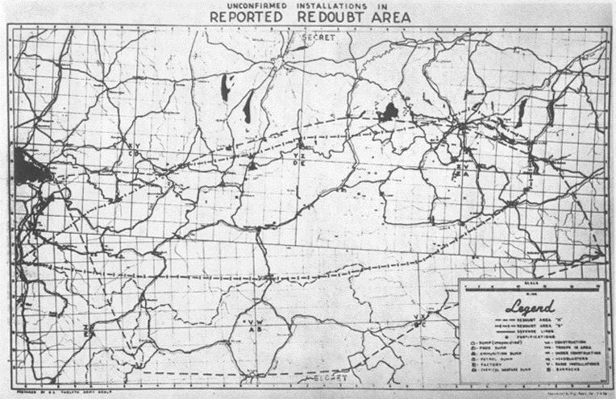

# Chương 1

Một đoàn xe tải chở đồ tiếp tế của quân đội nối đuôi nhau lăn bánh trên con đường chính nhỏ hẹp của thành phố nước Pháp, bụi mù mịt. Những chiếc xe gầm rú xếp thành một hàng dài vô tận, chạy về phía tây bắc trên hành trình chở hàng tới sông Rhine và Mặt trận phía Tây. Không chiếc nào được phép dừng lại; xung quanh chỗ nào cũng có quân cảnh đứng để đảm bảo dòng xe luân chuyển thông suốt. Đối với các tài xế, dù sao cũng chẳng có lý do gì để mà dừng lại cả. Đây chỉ là một thành phố buồn chán khác của Pháp, với tòa thánh đường quen thuộc, chỉ là một trạm kiểm soát khác trên đường cao tốc “Red Ball.” Họ không biết rằng vào thời điểm này của cuộc chiến, Reims có lẽ là thành phố quan trọng nhất châu Âu.

Trong nhiều thế kỷ, các trận chiến liên tục nổ ra để giành giao lộ chiến lược ở miền đông bắc nước Pháp này. Tòa thánh đường xây kiểu Gothic tráng lệ nhô cao ở trung tâm thành phố đã phải chịu vô số trận thả bom, và được xây lại hết lần này tới lần khác. Mọi ông vua Pháp đều được trao vương miện tại đây, từ Clovis vào năm 496 đến vua Louis XVI năm 1774. Trong cuộc chiến này, thật may là thành phố và biểu tượng của nó đã được chừa ra. Giờ đây, tòa thánh đường với hai ngọn tháp đôi hùng vĩ đang phủ bóng xuống sở chỉ huy của một nhà lãnh đạo vĩ đại khác. Tên ông là Dwight D. Eisenhower.

Bộ chỉ huy Tối cao Lực lượng Viễn chinh Đồng minh nằm trên một con đường nhỏ gần ga tàu hỏa, đặt tại một tòa nhà ba tầng đơn giản và hiện đại. Tòa nhà này là Collège Moderne et Technique, từng là một trường kỹ thuật dành cho nam sinh. Có dạng như chiếc hộp, bốn phía tòa nhà vây quanh một cái sân trong, ban đầu ngôi trường xây bằng gạch đỏ này được thiết kế cho hơn 1.500 học sinh theo học. Các thành viên trong ban tham mưu gọi nó là “ngôi trường bé nhỏ màu đỏ.” Có lẽ là vì đối với yêu cầu của SHAEF, nó khá là nhỏ: bộ chỉ huy đã tăng gần gấp đôi quân số kể từ năm 1944 và giờ có gần 1.200 sĩ quan và khoảng 4.000 biên chế. Kết quả là ngôi trường chỉ có thể đáp ứng được ngài Tư lệnh Tối cao, các tướng lĩnh tham mưu trực thuộc ông và phòng ban của họ. Số còn lại làm việc trong các tòa nhà khác trong thành phố Reims.

Trong phòng học ở tầng hai mà ông dùng làm văn phòng, ngài đại tướng đã làm việc cả ngày không nghỉ. Căn phòng nhỏ và khá đạm mạc. Hai ô cửa sổ nhìn ra đường được phủ rèm đen. Có mấy chiếc ghế mềm đặt trên sàn nhà bằng gỗ sồi bóng loáng, thế là hết. Bàn làm việc của Eisenhower, đặt trong một góc phòng thụt vào ở cuối phòng, nằm trên một cái bục nhô cao hơn mặt sàn một chút – từng được giáo viên dùng làm bục giảng. Trên bàn có một bộ văn phòng phẩm bằng da màu xanh, một chiếc điện thoại nội bộ, mấy tấm ảnh lồng khung da của vợ con ông, và hai chiếc điện thoại màu đen – một chiếc sử dụng thường ngày, chiếc còn lại đặc biệt dùng để gọi đến Washington và London mà không bị nghe lén. Ngoài ra còn có vài gạt tàn thuốc, vì ngài Tư lệnh Tối cao nghiện thuốc lá một cây, một ngày ông hút hơn 60 điếu \(\*\). Đằng sau bàn là cờ hiệu của ông và ở góc đối diện là quốc kỳ Mỹ.

Chiều hôm qua, Eisenhower đã có một chuyến bay ngắn tới Paris để dự một buổi họp báo. Tin tức lớn chính là chiến thắng sông Rhine. Ngài Tư lệnh Tối cao thông báo rằng lực lượng phòng thủ chính của địch ở phía tây đã tan tác. Dù Eisenhower nói với các phóng viên là ông không muốn “xem như chiến tranh thế là xong, vì quân Đức sẽ đứng dậy và chiến đấu ở bất cứ nơi đâu có thể,” theo ông thì Đức là “một kẻ thù đang bị thương.” Trong buổi họp báo, có người nhắc tới Berlin. Một phóng viên hỏi ai sẽ tới được Berlin trước, “người Nga hay là chúng ta?” Eisenhower trả lời rằng ông nghĩ “nội phần lợi lộc không thôi cũng đủ để họ làm thế,” nhưng ông nhanh chóng nói thêm là ông “không muốn dự đoán điều gì”; dù quân Nga “có quãng đường chạy ngắn hơn” nhưng họ lại phải đối đầu với “cả đống quân Đức.”

Eisenhower qua đêm ở khách sạn Raphael; rồi rời Paris khi bình minh vừa lên chưa bao lâu, ông bay về Reims. Lúc 7:45 sáng thì ông đã tới văn phòng và hội ý với Tham mưu trưởng của mình, Trung tướng Walter Bedell Smith. Tướng Smith ngồi đợi Eisenhower, với mấy bức điện mật mà chỉ có ngài Tư lệnh Tối cao mới có thể hồi âm nằm trong chiếc cặp hồ sơ bằng da màu xanh có khóa bên trên. Mấy bức điện được đóng dấu tối mật: “Chỉ để Eisenhower xem.” Trong số đó có lời nhắn từ Montgomery, mong được cho phép tiến tới sông Elbe và Berlin. Nhưng bức điện quan trọng nhất là từ cấp trên của Eisenhower, Tham mưu trưởng Lục quân Hoa Kỳ, Đại tướng George C. Marshall. Thật trùng hợp là cả hai bức điện của Marshall và Montgomery cùng đến chỗ SHAEF vào tối hôm qua, cách nhau có hai tiếng đồng hồ - và cả hai đều có ảnh hưởng lớn đến Eisenhower. Vào thứ tư tuần này, ngày 28/3, hai bức điện này sẽ là chất xúc tác cho quyết định cuối cùng của ngài Tư lệnh Tối cao về chiến lược mà ông sẽ áp dụng cho tới khi chiến tranh kết thúc.

Mấy tháng trước, Hội đồng Tham mưu trưởng Anh-Mỹ đã thông báo nhiệm vụ của Eisenhower trong vai trò Tư lệnh Tối cao chỉ bằng một câu: “Anh sẽ đặt chân lên châu Âu lục địa và liên kết với các quốc gia khác trong Liên hiệp quốc, thực thi các chiến dịch nhắm vào trung tâm nước Đức và tiêu diệt các lực lượng vũ trang của nó.” Ông đã làm rất tốt chỉ thị này. Nhờ vào nhân cách, năng lực lãnh đạo và tài ứng biến của mình, ông đã gắn kết binh lính của hơn 12 quốc gia thành lực lượng mạnh mẽ nhất trong lịch sử. Ít ai có thể làm được như vậy đồng thời hạn chế sự thù địch giữa các quốc gia xuống mức thấp nhất. Eisenhower, 55 tuổi, không phù hợp với khái niệm cổ điển của châu Âu về nhà lãnh đạo quân sự. Không giống như các tướng lĩnh người Anh, ông không được đào tạo rằng xem các mục tiêu chính trị là một phần của chiến lược quân sự. Dù có bằng thạc sĩ khoa học chính trị về thỏa hiệp và xoa dịu, nhưng về mặt chính trị, Eisenhower lại không hề biết gì về giao thiệp quốc tế - và ông tự hào về chuyện đó. Theo truyền thống quân sự của Mỹ, ông được dạy rằng không bao giờ chiếm đoạt uy quyền tối thượng của nhân dân. Tóm lại, ông hài lòng với việc chiến đấu và giành thắng lợi; chuyện chính trị thì để cho các chính khách.

Thậm chí vào lúc này, tại thời điểm mấu chốt của cuộc chiến, các mục tiêu của Eisenhower vẫn luôn như vậy, chỉ đơn thuần mang tính quân sự. Ông chưa từng đưa ra một chỉ thị chính trị nào về nước Đức sau chiến tranh, ông cũng không coi đó là trách nhiệm của mình. Sau này ông nói, “Việc của tôi là chóng kết thúc chiến tranh… tiêu diệt quân đội Đức càng nhanh càng tốt.”

Eisenhower có đủ lý do để phấn khởi trước tình hình diễn biến: các đoàn quân của ông đã vượt qua sông Rhine và tràn vào vùng trung tâm nước Đức chỉ trong 21 ngày, nhanh hơn lịch trình dự kiến. Từng bước tiến quân của họ đều là tiêu đề cho các bài báo, được thế giới tự do hào hứng dõi theo, giờ lại khiến vị Tư lệnh Tối cao phải đưa ra một loạt quyết định chỉ huy phức tạp. Tiến độ tấn công nhanh bất ngờ của quân Anh-Mỹ làm cho một số bước chiến lược lập ra từ mấy tháng trước trở nên lạc hậu. Eisenhower phải điều chỉnh kế hoạch của mình để thích ứng với tình hình mới. Điều này có nghĩa là phải thay đổi và định nghĩa lại vai trì của một số tập đoàn quân và tư lệnh của chúng – đặc biệt là Nguyên soái Montgomery và Cụm tập đoàn quân 21 hùng mạnh của ông. Bức điện mới nhất của Montgomery là một lời thúc giục hành động. Vị nguyên soái 58 tuổi không hỏi phải đánh trận này thế nào; ông chỉ đòi quyền dẫn đầu cuộc tấn công. Trước khi phần lớn tư lệnh kịp nhận ra các ngụ ý chính trị của một tình huống quân sự, Montgomery đã thấy quân Đồng minh nhất thiết phải chiếm được Berlin – và ông tin là việc này nên do Cụm tập đoàn quân 21 thực hiện. Bức điện của ông được trình bày đúng như tính cứng đầu cứng cổ của Montgomery, cho thấy rõ là vẫn còn có những khác biệt quan trọng giữa ý kiến của ông và của Tư lệnh Tối cao. Theo tướng Smith và những người khác nhớ lại, phản ứng của Eisenhower trước bức điện của ngài nguyên soái “giống như một con ngựa có cái dằm dưới yên.”

Khác biệt mấu chốt về lý thuyết quân sự giữa Montgomery và Eisenhower nằm liên quan tới cuộc tấn công đơn lẻ so với chiến lược diện rộng. Suốt nhiều tháng nay, Montgomery và thượng cấp của ông, Tham mưu trưởng Ban tham mưu Hoàng gia, Nguyên soái Sir Alan Brooke, rất kích động muốn thực hiện một cuộc tấn công chớp nhoáng vào trung tâm nước Đức. Gần như ngay sau khi Paris sụp đổ, trong khi quân Đức vẫn còn lộn xộn và tháo chạy khỏi Pháp thì Montgomery đã trình kế hoạch của mình lên Eisenhower. Ông viết, “Giờ ta đã đạt đến giai đoạn mà chỉ cần một cuộc tấn công thực sự mạnh vào Berlin là đủ để chấm dứt cuộc chiến với Đức.”

Montgomery trình bày kế hoạch của mình trong chín đoạn văn ngắn ngủn. Ông lấy lý do là quân Anh-Mỹ thiếu đồ tiếp tế và đội bảo trì để không chia quân thành hai hướng tấn công song song vào Đức. Theo quan điểm của ông, chỉ cần một mũi tấn công – là đội quân của ông – và nó sẽ cần “mọi nguồn lực bảo trì… không hạn chế.” Các chiến dịch khác sẽ phải phù hợp với nguồn hỗ trợ hậu cần còn lại. Montgomery cảnh báo, “nếu chúng ta cố tìm giải pháp thỏa hiệp và chia cắt lực lượng bảo trì của mình khiến cho không mũi tấn công nào thực sự mạnh, thì chỉ tổ kéo dài cuộc chiến mà thôi.” Thời gian là “yếu tố quan trọng sống còn… nên cần có quyết định ngay.”

Kế hoạch này khá là giàu trí tưởng tượng, và từ quan điểm của Montgomery, được tính toán thời gian chuẩn xác. Nó cũng đánh dấu một điểm trái ngược lạ kỳ với cách tiếp cận trận đánh thông thường của ngài nguyên soái. Sau này, Trung tướng Sir Frederick Morgan, giờ là Trợ lý Tham mưu trưởng của Eisenhower kể lại: “Nói ngắn gọn thì, Montgomery xưa nay nổi tiếng thận trọng, lại có ý tưởng là nếu được ưu tiên hơn các cụm tập đoàn quân của Mỹ, ông ta có thể vượt qua quân địch, tiến đánh Berlin và nhanh chóng kết thúc chiến tranh bằng trình tự ngắn nhất.”

Rõ ràng kế hoạch này là một canh bạc lớn. Đưa hai cụm tập đoàn quân lớn có hơn 40 sư đoàn vào nước Đức từ phía đông bắc trong một cuộc tấn công ồ ạt duy nhất có thể đem lại chiến thắng quyết định và nhanh chóng – nhưng nó cũng có thể dẫn tới một thảm họa toàn diện và có lẽ không thể xoay chuyển được. Đối với ngài Tư lệnh Tối cao, các rủi ro đó vượt xa bất kỳ cơ hội thành công nào, và ông đã nói rõ trong một thông điệp lịch thiệp gửi đến Montgomery. Eisenhower nói, “Tôi đồng ý với anh về quan điểm mở một cuộc tấn công hoành tráng vào Berlin, nhưng tôi không cho là nó nên được khởi xướng vào lúc này.” Ông thấy rằng trước tiên cần mở các cảng Le Havre và Antwerp “để chống đỡ được một cuộc tấn công quy mô lớn vào sâu bên trong nước Đức.” Hơn nữa, Eisenhower còn nói, “không cần tái phân phối các nguồn lực hiện có của chúng ta cũng đã đủ để thực hiện một cuộc tấn công vào Berlin rồi.” Chiến lược của ngài Tư lệnh Tối cao là tiến vào Đức trên diện rộng, vượt sông Rhine rồi chiếm thung lũng sông Ruhr, nơi có vùng công nghiệp phát triển, trước khi tấn công thủ đô.

Cuộc trao đổi đó đã diễn ra vào tuần đầu tiên của tháng 9/1944. Một tuần sau, trong một thông điệp gửi đến các vị tư lệnh của ba cụm tập đoàn quân là Montgomery, Bradley và Devers, Eisenhower nói cụ thể hơn về kế hoạch của mình: “Rõ ràng Berlin là mục tiêu chính và nó được quân địch tập trung lực lượng để bảo vệ. Tôi không nghi ngờ gì là chúng ta cần tập trung mọi sức lực vào một cuộc tấn công chớp nhoáng vào Berlin. Tuy nhiên, chiến lược của chúng ta sẽ phải phối hợp với quân Nga, nên chúng ta cũng phải cân nhắc đến các mục tiêu thay thế.”

Các mục tiêu khả dĩ, theo như Eisenhower thấy thế, khá đa dạng: các cảng miền bắc nước Đức \(“có thể chiếm đóng chúng để bảo vệ bên cánh của cuộc tấn công vào Berlin”\); các trung tâm công nghiệp và liên lạc quan trọng ở Hanover, Brunswick, Leipzig và Dresden \(“có lẽ quân Đức sẽ trấn giữ ở đây vì chúng che chắn cho Berlin”\); và cuối cùng là vùng Nuremberg-Munich ở miền nam, cũng cần phải chiếm \(“để cắt đường lui của địch tới Italy và bán đảo Balkan”\). Do đó, ngài Tư lệnh Tối cao cảnh báo, “Chúng ta phải chuẩn bị cho một hoặc một số trường hợp sau:

“A. Chỉ đạo lực lượng của các cụm tập đoàn quân phía bắc và trung tâm tiến về Berlin theo trục Ruhr-Hanover-Berlin hoặc Frankfurt-Leipzig-Berlin hoặc cả hai. “B. Nếu Nga tới Berlin trước chúng ta, cụm tập đoàn quân phía bắc sẽ chiếm vùng Hanover, còn quân ở Hamburg của cụm tập đoàn quân trung tâm… sẽ chiếm một phần hoặc toàn bộ vùng Leipzig-Dresden tùy vào tình hình tiến quân của Nga. “C. Trong bất kỳ trường hợp nào, cụm tập đoàn quân phía nam cũng sẽ chiếm Augsburg-Munich. Vùng Nuremberg-Regensburg sẽ do cụm tập đoàn quân trung tâm hoặc phía nam chiếm… tùy theo tình hình lúc đó.”

Eisenhower tóm tắt chiến lược của mình bằng mấy lời sau: “Nói đơn giản thì, tôi muốn tiến về Berlin bằng tuyến đường nhanh nhất, trực tiếp nhất, các lực lượng khác sẽ hỗ trợ cho liên quân Anh-Mỹ, đi qua các trung tâm chủ chốt và chiếm các vùng hai bên cánh, trong một chiến dịch có sự phối hợp với nhau.” Ông nói thêm, nhưng phải chờ đợi cái đã, vì “vào giai đoạn này thì không thể nói trước được thời gian hay quân lực của các cuộc tiến công trên.”

Dù chiến lược tấn công trên diện rộng có đúng hay sai, Eisenhower cũng là Tư lệnh Tối cao và Montgomery phải chấp hành mệnh lệnh của ông. Nhưng Montgomery cực kỳ thất vọng. Với người Anh, ông ta là quân nhân danh tiếng nhất kể từ trận Wellington; còn đối với lính của mình, Monty là một huyền thoại trong thời của ông. Rất nhiều người Anh coi ông là vị tư lệnh chiến trường giàu kinh nghiệm nhất tại châu Âu \(ông cũng biết rõ điều này\), và việc kế hoạch mà ông tin là có thể kết thúc chiến tranh trong vòng ba tháng bị bác bỏ đã khiến Montgomery buồn phiền sâu sắc \(\*\*\). Cuộc tranh cãi về chiến lược vào mùa thu năm 1944 đã mở ra sự rạn nứt không bao giờ hàn gắn được hoàn toàn giữa hai vị tư lệnh.

Trong bảy tháng sau đó, Eisenhower không hề thay đổi ý định về một cuộc tấn công trên diện rộng. Montgomery cũng không ngừng bày tỏ ý kiến rằng nên thắng cuộc chiến này bằng cách nào, tại đâu và bởi lực lượng nào. Sau này, Tham mưu trưởng của ông là Thiếu tướng Sir Francis de Guingand viết rằng, “Montgomery… cảm thấy dù có dẫn tới hậu quả gì cũng đáng, miễn là quan điểm của ông thắng thế: thực sự thì, kết thúc chiến tranh xứng đáng với bất kỳ giá nào.” Một trong những hậu quả mà Montgomery đem lại khá là lớn: Tham mưu trưởng Ban tham mưu Hoàng gia, Nguyên soái Brooke, thấy Eisenhower là người mập mờ và thiếu quyết đoán. Ông từng tóm lược rằng ngài Tư lệnh Tối cao là một người “có nhân cách thu hút, nhưng đồng thời lại có đầu óc rất, rất hạn chế về quan điểm chiến lược.”

Chú thích: \(\*\): Năm 1948, vì nhịp tim tăng cao đột ngột, các bác sĩ đã bảo ông bỏ thuốc. Từ đó Eisenhower không bao giờ hút thuốc nữa.

\(\*\*\): Niềm kiêu hãnh của ông được phục hồi phần nào không lâu sau việc này, khi người Anh cho thấy họ rất tin tưởng Montgomery và các chính sách của ông bằng cách chỉ định ông làm Thống chế Lục quân. Đối với con người từng lật ngược thế cờ cho quân Anh tại sa mạc và đánh đuổi Rommel ra khỏi Bắc Phi thì vinh dự này đến quá chậm.

Eisenhower biết rõ là Cục Chiến tranh và sở chỉ huy của Montgomery đã phát ra nhiều lời bình luận cay đắng. Nhưng dù vụ xầm xì về chính sách chiến lược của ông có làm ông tổn thương, thì Eisenhower cũng không để lộ điều đó. Và ông chẳng bao giờ trả đũa. Ngay cả khi Brooke và Montgomery biện hộ cho việc chỉ định một vị “Tư lệnh các lực lượng trên bộ” – một đại nguyên soái nằm kẹp giữa Eisenhower và các cụm tập đoàn quân của ông – thì vị Tư lệnh Tối cao này cũng không hề nổi giận. Cuối cùng, sau nhiều tháng “ngồi yên không hé răng” – theo cách nói của Đại tướng Omar Bradley – thì Eisenhower cũng nổi điên. Mọi chuyện bùng nổ sau khi quân Đức tấn công qua cao nguyên Ardennes.

Vì mũi tiến công của địch đã chia cắt mặt trận của quân Anh-Mỹ, Eisenhower buộc phải dồn toàn bộ quân vào đầu phía bắc do Montgomery chỉ huy. Các cánh quân này gồm hai phần ba Cụm Tập đoàn quân 12 của Đại tướng Bradley – là Tập đoàn quân Hoa Kỳ 1 và 9.

Sau khi đẩy lui được quân Đức, Montgomery đã mở một cuộc họp báo đặc biệt, trong đó nhấn mạnh rằng gần như một tay ông đã giải cứu quân Mỹ khỏi thảm họa. Ngài nguyên soái tuyên bố ông đã dọn dẹp sạch sẽ chiến trường, và đã “ngăn chặn… đuổi cổ… và tiêu diệt” quân địch. “Trận chiến khá thú vị. Tôi nghĩ nó có thể là một trong những trận khó khăn nhất… mà tôi từng đánh.” Montgomery nói ông đã “dùng mọi lực lượng khả dĩ của các cụm tập đoàn quân của Anh… do đó, mọi người có thể hình dung ra cảnh các cánh quân Anh chiến đấu hai bên quân Mỹ, vốn vừa chịu một cú đòn nặng.”

Thưc sự thì Montgomery đã chỉ huy cuộc phản công chính từ hướng bắc và hướng đông một cách oai hùng. Nhưng tại buổi họp báo của ngài đại nguyên soái, nói như Eisenhower là “không may là ông ta đã tạo nên cái ấn tượng rằng mình là vị cứu tinh của quân Mỹ.” Montgomery đã ỉm đi vai trò của tướng Bradley, Patton và các tư lệnh khác của Mỹ, hay trong trận đánh, cứ mỗi lính Anh chiến đấu thì lại có ba mươi đến bốn mươi lính Mỹ tham gia. Quan trọng hơn hết, ông cũng lờ tịt rằng mỗi thương vong của lính Anh tương ứng với bốn mươi đến sáu mươi lính Mỹ ngã xuống \(\*\). Cơ quan tuyên truyền của Đức nhanh chóng khiến mọi chuyện tồi tệ hơn. Đài phát thanh của địch thổi phồng và bóp méo buổi họp báo, rồi phát thẳng về mặt trận quân Mỹ; nhờ đó mà nhiều người Mỹ được nghe vụ này lần đầu. Ngay sau buổi họp báo và vụ lùm xùm mà nó gây nên, cuộc tranh cãi ngày trước về một vị tư lệnh các lực lượng trên bộ lại dấy lên, lần này do báo giới Anh tích cực phát động chiến dịch ủng hộ. Tướng Bradley nổi điên. Ông tuyên bố mình sẽ từ chức nếu ngài đại nguyên soái được bổ nhiệm làm tư lệnh các lực lượng trên bộ. Ông nói với Eisenhower “Sau những gì đã xảy ra, nếu Montgomery được giao trọng trách đó… anh cứ đuổi tôi về nhà cho xong… tôi không thể chịu nổi chuyện này.” Tướng Patton nói với tướng Bradley: “Tôi cũng sẽ đi với anh.”

Đây là vết rạn nứt chưa từng có trong nội bộ quân Anh-Mỹ. Khi chiến dịch “tuyên truyền cho Montgomery” làm nó trầm trọng thêm – một chiến dịch mà một số người Mỹ cho là bắt nguồn trực tiếp từ sở chỉ huy của Montgomery – thì cuối cùng vị Tư lệnh Tối cao cũng thấy tình hình đã đến mức không thể chịu đựng nổi nữa. Ông quyết định kết thúc cuộc cãi nhau một lần cho xong: ông sẽ cách chức Montgomery bằng cách đưa toàn bộ vấn đề ra trước Hội đồng tham mưu trưởng Anh-Mỹ.

Vào lúc đó, Tham mưu trưởng của Montgomery là Đại tướng De Guingand biết chuyện tai họa đang treo lơ lửng trên đầu và vội vàng tìm cách cứu vãn tình đoàn kết Anh-Mỹ. Ông bay đến SHAEF và gặp Tư lệnh Tối cao. Sau này, De Guingand nhớ lại, “Ông ấy đưa tôi xem bức điện ông ấy định gửi cho Washington. Tôi xem mà choáng.” Với sự hỗ trợ của Đại tướng Bedell Smith, ông đã thuyết phục Eisenhower hoãn bức điện thêm 24 tiếng đồng hồ. Eisenhower đồng ý cực kỳ miễn cưỡng.

Quay lại sở chỉ huy của Montgomery, De Guingand nói thẳng mọi chuyện với ngài đại nguyên soái. De Guingand nói, “Tôi bảo Monty là tôi đã đọc bức điện của Ike, nó viết rằng ‘Hoặc tôi hoặc Monty.’” Montgomery bị sốc. Tướng De Guingand chưa bao giờ thấy ông “cô đơn và xuống tinh thần đến thế.” Ông nhìn vị Tham mưu trưởng của mình và lặng lẽ nói, “Freddie, anh nghĩ tôi nên làm gì đây?” De Guingand đã soạn sẵn một bức điện. Dựa vào đó, Montgomery gửi cho Eisenhower một thông điệp đậm chất quân nhân, trong đó nói rõ là ông không hề có ý bất tuân. Ông nói, “Dù quyết định của ngài là gì, ngài cũng có thể tin ở tôi một trăm phần trăm. Cuối bức điện ký là “Người thuộc cấp tận tụy của ngài, Monty.” \(\*\*\)

Chuyện này kết thúc ở đó – ít nhất thì tạm thời là thế. Nhưng giờ đây, ở sở chỉ huy ở Reims, vào ngày quyết định, ngày 28/3/1945, Eisenhower lại nghe điệp khúc cũ vang lên rõ mồn một: không phải việc ủng hộ chỉ định tư lệnh các lực lượng trên bộ nữa, mà là một vấn đề cũ hơn, căn bản hơn – dùng một mũi tiến công hay dàn trải mặt trận trên diện rộng. Không hề hỏi ý Eisenhower, Montgomery đã “ra lệnh cho các tư lệnh hành quân về hướng đông”, theo lời Montgomery, và tính mở một cuộc tấn công mạnh mẽ về hướng sông Elbe và Berlin, rõ ràng là định tiến vào thủ đô trong vinh quang.

Thực sự thì khi tiến hành cuộc tiến công chủ lực vào phía bắc vùng Rhur, Montgomery đã làm đúng theo chiến lược được chấp thuận trước đó – kế hoạch của Eisenhower, được Hội đồng Tham mưu trưởng ở Malta chấp thuận hồi tháng 1. Những gì Montgomery đang làm đơn giản là mở rộng cuộc tiến công đó một cách hợp lý – một bước đi giúp ông tới được Berlin. Dù hành động có hơi vội vàng, sự phấn khích của ông cũng là dễ hiểu. Cũng giống Winston Churchill và Đại nguyên soái Brooke, Montgomery tin là thời gian sắp hết, rằng cuộc chiến sẽ thất bại về mặt chính trị nếu như quân Anh-Mỹ tới Berlin sau quân Nga.

Mặt khác, ngài Tư lệnh Tối cao lại không hề nhận được chỉ thị gì từ cấp trên của ông ở Washington về cảm giác cấp bách của người Anh. Và dù ông là Tư lệnh Lực lượng Đồng minh, Eisenhower vẫn phải nhận lệnh từ Bộ Chiến tranh Hoa Kỳ. Khi không có giải thích gì về chính sách từ Washington, mục tiêu của ông vẫn như cũ: đánh bại Đức và tiêu diệt các lực lực vũ trang của nó. Và giờ ông thấy cách nhanh nhất để đạt được mục tiêu quân sự này là thay đổi triệt để kế hoạch mà ông đã trình bày trước Hội đồng Tham mưu trưởng hồi tháng 1.

Ban đầu, theo kế hoạch của Eisenhower, Cụm Tập đoàn quân 12 của Đại tướng Bradley ở trung tâm sẽ có vai trò khá hạn chế, hỗ trợ cánh quân chính của Montgomery ở miền bắc. Nhưng ai mà biết trước được các tập đoàn quân của tướng Bradley lại thành công rực rỡ kể từ đầu tháng 3? Năng lực lãnh đạo tài tình và vận may đã dẫn đến những kết quả chói lọi đó. Thậm chí từ trước cuộc tấn công mạnh mẽ của Montgomery vào sông Rhine, Tập đoàn quân 1 Hoa Kỳ đã chiếm được cầu Remagen và nhanh chóng vượt sông. Xa hơn về phía nam, Tập đoàn quân 3 của tướng Patton vượt sông Rhine gần như không có trở ngại gì. Kể từ đó, quân của tướng Bradley tiến như vũ bão, giành hết chiến thắng này đến chiến thắng khác. Thành quả của họ đã thổi bùng lên trí tưởng tượng của công chúng Mỹ, và giờ tướng Bradley đang tìm một vai trò lớn hơn trong chiến dịch cuối cùng. Về mặt này, Bradley và các tướng lĩnh của ông cũng không khác Montgomery là mấy: họ cũng muốn có uy danh và vinh quang được kết thúc chiến tranh – và nếu có cơ hội thì chiếm Berlin.

Ngay lúc này, Eisenhower đã hứa sẽ phát động một cuộc tiến công lớn về phía đông, nhưng ông vẫn chưa xác định cánh quân nào – hay là những cánh quân nào – sẽ đảm nhiệm cuộc tiến công cuối cùng. Giờ, trước khi ra quyết định, Eisenhower phải cân nhắc đến nhiều yếu tố, tất cả đều có ảnh hưởng đến kế hoạch tấn công cuối cùng của ông.

Đầu tiên là tốc độ tiến quân nhanh không ngờ của quân Nga về hướng sông Oder. Vào lúc ngài Tư lệnh Tối cao lập kế hoạch cho cuộc tấn công sông Rhine và cuộc tấn công của Montgomery vào phía bắc vùng Ruhr, có vẻ như quân Nga sẽ phải mất nhiều tháng liền mới có thể vượt qua được khoảng cách xa xôi dẫn tới Berlin. Nhưng giờ Hồng quân chỉ cách thành phố không đầy 38 dặm – trong khi quân Anh-Mỹ vẫn còn cách hơn 200 dặm nữa. Chừng nào thì quân Nga sẽ phát động tấn công? Bọn họ định sắp đặt tấn công ở đâu và như thế nào – cụm tập đoàn quân của Zhukov ở trung tâm, đối diện Berlin, hay là cả ba cụm đồng loạt tấn công? Ước tính của quân Nga về sức mạnh của quân Đức kháng cự là bao nhiêu, và Hồng quân sẽ mất bao lâu để vượt qua hàng phòng ngự đó? Và sau khi vượt sông Oder, quân Liên Xô sẽ mất bao lâu mới tới được Berlin rồi chiếm lấy nó? Vị Tư lệnh Tối cao không thể trả lời được những câu hỏi này, mà tất cả đều cực kỳ quan trọng trong kế hoạch của ông.

Sự thật đơn giản là Eisenhower hầu như chẳng biết tí gì về ý định của Hồng quân. Không hề có sự phối hợp quân sự hàng ngày giữa các tư lệnh Anh-Mỹ và Liên Xô ngoài chiến trường. Đến cả một đường liên lạc vô tuyến trực tiếp giữa SHAEF và phái bộ liên lạc quân sự Anh-Mỹ tại Moscow cũng không có. Mọi liên lạc giữa hai mặt trận đều trao đổi thông qua các kênh ngoại giao thông thường – một phương pháp hoàn toàn không phù hợp vào lúc này, tình hình diễn biến quá nhanh. Dù Eisenhower biết được sức mạnh ước chừng của quân Nga, ông không biết thứ tự chiến đấu của họ. Ngoài các dữ liệu thỉnh thoảng có được từ nhiều nguồn tin tình báo khác nhau – phần lớn có độ chính xác không cao \(_\*_\) - nguồn tin chính của SHAEF về các bước tiến của quân Nga đến từ các thông cáo của Liên Xô do đài BBC phát sóng mỗi tối.

Tuy nhiên, có một điều hiển hiện rõ ràng: Hồng quân sắp tới được Berlin. Quân Nga đã tới gần như vậy rồi, liệu ngài Tư lệnh Tối cao có nên cố giành thành phố nữa không?

Vấn đề này có rất nhiều phương diện. Quân Nga đã dừng ở sông Oder hơn 2 tháng, và trừ một vài bước tiến cục bộ cùng các hoạt động tuần tra thì có vẻ như họ đã hoàn toàn ngừng lại. Các kênh tiếp tế và liên lạc của họ hẳn đang bị kéo căng hết mức, và có lẽ họ sẽ không thể tấn công cho tới chừng nào băng tan vào mùa xuân. Trong khi đó, các cánh quân phương tây lại di chuyển với tốc độ kinh hoàng, đang tiến ngày càng sâu vào trong lòng nước Đức. Trung bình có lúc họ tiến được hơn 35 dặm một ngày. Ngài Tư lệnh Tối cao không định bỏ cuộc, dù kế hoạch của quân Nga có là gì đi nữa. Nhưng ông hơi do dự khi bước vào cuộc đua giành Berlin với Nga. Đó có thể không chỉ là sự bẽ mặt của bên thua cuộc mà còn là tai họa cho cả hai bên, nếu các đoàn quân đang lao tới bất ngờ đụng độ.

Chú thích: \(\*\): Số liệu do Winston Churchill cung cấp vào ngày 18/1/1945, trong một buổi diễn thuyết trước Viện Thứ dân. Sợ tình hữu nghị giữa hai bên sụp đổ, ông đã thông báo rằng “quân Mỹ đã đảm đương phần lớn cuộc chiến” ở cao nguyên Ardennes, gánh chịu tổn thất “tương đương với cả hai bên của trận Gettysburg cộng lại.” Sau đó, có thể xem như một cú tát thẳng vào mặt Montgomery và những người ủng hộ ông, Churchill cảnh báo quân Anh không được “để bản thân bị bọn người gây bất hòa lợi dụng.”

\(\*\*\): Vào năm 1963, Montgomery nói với tác giả “Đáng lẽ tôi không nên tổ chức buổi họp báo đó. Lúc đó, người Mỹ có vẻ quá nhạy cảm và nhiều tướng lĩnh Mỹ không ưa tôi, đến mức tôi nói gì cũng bị coi là sai.” Sau này Eisenhower nói, “Montgomery tin rằng việc chỉ định một tư lệnh chiến trường là vấn đề cốt yếu. Ông ta thậm chí còn đề nghị sẽ phục vụ dưới quyền tướng Bradley nếu tôi chịu chấp thuận.”

\(_\*_\): Ví dụ như, vào ngày 11/3, tình báo của SHAEF báo rằng các mũi nhọn của Zhukov đã tới được Seelow, phía tây sông Oder và chỉ còn cách Berlin có 28 dặm. Khi tác giả phỏng vấn các quan chức quốc phòng của Liên Xô tại Moscow năm 1963, ông mới biết được là tới tận ngày 17/4 Zhukov mới tới được Seelow, trung tâm hệ thống phòng ngự của Đức tại sông Oder.

Trước đó quân Nga từng có một cuộc xung đột kinh khủng, khi Nga vẫn còn là đồng minh trên hiệp ước với Đức. Năm 1939, sau cuộc tấn công chớp nhoáng không báo trước của Hitler vào Ba Lan, để rồi sau đó Đức và Nga chia đôi đất nước này, quân Đức tiến về phía đông đã đụng độ Hồng quân đang tiến về phía tây: đường phân ranh giới vẫn chưa được thiết lập. Kết quả dẫn tới một trận chiến nhỏ, và cả hai bên đều chịu thương vong nặng nề. Giờ một cuộc xung đột tương tự có thể xảy ra, nhưng là giữa quân Anh-Mỹ với quân Nga – và ở quy mô lớn hơn thế nhiều. Đó quả là một cơn ác mộng. Các cuộc chiến đã dần bắt đầu. Rõ ràng cần phối hợp từng bước với Nga, và phải nhanh lên mới được.

Hơn nữa, có một vấn đề chiến thuật cứ luẩn quẩn trong đầu Eisenhower như một đám mây dông. Trong căn phòng bản đồ lớn gần văn phòng ông, có một tấm bản đồ tình báo được vẽ cẩn thận, mang cái tên huyền thoại “Pháo đài quốc gia.” Trên đó là một vùng núi nằm phía nam Munich và trải dài trên vùng núi xứ Bavaria, phía tây nước Áo và phía bắc Italy. Về tổng thể, nó có diện tích khoảng 20.000 dặm vuông. Trung tâm nơi đó là Berchtesgaden. Ở vùng Obersalzberg gần đó – bao quanh bởi các ngọn núi cao từ 2.100 đến 2.700 m, mỗi ngọn đều có những khẩu súng phòng không đã ngụy trang nằm rải rác – là chỗ trú ẩn trên đỉnh núi của Hitler, “Eagle’s Nest.”

Các chấm đỏ phủ kín bề mặt bản đồ, mỗi cái là một ký hiệu quân sự biểu thị một dạng bố phòng nào đó. Có các kho quân sự tạm thời chứa hóa chất, xăng dầu, đạn dược và lương thực; các trạm năng lượng và vô tuyến; các điểm tập trung quân, trại lính và sở chỉ huy; các đường cứ điểm hình zigzag, từ những công sự bê tông ngầm cho tới các boongke bê tông to lớn; thậm chí có cả các nhà máy ngầm chống bom. Giờ cứ mỗi ngày qua lại có thêm nhiều ký hiệu trên tấm bản đồ, và dù tất cả số đó đều có nhãn “chưa xác định,” đối với SHAEF, hệ thống phòng thủ kiên cố ở vùng núi này là mối đe dọa lớn nhất còn lại trong cuộc chiến tại châu Âu. Khu vực này có khi được gọi là Alpenfestung, Pháo đài Alpine hay “Pháo đài quốc gia.” Theo tình báo, trong thành lũy hiểm trở này, bọn Nazi, với Hitler là đầu lĩnh, định chiến đấu tới cùng. Thành trì vững chãi này được coi là gần như bất khả xâm phạm và lực lượng cố thủ cuồng tín bên trong có thể cầm cự được chừng hai năm. Có một khía cạnh khác thậm chí còn đáng sợ hơn; là các lực lượng kiểu đặc công được huấn luyện đặc biệt – Goebbels gọi bọn họ là “Người sói” – có thể xông ra từ pháo đài trên núi và gây nguy hiểm cho các đội quân chiếm đóng.

Liệu Alpenfestung có tồn tại thật không? Có vẻ như giới chức quân sự ở Washington nghĩ vậy. Thông tin được tích lũy từ hồi tháng 9. Năm 1944, trong một bài nghiên cứu chung về miền nam nước Đức, Ban Chiến lược \(OSS\) đã dự đoán rằng khi chiến tranh gần đi vào hồi kết, quân Nazi có thể sẽ di tản các cơ quan chính phủ nhất định về Bavaria. Từ đó, các báo cáo và đánh giá tình báo liên tục đổ về, từ chiến trường, từ các nước trung lập, thậm chí từ các nguồn tin nằm trong nước Đức. Phần lớn các đánh giá này khá thận trọng, nhưng cũng có một số hơi bị ảo tưởng.

_Pháo đài phương Nam. Tấm bản đồ này được vẽ ở Sở chỉ huy tối cao để biểu diễn cái được cho là các bố trí phòng ngự, vốn chỉ tồn tại trong tâm trí các sĩ quan tình báo Đồng minh. Người ta tin vào các kho đạn và phòng tuyến không tồn tại này đến nỗi tấm bản đồ chiếm một phần quan trọng trong quyết định không tấn công Berlin._

Ngày 12/2/1945, Bộ Chiến tranh đưa ra một tài liệu phản gián nghiêm trọng, nói rằng: “Các báo cáo về cứ điểm cuối cùng của Nazi có thể nằm ở vùng núi Alps ở Bavaria chưa được coi trọng đúng mức… Câu chuyện thần thoại của bọn Nazi, vốn rất quan trọng khi phải đối phó với những kẻ như Hitler, cần bị tiêu diệt triệt để \(1\). Cần chú ý là Berchtesgaden, nơi có thể là đại bản doanh, nằm ở khu lăng mộ của Barbarossa, kẻ đã trở về từ cõi chết theo thần thoại Đức.” \(2\) Bản thông báo giục các tư lệnh chiến trường phải cảnh báo mối nguy “đến cấp quân đoàn.”

Ngày 16/2, các đặc vụ của Đồng minh ở Thụy Sĩ gửi về Washington một báo cáo kỳ dị, lấy được từ các tùy viên quân sự trung lập ở Berlin: “ Không nghi ngờ gì nữa, bọn Nazi đang chuẩn bị cho một cuộc chiến ác liệt từ pháo đài trên núi… Các điểm cố thủ được liên kết với nhau bằng đường sắt ngầm… chúng trữ sẵn số đạn dược tốt nhất, đủ dùng trong vài tháng, cùng với toàn bộ nguồn hơi độc của Đức. Tất cả những người tham gia xây dựng các cơ sở bí mật sẽ bị giết – kể cả những người dân còn lại ở đó… khi trận chiến thực sự bắt đầu.”

Dù cả các cơ quan tình báo Anh và OSS đều đưa ra các phát biểu cẩn trọng nhằm làm dịu các bản báo cáo đáng sợ đó, trong 27 ngày sau đó, bóng ma của Pháo đài quốc gia vẫn lan truyền. Đến ngày 21/3, mối đe dọa đã bắt đầu ảnh hưởng đến tư duy chiến thuật. Sở chỉ huy của Cụm tập đoàn quân 12 của tướng Bradley đưa ra một thư báo có tựa đề “Tái định hướng chiến lược”, trong đó khẳng định các mục tiêu của Đồng minh đã thay đổi, nêu rằng “các kế hoạch mà chúng ta làm theo từ lúc còn ở bờ biển giờ đã lỗi thời.” Một trong các thay đổi đó là: tầm quan trọng của Berlin đã giảm đi nhiều. Bản báo cáo viết, “Vùng thủ đô không còn là vị trí quan trọng nữa… mọi dấu hiệu đều cho thấy đầu não quân sự và chính trị của địch đang chuyển về ‘Pháo đài’ ở hạ Bavaria.”

Để đối phó với mối đe dọa này, tướng Bradley đề nghị thay vì tấn công về phía bắc thì cụm tập đoàn quân của ông sẽ chia đôi nước Đức bằng cách tiến về vùng trung tâm. Điều này sẽ “ngăn quân Đức rút lui” về phía nam “vào trong Pháo đài.” Thêm nữa, nó sẽ đẩy quân địch “về phía bắc, ở đó chúng sẽ bị vây bởi bờ biển Baltic và biển Bắc.” Sau đó, bản báo cáo đề xuất rằng Cụm tập đoàn quân 12 sẽ quay về phía nam để giảm thiểu sức kháng cự còn lại của địch ở Alpenfestung.

Bản phân tích gây hoang mang nhất xuất hiện vào ngày 25/3, đến từ Trưởng ban Tình báo của Tập đoàn quân 7 của Trung tướng Patch, đang chiến đấu ở cánh phía nam mặt trận. Nó dự báo trong pháo đài có thể có “một lực lượng tinh nhuệ, chủ yếu là SS và quân miền núi, khoảng 200.000 đến 300.000 lính.” Bản báo cáo nói, đồ tiếp tế đã được đưa đến pháo đài bằng “ba đến năm đoàn tàu hỏa cực dài… mỗi tuần \(từ tháng 1/1945\)… Trong số đó, quan sát thấy có nhiều đoàn tàu có một loại súng mới trên đó…” Thậm chí bản báo cáo còn đề cập đến một nhà máy ngầm chế tạo máy bay “có thể sản xuất… máy bay Messerschmitt.” \(3\)

Ngày qua ngày, các báo cáo đổ về SHAEF. Dù các chứng cứ có được phân tích tới lui thế nào, bức tranh vẫn y nguyên: dù Alpenfestung có thể chỉ là một trò chơi khăm, nhưng cũng không thể lờ đi khả năng tồn tại của nó. Mối bận tâm của SHAEF được nêu rõ trong một đánh giá tình báo về pháo đài ngày 11/3: “Trên lý thuyết… trong pháo đài này… được cả thiên nhiên và các vũ khí bí mật mạnh mẽ nhất vừa được phát minh, sức mạnh từ xưa đến nay đã giúp nước Đức sống sót để rồi phục sinh… Xu hướng phòng thủ chính của Đức có vẻ là bảo vệ vùng núi Alps… Bằng chứng cho thấy một số lượng lớn quân SS và đơn vị đặc biệt đang rút lui có hệ thống về Áo… Có vẻ khá chắc chắn là một số cơ quan và cá nhân quan trọng nhất của bộ máy Nazi đã được thiết lập tại pháo đài… Goering, Himmler, Hitler… được cho là đang rút lui về các thành trì riêng trong núi…”

Trưởng ban Tình báo của SHAEF, Thiếu tướng Kenneth W. D. Strong của Anh, nhận xét với ngài Tham mưu trưởng: “Có thể pháo đài không có ở đó, nhưng chúng ta phải tiến hành các bước nhằm ngăn không cho nó có ở đó.” Bedell Smith cũng đồng ý. Theo ông, có “đủ lý do để tin rằng bọn Nazi định xây chốn cố thủ cuối cùng trong núi.”

Khi các quan điểm đã cân nhắc của các thành viên SHAEF và các tư lệnh chiến trường của Mỹ nằm chất đống trong văn phòng Eisenhower, thì thông điệp đáng chú ý nhất xuất hiện. Nó đến từ cấp trên của ngài Tư lệnh Tối cao, Đại tướng Marshall, người Eisenhower tôn kính hơn hết thảy. \(4\)

Bức điện của Marshall viết, “Từ các báo cáo chiến dịch hiện tại, có vẻ như hệ thống phòng thủ của Đức ở phía tây có thể sẽ sụp đổ. Điều này sẽ cho phép anh đưa kha khá sư đoàn tiến nhanh về phía đông trên một mặt trận rộng lớn. Quan điểm của anh về việc… xem nào, đưa quân tiến nhanh theo trục Nuremberg-Linz hay Karlsruhe-Munich là như thế nào? Ý tưởng đằng sau việc này là… hành động nhanh chóng có thể ngăn ngừa sự hình thành của bất kỳ vùng kháng cự có tổ chức nào. Vùng núi phía nam được xem là một trong những nơi có khả năng.

“Một trong những vấn đề nổi lên bên cạnh sự kháng cự rời rạc của quân Đức là việc đụng độ quân Nga. Anh nghĩ sao về việc kiểm soát và phối hợp để ngăn các trường hợp không may…? Có một khả năng là thiết lập đường phân ranh thống nhất. Các cách sắp xếp hiện có của ta… chưa tương xứng… cần tiến hành các bước cung ứng liên lạc ngay, không được trì hoãn…”

Chú thích: \(1\): Nguyên văn “requires a Götterdämmerung.” Götterdämmerung tiếng Đức nghĩa là “Hoàng hôn của các vị thần”, tượng trưng cho sự sụp đổ của các vị thần trong trận chiến cuối cùng với quỷ dữ, theo thần thoại Đức. Götterdämmerung còn được dùng để chỉ sự sụp đổ của một thể chế, một xã hội,… \(ND\).

\(2\): Người chuẩn bị tài liệu phản gián này đã có sai sót về nơi yên nghỉ cuối cùng của Barbarossa. Nơi chôn cất Barbarossa \(Râu Đỏ\) – là họ của vua Frederick I \(1121-1190\) – không phải ở Berchtesgaden. Theo thần thoại, “ngài không hề chết, mà chỉ ngủ” giữa những ngọn đồi ở Thuringia. Ngài ngồi “trên một cái bàn đá, có sáu hiệp sĩ luôn kề bên, chờ đợi đến khi ngài tỉnh giấc và cứu nước Đức khỏi cảnh tù tội, đưa nước Đức lên trên đỉnh thế giới… bộ râu của ngài đã mọc xuyên qua phiến đá, nhưng phải cuốn bộ râu ba vòng quanh cái bàn trước khi ngài giáng thế lần thứ hai.”

\(3\): Messerschmitt là một tập đoàn sản xuất máy bay của Đức, nổi tiếng với dòng máy bay chiến đấu trong thời kỳ Thế chiến thứ hai, đặc biệt là hai dòng Bf 109 và Me 262. Thời hậu chiến, sau một vài lần sáp nhập, Messerschmitt đổi tên thành Messerschmitt-Bölkow-Blohm, rồi được Deutsche Aerospace \(DASA, giờ là một bộ phận của EADS\) mua lại vào năm 1989 \(ND\).

\(4\): Một tham mưu cao cấp của tướng Marshall, Đại tướng John Hull, Quyền Tham mưu trưởng Chiến dịch của Lục quân Hoa Kỳ vào năm 1945, nói rằng “Ike là người được Marshall bảo trợ, và có lẽ Ike sẽ không bằng lòng nếu tôi nói thế này, nhưng mối quan hệ giữa hai người họ hơi giống cha con.”

Thông điệp với lời lẽ cẩn trọng của Marshall cuối cùng cũng giúp kế hoạch của ngài Tư lệnh Tối cao hình thành. Sau khi cân nhắc mọi vấn đề, hội ý với ban tham mưu, thảo luận tình hình suốt nhiều tuần lễ với ông bạn già và cũng là bạn cùng lớp ở West Point \(\*\), Đại tướng Bradley, và quan trọng nhất là đã quen với các quan điểm của người cấp trên, giờ Eisenhower đã định hình được chiến lược và ra quyết định.

Vào buổi chiều tháng ba lạnh lẽo đó, ông soạn ba bức điện. Bức đầu tiên rất nổi tiếng trong lịch sử và chưa từng có tiền lệ: nó được gửi đến Moscow, cùng một tin nhắn kèm theo gửi đến Phái bộ Quân sự Đồng minh. Eisenhower viết rằng các chiến dịch của SHAEF đã tới giai đoạn “mà tôi cần được biết kế hoạch của Nga để đạt được thành công nhanh nhất.” Do đó, ông muốn Phái bộ phải “đưa một thông điệp cá nhân từ tôi gửi đến Thống chế Stalin” và bằng mọi giá “tìm cách hỗ trợ để được hồi âm đầy đủ.”

Trước đó, ngài Tư lệnh Tối cao chưa từng liên lạc trực tiếp với nhà lãnh đạo Xô Viết, nhưng giờ tình thế rất cấp bách. Ông đã được trao quyền thương lượng trực tiếp với Nga về các vấn đề quân sự có liên quan đến việc phối hợp, vậy nên Eisenhower thấy chẳng có lý do đặc biệt gì cần phải hội ý trước với Hội đồng Tham mưu trưởng Anh-Mỹ hay chính phủ Mỹ và Anh. Thực vậy, đến cả Phó Tư lệnh Tối cao là Chánh Thống chế Không quân Sir Arthur Tedder cũng chẳng hề hay biết gì. Tuy vậy, họ được xem các bản sao đã chuẩn bị sẵn cho mình.

Ngài Tư lệnh Tối cao chấp thuận bản thảo của bức điện gửi cho Stalin vào lúc 3 giờ hơn. Lúc 4 giờ chiều, sau khi đã mã hóa xong, “Thông điệp cá nhân gửi Thống chế Stalin” của Eisenhower được gửi đi. Trong đó, ngài đại tướng hỏi về kế hoạch của ngài tổng tư lệnh, đồng thời trình bày kế hoạch của mình. Ông nói, “Chiến dịch hiện tại của tôi được thiết kế để bao vây và tiêu diệt quân địch đang phòng thủ ở sông Ruhr… Tôi đoán giai đoạn này… sẽ kết thúc vào cuối tháng 4, thậm chí còn sớm hơn nữa, và nhiệm vụ kế tiếp của tôi sẽ là chia cắt lực lượng còn lại của địch bằng cách chung tay với quân của ngài… Tốt nhất là hợp quân theo trục Erfurt-Leipzig-Dresden. Tôi tin là… các cơ quan đầu não trong chính phủ Đức đang chuyển đến vùng này. Tôi định sẽ tấn công chủ yếu dọc theo trục này. Bên cạnh đó, một cuộc tiến công thứ hai sẽ được thực hiện để hợp quân với quân của ngài ở Regensburg-Linz càng sớm càng tốt, từ đó ngăn lực lượng kháng cự của Đức hợp nhất lại ở Pháo đài miền nam nước Đức. “Trước khi quyết định chắc chắn về kế hoạch của tôi, quan trọng nhất là cần phối hợp… với kế hoạch của ngài, cả về thời gian và phương hướng. Ngài có thể… cho tôi biết dự định của mình và… kế hoạch dự kiến được phác thảo … có phù hợp với hành động sắp tới của ngài không. Tôi thấy nếu chúng ta muốn tiêu diệt hoàn toàn quân Đức không chút chậm trễ, thì việc phối hợp hành động và… hoàn chỉnh đường dây liên lạc giữa các lực lượng đang hành quân của chúng ta… là vô cùng thiết yếu…”

Sau đó, ông chuẩn bị các bức điện gửi cho Marshall và Montgomery. Các bức điện này được gửi đi vào lúc 7 giờ tối, cách nhau 5 phút. Eisenhower nói với Tham mưu trưởng Hoa Kỳ rằng ông đã liên lạc với Stalin “về vấn đề phải hội quân ở đâu…” Rồi ông chỉ ra rằng “quan điểm của tôi tương tự với ngài, dù tôi cho là vùng Leipzig-Dresden quan trọng hơn…” vì nó là “tuyến đường ngắn nhất để tới chỗ quân Nga” và cũng sẽ “băng qua một vùng công nghiệp còn lại của Đức… được cho là nơi Bộ Tư lệnh Tối cao và các bộ đang chuyển đến.” Đối với mối lo ngại của Marshall về “Pháo đài Quốc gia,” Eisenhower báo cáo rằng ông biết rõ “tầm quan trọng của việc chặn trước khả năng để địch hình thành các vùng kháng cự có tổ chức” và sẽ tiến hành “một cuộc tiến công về phía Linz và Munich ngay khi tình hình cho phép.” Về việc phối hợp với quân Nga, Eisenhower nói thêm, ông không cho là “chúng ta có thể ràng buộc bản thân vào một đường ranh giới” nhưng sẽ tiếp cận bọn họ bằng lời đề nghị “khi quân hai bên gặp nhau, mỗi bên sẽ rút về vùng chiếm đóng của mình khi bên kia yêu cầu.”

Bức điện thứ ba trong ngày của Eisenhower, gửi cho Montgomery, mang theo tin tức khá thất vọng. Ngài Tư lệnh Tối cao nói “Ngay khi anh hội quân với Bradley… \[phía đông sông Ruhr\]… Tập đoàn quân 9 Hoa Kỳ sẽ chuyển qua cho Bradley chỉ huy. Bradley sẽ chịu trách nhiệm càn quét vùng Ruhr và đưa mũi tấn công chủ đạo của ông ấy đi theo trục Erfurt-Leipzig-Dresden để phối hợp với Nga trong thời gian ngắn nhất…” Montgomery sẽ tiến về sông Elbe; tại đó “Tập đoàn quân 9 sẽ giao lại cho anh chỉ huy để thuận tiện vượt qua chướng ngại vật đó.” Sau khi đọc qua bản thảo, Eisenhower viết thêm một dòng cuối bằng bút chì, “Như anh đã nói, tình hình có vẻ khả quan.”

Ngài Tư lệnh Tối cao đã sửa đổi kế hoạch của mình về phạm vi này: thay vì tấn công chủ lực vào miền bắc nước Đức như ban đầu đã định, ông đã quyết định tấn công thẳng vào trung tâm. Tập đoàn quân 9 được giao lại cho Bradley, giờ đây nắm vai trò chính. Bradley sẽ phát động cuộc tấn công cuối cùng, nhằm đưa quân đến vùng Dresden, cách Berlin 100 dặm về phía nam.

Dù Eisenhower đã chấp nhận một số đề xuất của Marshall, tiến trình của ông lại giống với đề xuất của Cụm Tập đoàn quân 12 của Đại tướng Bradley nêu trong bản thư báo “Tái định hướng chiến lược.” Nhưng trong cả ba bức điện của Eisenhower về kế hoạch cho chiến dịch của ông, có một điều bỏ sót đáng chú ý: mục tiêu mà ngài Tư lệnh Tối cao từng xem là “phần thưởng chính.” Ông không hề nhắc tới Berlin.

Cổng Brandenburg sứt mẻ hiện lờ mờ trong đám bụi. Qua những ô cửa sổ đã bịt một phần bằng ván của tòa biệt thự của mình, Tiến sĩ Goebbels nhìn chăm chăm vào tượng đài. Người đứng đầu cơ quan tuyên truyền của Hitler, có bề ngoài trông như một con quỷ lùn, đứng quay lưng một cách khinh khỉnh với mấy người khách – ít ra thì người đang nói chuyện có vẻ là khách, Sĩ quan chỉ huy Berlin, Thiếu tướng Hellmuth Reymann. Ngài thiếu tướng đang cố xin quyết định về một vấn đề mà ông cho là cấp bách nhất: số phận của cư dân trong thành phố trước khi trận chiến bắt đầu.

Đây là lần thứ tư trong tháng tướng Reymann cùng Tham mưu trưởng của ông là Đại tá Hans Refior gặp mặt Goebbles. Ngoài Hitler, giờ Goebbels, 47 tuổi, là nhân vật quan trọng nhất Berlin. Ông ta không chỉ là Bộ trưởng Bộ Thông tin Quần chúng và Tuyên truyền; mà còn là Tỉnh trưởng Berlin. Ông ta là Ủy viên Bộ Quốc phòng Đức, chịu trách nhiệm về mọi phương diện của cư dân thành phố, tổ chức và huấn luyện Lực lượng Phòng vệ Hậu phương và xây dựng các công sự. Giữa lúc thiếu sự rạch ròi về quyền hạn giữa các cơ quan quân sự và dân sự, khiến các nhà lãnh đạo trong quân và dân phải lúng túng, Goebbels khiến tình hình càng thêm rối rắm. Dù hoàn toàn làm ngơ các vấn đề quân sự hoặc đô thị, ông ta lại vạch rõ rằng mình là người duy nhất có trách nhiệm bảo vệ Berlin. Kết quả là tướng Reymann nhận thấy mình đang ở trong một vị trí tiến thoái lưỡng nan. Ông phải nhận chỉ thị từ ai – từ bộ chỉ huy quân sự của Hitler hay từ Goebbels? Ông không chắc, và có vẻ chẳng ai muốn làm rõ vị trí chỉ huy là của ai. Reymann muốn phát điên.

Ở các cuộc gặp trước, Reymann đã đưa ra vấn đề sơ tán. Ban đầu, Goebbels nói “không thể được.” Rồi ông ta nói với viên thiếu tướng rằng đã có sẵn kế hoạch rồi, do “các quan chức SS cấp cao hơn và cảnh sát” chuẩn bị. Tham mưu trưởng của tướng Reymann nhanh chóng điều tra ra. Đại tá Refior đã tìm ra kế hoạch đó. Ông nói với Reymann, “Nó gồm một tấm bản đồ, tỷ lệ 1:300.000, trên đó ghi người chịu trách nhiệm là một đại úy cảnh sát, có đánh dấu các tuyến đường sơ tán ra khỏi Berlin theo hướng tây và hướng nam bằng mực đỏ.” Ông báo cáo, “Trên đó không hề có trạm y tế, không có kho lương, không có phương tiện vận tải dành cho người đau yếu.” Ông nói thêm, “theo như tôi thấy, kế hoạch yêu cầu người tản cư tập hợp trên các tuyến đường đó, chỉ mang theo hành lý xách tay, đi 20 đến 30 km tới các ga tàu hỏa, từ đó họ được đưa tới Thüringen, Sachsen-Anhalt và Mecklenburg. Mọi việc sẽ bắt đầu tiến hành khi Goebbels nhấn nút. Nhưng vẫn chưa rõ tàu sẽ xuất phát từ đâu.”

Reymann cố thảo luận vấn đề với Hitler. Ông chỉ mới gặp Hitler hai lần: vào ngày nhậm chức và sau đó mấy ngày, khi ông được mời đến sự một buổi họp tối của Quốc trưởng. Trong buổi họp đó, đề tài thảo luận chủ yếu là về mặt trận sông Oder và Reymann không có cơ hội giải thích về tình hình Berlin. Nhưng vào một quãng tạm lắng trong buổi họp, ông đã nói chuyện với Hitler và giục ông ta nhanh chóng ra lệnh sơ tán toàn bộ trẻ em dưới mười tuổi của thủ đô. Một sự im ắng đột ngột phủ xuống sau lời đề xuất của Reymann, rồi Hitler quay qua phía ông và lạnh lùng hỏi, “Ý anh là sao? Chính xác thì ý anh là sao?” Rồi ông ta nói, chầm chậm nhấn mạnh từng chữ, “Ở Berlin không còn đứa con nít nào trong độ tuổi đó nữa!” Không ai dám cãi lại ông ta. Hitler nhanh chóng chuyển qua chuyện khác.

Lời khước từ đó không làm viên sĩ quan chỉ huy Berlin thoái chí. Giờ Reymann quay qua hỏi Goebbels về đề tài tương tự. Ông nói, “Thưa ngài bộ trưởng, làm sao ta hỗ trợ người dân khi bị bao vây? Ta sẽ cung ứng lương thực như thế nào? Lương thực từ đâu mà có? Theo số liệu của thị trưởng thì bây giờ trong thành phố có 110.000 trẻ em dưới mười tuổi cùng với mẹ của chúng. Làm sao ta cung cấp sữa cho em bé?”

Reymann dừng lại, chờ câu trả lời. Goebbels tiếp tục nhìn ra ngoài cửa sổ. Rồi ông ta gắt gỏng mà không hề quay lại: “Làm sao cung ứng lương thực à? Chúng ta sẽ đưa vật nuôi từ vùng nông thôn xung quanh về đây – đó là cách ta cung ứng lương thực đấy! Về bọn trẻ con, ta vẫn còn một lượng sữa hộp đủ dùng trong ba tháng.” Sữa hộp là một tin tức mới đối với Reymann và Refior. Còn vụ vật nuôi có vẻ hơi bị điên. Trong cuộc chiến, bò dễ bị thương hơn người, ít ra người ta còn đi trú được. Goebbels định nuôi chúng ở đâu? Và chúng sẽ ăn cái gì? Reymann sốt sắng: “Chắc chắn là ta phải cân nhắc về kế hoạch sơ tán trước mắt cái đã. Ta không thể chờ lâu hơn được nữa. Mỗi ngày trôi qua thì mọi chuyện càng khó khăn thêm. Ít nhất bây giờ chúng ta cũng phải sơ tán phụ nữ và trẻ em – trước khi quá muộn.”

Goebbels không đáp. Im lặng thật lâu. Ngoài kia trời đang tối dần. Đột nhiên ông ta đứng lên, tóm lấy sợi dây bên cửa sổ rồi kéo mạnh một cái. Tấm rèm tối lạch cạch khép lại. Goebbels quay lại. Bị tật bẩm sinh ở chân, ông ta đi khập khiễng tới chỗ bàn làm việc, bật đèn, nhìn chiếc đồng hồ đeo tay đặt trên mảnh vải lót, rồi nhìn Reymann. Ông ta nhẹ nhàng nói, “Ngài thiếu tướng thân mến của tôi ơi, tôi là người quyết định khi nào cần sơ tán, và liệu có cần hay không.” Rồi ông ta gầm gừ: “Nhưng tôi không định khiến cả Berlin sợ hãi bằng cách ra lệnh ngay bây giờ! Còn cả đống thì giờ! Cả đống thì giờ!” Ông ta đuổi khách. “Chào tạm biệt các quý ông.”

Khi Reymann và Refior rời khỏi tòa biệt thự, họ dừng lại một chút chỗ bậc thềm. Tướng Reymann nhìn bao quát thành phố. Dù còi báo động không kích chưa vang lên, đằng xa đã thấy đèn pha dò tìm rọi lên bầu trời đêm. Chầm chậm đeo găng tay, Reymann nói với Refior: “Chúng ta đang phải đối mặt với một nhiệm vụ mà ta không thể giải quyết được; cũng không có cơ hội thành công. Tôi chỉ có thể hi vọng sẽ có phép màu xảy ra để thay đổi vận mệnh của chúng ta, hoặc là chiến tranh sẽ kết thúc trước khi Berlin bị bao vây.” Ông nhìn người Tham mưu trưởng của mình. Rồi ông nói thêm, “Nếu không, chì có Chúa mới cứu được Berlin.”

Không lâu sau đó, tại bộ chỉ huy của mình nằm ở Hohenzollerndamm, Reymann nhận được một cuộc điện thoại từ OKH \(Bộ Tư lệnh Lục quân Tối cao\). Ngoài ngài Tư lệnh Tối cao Hitler và ngài Tỉnh trưởng Berlin Goebbels, giờ Reymann được biết mình còn là thuộc cấp của một người nữa. Ông được cho biết đã có sắp xếp là Vùng Phòng ngự Berlin sẽ do Cụm Tập đoàn quân Vistula và tư lệnh của nó là Thượng tướng Gotthard Heinrici chỉ huy. Reymann thấy tia hi vọng đầu tiên xuất hiện ngay khi nghe đến tên Heinrici. Ông bảo Refior tóm tắt tình hình cho ban tham mưu của Cụm Tập đoàn quân Vistula sớm nhất có thể. Chỉ có một điều làm ông lo lắng. Ông không biết tướng Heinrici thấy thế nào khi vừa phải bảo vệ Berlin, vừa lo cầm cự với quân Nga bên sông Oder. Reymann biết Heinrici khá rõ. Ông có thể tưởng tượng ra phản ứng của Giftzwergs khi ông ta nghe được tin này.

Heinrici gầm lên, “Thật ngu xuẩn! Quá sức ngu xuẩn!”

Tham mưu trưởng mới của Cụm Tập đoàn quân Vistula, Trung tướng Eberhard Kinzel, và Tư lệnh hành quân, Đại tá Hans Eismann, nhìn nhau rồi im lặng. Chẳng có gì để nói cả. “Ngu xuẩn” là đã nói nhẹ đi rồi. Việc giao Vùng Phòng thủ Berlin cho tướng Heinrici, vốn đang chịu sức ép rất lớn chỉ huy vào thời điểm đặc biệt thế này có vẻ như khiến cả hai sĩ quan không thể hiểu nổi. Họ cũng không thể hiểu làm sao Heinrici có thể chỉ đạo, thậm chí là nhìn qua kế hoạch phòng thủ của Reymann. Nội chuyện khoảng cách cũng đủ khiến nó bất khả thi rồi; bộ chỉ huy của Vistula cách Berlin hơn 50 dặm. Và rõ ràng là người đề ra ý tưởng này không biết tí gì về các vấn đề khó nhằn mà Heinrici đang phải đương đầu.

Trước đó, cũng trong tối hôm ấy, các sĩ quan trong ban chiến dịch của OKH \(Bộ Tư lệnh Lục quân Tối cao\) đã cẩn thận trình bày về việc bảo vệ Berlin với Kinzel. Ý tưởng đó được đưa ra khá rụt rè – gần như một lời đề nghị. Giờ, khi Heinrici rảo bước quanh văn phòng, bùn ngoài chiến trường vẫn còn bám trên chiếc xà cạp lỗi mốt, ông làm rõ cho các thuộc cấp hiểu là ông chỉ xem kế hoạch này là một lời đề nghị mà thôi. Cụm Tập đoàn quân Vistula chỉ có một nhiệm vụ: khiến quân Nga dừng bước bên sông Oder. Heinrici nói, “Trừ khi bị bắt buộc, còn không thì tôi không định nhận trách nhiệm về Berlin đâu.”

Điều đó không có nghĩa là ông không biết gì về tình cảnh tuyệt vọng của dân cư trong thành phố. Thực ra, vận mệnh của gần ba triệu người dân Berlin thường xuất hiện trong suy nghĩ của Heinrici. Ông bị ám ảnh trước khả năng Berlin biến thành chiến trường; ông biết rõ hơn ai hết chuyện gì sẽ xảy ra với người dân bị kẹt lại trước họng pháo và những giao tranh trên đường phố. Ông tin là bọn Nga chẳng có chút lòng thương, và giữa đỉnh điểm cuộc chiế, ông không mong gì là chúng có thể phân biệt giữa dân với lính. Tuy vậy, lúc này ông không thể nào đảm nhiệm vấn đề Berlin và cư dân của nó được. Cụm Tập đoàn quân Vistula là rào cản duy nhất giữa Berlin và quân Nga, và như thường lệ, mối quan tâm chính của Heinrici là lính của ông. Giftzwerg hay càu nhàu và hiếu chiến đang điên tiết với Hitler và người đứng đầu OKH, Guderian, vì ông coi đó là hy sinh mạng sống của lính của ông một cách có chủ đích.

Quay qua Kinzel, ông nói: “Gọi Guderian cho tôi.”

Từ lúc nhậm chức một tuần trước đó, Heinrici luôn ở ngoài mặt trận. Ông đi lại không biết mệt giữa các bộ chỉ huy, sắp xếp chiến lược với các tư lệnh sư đoàn, đến thăm lính trong các hầm trú ẩn và boongke. Ông nhanh chóng khám phá ra các mối nghi ngờ của mình là đúng: lực lượng của ông chỉ là các tập đoàn quân trên danh nghĩa. Ông kinh hoàng nhận ra phần lớn các đơn vị được đắp vào bằng các nhóm quân rời rạc và phần tàn dư của các sư đoàn danh tiếng một thời nhưng đã bị tiêu diệt từ lâu. Trong số đó, Heinrici còn phát hiện ra có những đơn vị không phải là người Đức. Có các sư đoàn mang tên “Na Uy” và “Hà Lan” gồm những tình nguyện viên người Na Uy và Hà Lan theo chủ nghĩa Nazi, và một sư đoàn gồm các tù nhân chiến tranh người Nga, do một quân nhân tài ba, từng phòng thủ ở Kiev lãnh đạo, là Thượng tướng Andrei A. Vlasov. Sau khi đầu hàng vào năm 1942, ông được thuyết phục tổ chức một đội quân Nga chống Stalin, ủng hộ Đức. Đội quân của Vlasov khiến Heinrici lo lắng: ông nghi họ sẽ đào ngũ ngay khi có dịp. Một vài sư đoàn thiết giáp của Heinrici vẫn còn ngon lành, và ông phụ thuộc vào họ khá nhiều. Nhưng bức tranh toàn cảnh vẫn ảm đạm quá đỗi. Các báo cáo tình báo cho thấy quân Nga có khoảng ba triệu lính. Heinrici có tổng cộng khoảng 482.000 quân nằm giữa Tập đoàn quân Thiết giáp 3 của tướng Von Mateuffel ở phía bắc và Tập đoàn quân 9 của tướng Busse ở phía nam, và hầu như không có quân dự bị.

Chú thích: \(\*\): Học viện Quân sự Hoa Kỳ, nằm ở West Point, New York \(ND\).

Không chỉ cực kỳ thiếu quân đã qua huấn luyện, Heinrici còn lâm vào cảnh thiếu thốn trang thiết bị và đồ tiếp tế. Ông cần xe tăng, súng tự động, thiết bị liên lạc, pháo, xăng, đạn dược, và cả súng trường nữa. Nguồn tiếp tế thiếu thốn đến nỗi Đại tá Eismann, tư lệnh hành quân, phát hiện ra là thay cho súng trường, người ta đã gửi đến mặt trận mấy khẩu súng chống tăng kiểu bazooka – và trong số vũ khí đó có mỗi một khẩu súng phóng lựu.

Eismann nói với Heinrici, “Điên hết rồi! Làm sao lính của ta có thể đánh tiếp sau loạt đạn đầu tiên? OKH muốn họ phải làm gì cơ chứ - dùng mấy khẩu súng hết đạn làm dùi cui à? Khác gì giết người.” Heinrici đồng ý. “OKH muốn người ta chờ xem số mệnh sẽ đem đến cho họ điều gì. Tôi thì không.” Bằng mọi cách có thể trong quyền hạn của mình, Heinrici đang cố cứu chữa tình hình trang thiết bị của ông, dù nhiều món đã biến mất.

Thứ ông thiếu nhất là đạn dược. Quân Nga đang bắt đầu xây cầu vượt sông Oder và mấy vùng đầm lầy lân cận. Ở một số chỗ, mực nước sông dâng lên vì lũ, rộng tới hơn 2 dặm. Lực lượng hải quân đặc biệt do Heinrici chỉ huy đã thả thủy lôi dọc theo dòng sông để phá hủy các cầu phao, nhưng quân Nga ngay lập tức phản công bằng cách dựng các tấm lưới bảo vệ. Đánh bom mấy chỗ xây cầu từ trên không thì không thể được. Các quan chức không quân đã trình bày với Heinrici là họ không có cả máy bay lẫn xăng để thực hiện nhiệm vụ. Họ chỉ có thể cung cấp máy bay một chỗ ngồi để trinh sát. Chỉ còn một cách để ngăn quân Nga đang xây cầu như điên: dùng pháo. Mà Heinrici lại còn rất ít.

Để bù cho sự thiếu hụt đó, Heinrici đã ra lệnh dùng súng phòng không thay cho pháo. Dù như thế tức là lớp bảo vệ trước không kích của quân Nga trở nên yếu đi, nhưng Heinrici giải thích là dùng mấy khẩu súng đó ngoài chiến trường sẽ có ích hơn. Và thực vậy, cách này đã làm dịu bớt tình hình. Chỉ trong vùng Stettin không thôi, Tập đoàn quân Thiết giáp 3 của tướng Von Manteuffel đã cần tới 600 khẩu súng phòng không. Mỗi cái phải có bệ đỡ bê tông, vì chúng quá lớn và cồng kềnh, nên không thể đặt trên xe cộ bình thường, nhưng chúng cũng giúp lấp đầy chỗ trống. Dù đứng đó đầy vẻ đe dọa, chúng chỉ được bắn khi thực sự cần thiết. Tình hình thiếu hụt đạn dược nghiêm trọng đến nỗi Heinrici quyết phải tiết kiệm số ít ỏi còn lại để dành cho lúc đánh nhau với quân Nga. Ông vẫn hay nói với các sĩ quan của mình là “Dù không có đủ súng đạn để ngăn bọn Nga xây cầu, ít ra chúng ta cũng đang níu chân chúng lại.” Đại tá Eismann thấy tình hình bi quan hơn thế. Sau này ông nói, “Cụm Tập đoàn quân này giống như một con thỏ, mê hoặc nhìn con rắn đang muốn nuốt chửng mình. Nó chẳng thể cử động nổi, chỉ biết chờ con rắn tấn công một cú nhanh như chớp… Tướng Heinrici không muốn thừa nhận sự thật là Cụm Tập đoàn quân này không thể làm được gì hiệu quả bằng chính sức nó nữa.”

Chỉ trong một tuần chỉ huy, Heinrici đã san bằng hàng tá khó khăn tưởng chừng không thể vượt qua. Giống như hồi còn ở Moscow, ông phỉnh phờ và khích lệ quân lính, gầm gừ và khen ngợi họ, nhằm tăng cường ý chí chiến đấu, cũng là giúp ông có thêm thời giờ và giúp họ giữ được mạng. Dù cảm giác của ông ra sao đi nữa, đối với các sĩ quan và quân lính, ông là Heinrici huyền thoại không biết e sợ, không thể gục ngã. Và đúng như tính cách đó, ông vẫn đang chiến đấu với “sự điên rồ và thành kiến” của cấp trên.

Ngay bây giờ, cơn giận bừng bừng của ông đang nhắm vào Hitler và người đứng đầu OKH, Guderian. Ngày 23/3, Tập đoàn quân 9 của tướng Busse đã tấn công hai lần, nỗ lực đột phá để đến Küstrin đang bị cô lập, quân Nga đã bao vây nơi này từ ngày Heinrici nhậm chức từ Himmler. Heinrici đã đồng ý với chiến thuật của Busse. Ông thấy họ đã có cơ hội duy nhất để giải cứu thành phố trước khi quân Nga kịp củng cố vị trí. Nhưng quân Nga quá mạnh; cả hai cuộc tấn công đều tỏ ra là thảm họa.

Khi báo cáo tình hình cho Guderian, ông ta nói thẳng thừng: “Phải tấn công thêm lần nữa.” Hitler muốn thế; Guderian cũng vậy. Heinrici cứng rắn đáp, “Thế là điên rồ. Tôi đề nghị lệnh cho các đơn vị thiết giáp ở Küstrin đột phá vòng vây. Đó là cách hợp lý nhất.” Guderian nổi cáu. Ông hét lên, “Phải tấn công.” Ngày 27/3, tướng Busse lần nữa đưa quân vào Küstrin. Cuộc tấn công đó mãnh liệt tới mức một vài đơn vị thiết giáp của ông đã đột phá được vào thành phố. Nhưng rồi quân Nga dập tắt cuộc tấn công của quân Đức bằng hỏa pháo. Ở bộ chỉ huy, Heinrici không nói nên lời. Ông nói, “Cuộc tấn công đại bại. Tập đoàn quân 9 phải chịu tổn thất khủng khiếp mà chả được tích sự gì.”

Ngay cả bây giờ, vào ngày hôm sau, cơn giận của ông vẫn chưa nguôi. Trong lúc chờ gọi điện cho Guderian, ông rảo bước quanh văn phòng, liên tục lẩm bẩm hai chữ “Thất bại!” Không cần biết chuyện gì sẽ xảy ra cho cá nhân mình, Heinrici định buộc tội cấp trên vì đã gây ra vụ thảm sát tám nghìn người – cuộc tấn công vào Küstrin làm mất gần một sư đoàn – ngay khi Guderian gọi lại.

Điện thoại reo, Kinzel cầm máy. Ông nói với Heinrici, “Là ở Zossen.”

Giọng nói trơn tru của Trung tướng Hans Krebs, Tham mưu trưởng của OKH vang lên, và đó không phải là người Heinrici mong gặp. Ông nói, “Tôi đã nói là muốn nói chuyện với Guderian.” Krebs lại nói lần nữa. Càng nghe, mặt Heinrici càng nghiêm lại. Hai sĩ quan nhìn ông và tự hỏi chuyện gì đang xảy ra. Heinrici hỏi “Hồi nào?” Ông lại nghe tiếp, rồi đột ngột nói “Cảm ơn” và cúp máy. Ông quay qua Kinzel và Eismann, lặng lẽ nói, “Guderian không còn là người đứng đầu OKH nữa. Hitler vừa cách chức ông ấy chiều nay. Trước sự ngạc nhiên của hai sĩ quan, ông nói thêm, “Krebs bảo Guderian bị ốm, nhưng ông ta cũng không biết rõ chuyện gì đã xảy ra.” Cơn giận của Heinrici hoàn toàn bốc hơi hết. Ông chỉ nhận xét thêm một điều. Ông trầm ngâm nói, “Thế này chẳng giống Guderian chút nào. Ông ấy thậm chí còn không nói lời tạm biệt.”

Khuya hôm đó, ban tham mưu của Heinrici mới có thể sắp xếp lại toàn bộ vụ việc. Chuyện Guderian bị cách chức diễn ra sau một trong các sự kiện điên rồ nhất từng có trong tòa nhà quốc hội. Buổi họp giữa ngày của Hitler bắt đầu khá lặng lẽ, nhưng trong đó có rất nhiều ý kiến thù địch không hề kiềm nén. Guderian đã viết một thư báo gửi Quốc trưởng, giải thích nguyên nhân thất bại của cuộc tấn công vào Küstrin. Hitler không chỉ khó chịu với giọng điệu của Guderian, mà còn bực bội trước sự bảo vệ của Guderian dành cho Tập đoàn quân 9 và đặc biệt là Đại tướng Busse. Quốc trưởng đã chọn Busse làm vật hi sinh và ra lệnh cho ông ta tham dự cuộc họp và làm một bản báo cáo đầy đủ. Như thường lệ, các cố vấn quân sự hàng đầu của Hitler cũng tham dự. Ngoài Guderian và Busse, còn có Tham mưu trưởng của Hitler, Keitel; Tư lệnh hành quân của ông ta, Jodl; sĩ quan quản trị của Quốc trưởng, Burgdorf; vài sĩ quan cao cấp khác và nhiều sĩ quan phụ tá. Hitler nghe báo cáo tổng quát về tình hình hiện tại trong vài phút, rồi tướng Busse được mời trình bày bản báo cáo của ông. Ông bắt đầu bằng cách tóm tắt sơ bộ cuộc tấn công đã được phát động như thế nào và lực lượng nào đã tham gia. Hitler bắt đầu nổi nóng. Ông ta thình lình hét lên cắt ngang: “Sao cuộc tấn công lại thất bại?” Không dừng lại, ông ta tự trả lời luôn. “Vì kém cỏi! Vì cẩu thả!” Ông ta dùng cả đống lời lẽ để chửi mắng Busse, Guderian và toàn bộ Bộ Tư lệnh Tối cao. Bọn họ đều là lũ “kém cỏi.” Ông ta quát mắng rằng cuộc tấn công vào Küstrin được phát động “mà không được chuẩn bị pháo binh thích đáng!” Rồi ông ta quay qua Guderian: “Nếu Busse không có đủ đạn dược như anh nói – thì sao anh không cấp thêm cho ông ta?”

Im lặng một hồi. Rồi Guderian lặng lẽ nói. “Tôi đã giải thích với ngài rồi…” Hitler phẩy tay ngắt lời. Ông ta hét lên, “Giải thích! Kiếm cớ! Anh chỉ biết có thế! Được! Vậy thì anh nói tôi nghe, ai khiến ta thất vọng ở Küstrin – quân lính hay là Busse?” Guderian thình lình sôi máu. Ông lắp bắp, “Vớ vẩn! Hết sức vớ vẩn!” Ông gần như khạc ra từng chữ. Nổi cơn thịnh nộ, gương mặt đỏ phừng phừng, ông bắn một tràng chỉ trích. Ông rống lên: “Busse không có lỗi! Tôi đã nói với ông rồi! Ông ấy chỉ làm theo lệnh! Busse đã dùng toàn bộ số đạn ông ta có thể dùng! Toàn bộ số ông ta có!” Cơn giận dữ của Guderian thật khủng khiếp. Ông vật lộn với từ ngữ. Ông nổi điên, “Bảo là quân lính có lỗi ư – nhìn thương vong mà xem! Nhìn vào tổn thất kìa! Quân lính đã làm đúng trách nhiệm của họ! Sự hi sinh của họ đã chứng tỏ điều đó!”

Hitler hét trả. Ông ta rống lên, “Chúng đã thua! Chúng đã thua.”

Guderian rống lên hết cỡ, mặt tím rịm: “Tôi yêu cầu ông… Tôi yêu cầu ông không được buộc tội Busse và quân của ông ấy nữa!”

Cả hai đều đã vượt xa khỏi tranh luận thông thường, nhưng họ không ngừng lại. Họ nhìn nhau, rồi lời qua tiếng lại bằng những lời lẽ giận dữ và kinh khủng tới nỗi các sĩ quan và phụ tá ngây ra vì sốc. Hitler tổng sỉ vả ban tham mưu, gọi bọn họ là “đồ chết nhát,” “đồ ngu,” và “đần độn.” Ông ta quát mắng rằng họ lúc nào cũng “làm mê muội,” “báo tin sai” và “lừa dối” mình. Guderian thách thức Hitler dùng mấy từ “làm mê muội” và “báo tin sai.” Bộ Đại tướng Gehlen trong ban tình báo của ông đã “báo tin sai” về sức mạnh của quân Nga à? “Không!” Guderian rống lên. Hitler vặn vẹo “Gehlen là một thẳng ngu!” Mười tám sư đoàn bị bao vây vẫn đang kẹt ở vùng Baltic và Courland thì sao? Guderian hét lên, “Ai đã làm ông mê muội về bọn họ hả?” Ông hỏi Quốc trưởng, “Chính xác thì ông định chừng nào mới giải cứu quân ở Courland?”

Cuộc tranh cãi ồn ào và dữ dội tới nỗi sau đó không ai nhớ chính xác phần sau của nó nữa . Đến cả Busse, thủ phạm vô tội của cuộc cãi vã, sau này cũng không thể kể cho Heinrici nghe chi tiết những gì đã diễn ra. Ông nói, “Chúng tôi gần như đờ ra. Không thể nào tin được chuyện gì đang xảy ra.”

Jodl là người đầu tiên hành động. Ông tóm lấy Guderian đang la hét, khẩn khoản, “Làm ơn! Làm ơn bình tĩnh lại đi.” Ông kéo Guderian qua một bên. Keitel và Burgdorf bắt đầu săn sóc cho Hitler, ông ta ngồi sụp xuống ghế, kiệt sức. Viên sĩ quan phụ tá đang kinh hãi của Guderian, Thiếu tá Freytag von Loringhoven, chắc chắn là sếp mình sẽ bị bắt nếu ông không đưa Guderian ra khỏi phòng ngay sau đó, chạy ra ngoài và gọi cho Krebs đang ở Zossen, kể cho ông ta nghe chuyện vừa xảy ra. Von Loringhoven van nài Krebs hãy nói chuyện với Guderian qua điện thoại, vờ có tin cấp bách từ mặt trận và nói chuyện với ông ấy cho tới khi ngài đại tướng bình tĩnh lại. Khá là khó khăn, nhưng Guderian cũng bị thuyết phục rời khỏi phòng. Krebs từng là sư phụ về nghệ thuật điều khiển thông tin cho phù hợp với tình hình, dễ dàng thu hút hoàn toàn sự chú ý của Guderian trong hơn mười lăm phút – và đến lúc đó thì Chỉ huy trưởng Bộ Tư lệnh Lục quân Tối cao đã kiểm soát được trở lại cảm xúc của mình.

Trong thời gian đó, Hitler cũng đã bình tĩnh lại. Khi Guderian quay lại, Hitler đang chủ trì cuộc họp như thể chưa có gì xảy ra. Thấy ông đi vào, Quốc trưởng ra lệnh mọi người trong phòng ra ngoài, trừ Keitel và Guderian. Rồi ông ta lạnh lùng nói, “Thượng tướng Guderian, vì lý do sức khỏe, ông cần đi nghỉ dưỡng bệnh 6 tuần ngay lập tức.” Bằng một giọng vô cảm, Guderian nói, “Tôi sẽ đi.” Nhưng Hitler vẫn chưa nói xong. Ông ta ra lệnh, “Vui lòng chờ tới khi cuộc họp kết thúc.” Mấy tiếng sau, cuộc họp kết thúc. Vào lúc đó, Hitler tỏ vẻ rất quan tâm lo lắng. Ông ta nói, “Hãy cố mà khỏe lại nhé. Trong 6 tuần, tình hình sẽ rất nghiêm trọng đấy. Đến lúc đó tôi sẽ cần tới anh. Anh định đi đâu?” Keitel cũng muốn biết. Nghi ngờ khi thấy bọn họ đột nhiên quan tâm, Guderian thận trọng quyết định không nói cho họ kế hoạch của mình. Ông tìm cớ rời khỏi điện Reichskanzlei. Guderian đã đi. Nhà cải cách công nghệ thiết giáp, người cuối cùng trong số các vị tướng tên tuồi của Hitler đã đi; sự đánh giá đúng đắn trong Bộ Tư lệnh Cấp cao của Đức cũng biến mất theo ông, chẳng còn dấu tích. 6 giờ sáng hôm sau, thứ 5 ngày 29/3, Heinrici đã có lý do để tiếc nuối sự ra đi của Guderian. Ông vừa nhận được một bức điện thông báo rằng Hitler vừa chỉ định Krebs làm Chỉ huy trưởng của OKH. Krebs là một gã dẻo miệng, ủng hộ Hitler mù quáng, bị rất nhiều người căm ghét sâu sắc. Về ban tham mưu của Vistula, tin tức bổ nhiệm này, cùng với sự ra đi của Guderian khiến bầu không khí trở nên ảm đạm. Tư lệnh hành quân, Đại tá Eismann tổng kết quan điểm phổ biến lúc đó. Sau này ông nhớ lại: “Ông ta luôn nở nụ cười thân thiện, làm tôi liên tưởng đến một con hươu… đúng với dự đoán của bọn tôi. Krebs chỉ nói toàn mấy lời tự tin – thế là tình thế lại biến thành màu hồng. Ông ta sẽ ủng hộ Hitler hơn hẳn Guderian.”

Heinrici không bình luận gì về vụ bổ nhiệm. Sự bảo vệ mạnh mẽ của Guderian dành cho Busse đã cứu được ông này và sẽ không còn một cuộc tấn công tự sát nào vào Küstrin nữa. Vì thế, Heinrici cảm thấy biết ơn Guderian, dù trước đây ông vẫn hay bất đồng ý kiến với ông ta. Ông sẽ nhớ Guderian, vì ông biết Krebs từ hồi xưa, và không trông mong ông ta giúp được gì. Sẽ không còn một Guderian trực tính để chống lưng cho Heinrici mỗi khi ông gặp Hitler để thảo luận tình hình ở mặt trận sông Oder nữa. Ông sẽ phải gặp Quốc trưởng trong một cuộc họp kéo dài cả ngày vào thứ 6 ngày 6/4.

Vào lúc 9 giờ hơn sáng 29/3, một chiếc xe hơi dừng bên ngoài tòa đại bản doanh chính của Cụm Tập đoàn quân Vistula, và viên Tham mưu trưởng Berlin có bờ vai rộng cùng thân hình cao hơn mét tám bước ra. Đại tá Hans “Teddy” Refior mạnh mẽ đang rất mong được gặp Tham mưu trưởng của tướng Heinrici, Trung tướng Kinzel. Ông rất hi vọng là cuộc gặp sẽ diễn ra trôi chảy; được tướng Heinrici chỉ huy sẽ là điều tốt đẹp nhất có thể xảy ra đối với Vùng Phòng thủ Berlin. Mang theo một mớ bản đồ và biểu đồ, đại tá Refior, 39 tuổi, to con vạm vỡ, bước vào trong nhà. Sau này ông viết trong nhật ký, dù đơn vị đóng ở Berlin khá nhỏ, nhưng Refior tin là tướng Heinrici “sẽ vui vẻ khi tăng thêm quân.”

Ngay khi gặp ngài Tham mưu trưởng thì ông bắt đầu dấy lên những tia nghi ngờ đầu tiên. Lời chào của Kinzel khá thận trọng, dù không đến nỗi thiếu thân thiện. Refior đã hi vọng là ông bạn học cũ của mình là Đại tá Eismann sẽ có mặt – họ đã cùng bàn bạc về tình hình Berlin trong mấy tuần qua – nhưng chỉ có một mình Kinzel đón tiếp ông. Tham mưu trưởng của Vistula có vẻ căng thẳng, cử chỉ của ông lộ vẻ thiếu kiên nhẫn. Được Kinzel gợi ý, Refior mở mấy tấm bản đồ, biểu đồ ra và nhanh chóng bắt đầu tóm lược tình hình. Ông giải thích rằng việc tướng Reymann không có cơ quan thẩm quyền chủ chốt để chỉ thị đã tạo ra một tình thế gần như bất khả thi trong việc chỉ huy Berlin. Ông nói thêm, “Khi bọn tôi hỏi OKH có phải bọn tôi thuộc quyền của họ không, thì họ bảo ‘OKH chỉ chịu trách nhiệm về mặt trận phía đông.Các anh thuộc quyền của OKW \[Bộ Tư lệnh Tối cao của các Lực lượng Vũ trang\].’ Thế là bọn tôi chạy qua OKW. Họ nói, ‘Sao lại đến chỗ bọn tôi? Mặt trận Berlin đối diện với mặt trận phía đông, mấy anh thuộc trách nhiệm của OKH mà.’” Khi Refior nói, Kinzel xem xét mấy tấm bản đồ và cách bố trí các lực lượng ở Berlin. Đột nhiên Kinzel ngẩng lên nhìn Refior và lặng lẽ nói với ông quyết định của tướng Heinrici vào đêm hôm trước, rằng sẽ không nhận trách nhiệm bảo vệ thành phố. Rồi theo như Refefior nhớ lại, Kinzel nói vắn tắt về Hitler, Goebbels và vị chóp bu khác. Ông nói, “Theo tôi, mấy thằng điên ở Berlin đó sẽ phải gieo gió gặt bão thôi.”

Trên đường quay về Berlin, Refior thấy lòng hăng hái sôi nổi của mình vụn vỡ, lần đầu hiểu được tình cảnh của “một đứa trẻ mồ côi bị từ chối.” Ông yêu Berlin. Ông từng theo học Học viện Quân sự, rồi kết hôn và có hai đứa con – một trai, một gái – tại thủ đô. Giờ đây, có vẻ như ông đang làm việc trong sự cô đơn ngày một tăng để bảo vệ thành phố mà ông từng có những năm tháng hạnh phúc nhất đời tại đây. Không có ai trong chuỗi mắt xích của bộ tư lệnh muốn đưa ra quyết định mà theo Refior thấy là quyết định tăm tối nhất: trách nhiệm phòng thủ và bảo vệ Berlin.

Tất cả những gì còn lại phải làm là cho ít đồ đạc trên bàn làm việc vào một cái vali nhỏ. Ông đã nói lời tạm biệt với ban tham mưu của mình, tóm lược tình hình cho người kế nhiệm, Krebs, giờ là Thượng tướng. Heinz Guderian đã sẵn sàng rời khỏi bộ chỉ huy ở Zossen, điểm đến sắp tới của ông là một bí mật được bảo vệ rất kỹ. Tuy nhiên, trước tiên ông định cùng vợ đi đến một viện điều dưỡng gần Munich, để điều trị cho trái tim ốm yếu của ông. Sau đó ông định đến nơi duy nhất còn bình yên ở Đức: Nam Bavaria. Những hoạt động duy nhất ở đó xoay quanh các bệnh viện quân đội và các nhà an dưỡng, những tướng lĩnh đã nghỉ hưu hoặc bị cách chức, các quan chức chính phủ đi sơ tán và các cơ quan của họ. Ngài đại tướng đã lựa chọn rất cẩn thận. Ông sẽ ngồi ngoài cuộc chiến trong bầu không khí chẳng hề giống chiến tranh, giữa những ngọn Alps xứ Bavaria. Là nguyên Chỉ huy trưởng của OKH, Guderian biết tuyệt đối sẽ không có chuyện gì xảy ra ở đó.

