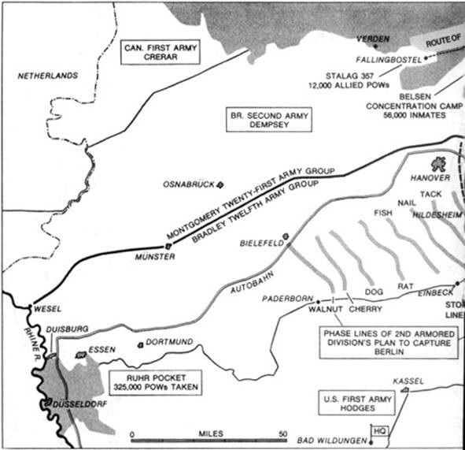
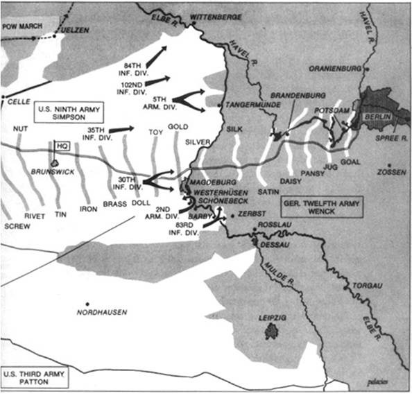
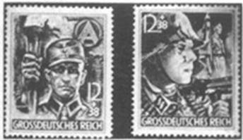

# Chương 5

Cuộc đua đã bắt đầu. Lịch sử chiến tranh chưa từng có đoàn quân hùng hậu nào lại di chuyển nhanh đến vậy. Tốc độ hành quân của quân Anh-Mỹ đang được đẩy nhanh, trên toàn mặt trận, cuộc tấn công đang được tiến hành dưới dạng một cuộc đua khổng lồ. Các tập đoàn quân tập trung vào mục tiêu giành được bờ sông Elbe, chiếm các đầu cầu để thắng trận đánh cuối cùng và kết thúc chiến tranh, nên mọi sư đoàn ở phía bắc và trung tâm mặt trận phía tây đều quyết tâm phải là người đầu tiên tới được bờ sông. Xa hơn, Berlin là mục tiêu cuối cùng, vẫn luôn là vậy.

Trong khu vực của Anh, Sư đoàn Thiết giáp 7 – những chú Chuột sa mạc danh tiếng – hầu như không ngừng nghỉ kể từ khi rời sông Rhine. Từ hồi vượt sông, Thiếu tướng Louis Lyne, tư lệnh Sư đoàn 7 đã nhấn mạnh rằng “mọi cấp bậc đều phải dán mắt vào sông Elbe. Một khi đã bắt đầu, chừng nào chưa tới nơi thì tôi còn chưa ra lệnh dừng lại, dù là đêm hay ngày cũng vậy… Chặng kế phải săn cho tốt.” Giờ đây, dù gặp phải kháng cự mạnh mẽ từ quân địch, những chú Chuột sa mạc vẫn đang tiến lên trung bình 20 dặm một ngày.

Chuẩn úy trung đoàn Charles Hennell nghĩ rằng “Sư đoàn 7 có quyền và có khả năng chiếm được thủ đô để làm phần thưởng cho những nỗ lực miệt mài và lâu dài củ mình, từ hồi còn ở Sa mạc phía tây.” Hennell chiến đấu ở Chuột sa mạc từ trận El Alamein. Chuẩn úy Eric Cole còn có lý do phải tới Berlin thuyết phục hơn. Là một cựu binh trong trận Dunkirk, anh từng bị quân Đức dồn ra biển hồi năm 1940. Giờ Cole đang quyết tâm chuẩn bị để san bằng tỉ số. Anh thường bảo đội ngũ thiết giáp phải giữ trang thiết bị cơ khí ở tình trạng vận hành tốt nhất. Cole định đánh cho bọn Đức đang ở phía trước sư đoàn phải chạy về Berlin.

Người của Sư đoàn Không vận 6 của Anh đã từng dẫn đầu các đồng hương của mình đến Normandy vào ngày D-Day; và họ quyết sẽ dẫn đầu cho đến ngày cuối cùng. Trung sĩ Hugh McWhinnie đã nghe ngóng từ các tù binh Đức là khi quân Anh qua được sông Elbe, quân địch sẽ “mở toang cửa để họ tới thẳng Berlin.” Anh rất nghi ngờ điều đó. Sư đoàn 6 đã chiến đấu giành từng dặm đất. Đại úy Wilfred Davison của Tiểu đoàn Dù 13 chắc chắn là sẽ có một cuộc đua giành lấy thành phố, nhưng giống như đa số trong sư đoàn, anh không hề nghi ngờ gì “Sư đoàn 6 đang dẫn đầu.” Nhưng ở bộ chỉ huy sư đoàn, Đại úy John L. Shearer bắt đầu thấy hơi lo lắng. Anh nghe đồn là “Berlin sẽ được giao cho Mỹ.”

Các sư đoàn không vận của Mỹ cũng nghe lời đồn tương tự. Vấn đề là nó không nhắc tới quân dù. Ở nơi đóng quân của Sư đoàn Không vận 82 của Thiếu tướng John Gavin, nơi các lính dù đã huấn luyện nhiều ngày nay, họ thấy rõ ràng là cuộc đổ bộ xuống Berlin coi như xong. Có lẽ chiến dịch nhảy dù sẽ chỉ diễn ra nếu quân địch đột ngột sụp đổ, khiến kế hoạch Nhật thực đi vào thực tiễn, khi đó sẽ cần quân dù đến Berlin làm nhiệm vụ chính trị. Nhưng chuyện này thật quá xa vời. SHAEF đã chỉ đạo cho Tập đoàn quân Không vận số 1 của Trung tướng Lewis Brereton là sẽ sớm có các cuộc đổ bộ cứu viện xuống các trại tù binh chiến tranh của phe Đồng minh, dưới bí danh “Chiến dịch Hân hoan.” Dù cũng rất muốn giải cứu các tù binh chiến tranh, nhưng viễn cảnh thực hiện chiến dịch giải cứu thay vì một nhiệm vụ chiến đấu khiến mọi người trong tập đoàn quân chẳng mấy hân hoan.

Sự chán nản tương tự ngập tràn trong các đoàn quân không vận khác. “Những con đại bàng la hét” của Sư đoàn không vận 101 của Đại tướng Maxwell Taylor từng chiến đấu như bộ binh không chỉ một lần, lần này là ở Ruhr. Một trung đoàn trong sư đoàn 82 của tướng Gavin cũng nhận được lệnh tới đó. Sư đoàn 82 cũng nhận được chỉ thị phải hỗ trợ Cụm Tập đoàn quân 21 của Montgomery trong chiến dịch vượt sông Elbe sau này.

Binh nhì Arthur Schultz “Hà Lan” của Trung đoàn dù 505 có lẽ là đại biểu phù hợp nhất cho cảm giác của những người lính dù. Anh trèo lên một chiếc xe tải đang hướng về Ruhr, tỏ vẻ bất cần nói với anh bạn mình là binh nhì Joe Tallett, “Vậy đó. Tôi dẫn bọn họ tới Normandy, phải không? Tới Hà Lan, phải không? Nhìn tôi này, nhóc. Tôi là một anh Mỹ quý phái và đất nước chỉ có một tôi mà thôi. Họ muốn tiền bỏ ra phải đáng đồng tiền bát gạo. Họ không đời nào để tôi phí hoài ở Berlin đâu. Chết tiệt, đời nào! Họ để dành lại thôi! Họ sẽ bảo tôi đổ bộ xuống Tokyo!”

Nhưng nếu như các sư đoàn không vận bị mất tinh thần, thì các tập đoàn quân trên bộ lại đang tràn đầy cảnh giác.

Ở trung tâm, các đội quân Mỹ đang tung hết sức và sức mạnh của họ thật dữ dội. Với sự trở lại của Tập đoàn quân 9 hùng mạnh của tướng Simpson từ Cụm Tập đoàn quân 21 của Montgomery, Bradley đã trở thành vị tướng đầu tiên trong lịch sử Mỹ chỉ huy bốn tập đoàn quân. Ngoài Tập đoàn quân 9, lực lượng của ông còn có các tập đoàn quân 1, 3 và 15 – gần 1 triệu lính.

Ngày 2/4, chỉ 9 ngày sau khi vượt sông Rhine, quân của ông đã hoàn thành xong cái bẫy bao vây sông Ruhr. Cụm Tập đoàn quân B của Thống chế Walter Model với quân số không ít hơn 325.000 người bị kẹt trong ngõ cụt rộng 4.000 dặm vuông. Một khi Model bị vây, mặt trận phía tây liền rộng mở và Bradley mạnh mẽ càn lướt qua, để lại một phần của tập đoàn quân 1 và 9 để càn quét ngõ cụt đó. Giờ quân của ông đang phấn khích hò hét không ngừng. Bradley đang tiến như vũ bão qua vùng trung tâm nước Đức, về hướng Leipzig và Dresden, với quân Anh ở sườn bắc và Cụm Tập đoàn quân 6 Hoa Kỳ của tướng Devers. Trong số các tập đoàn quân trên trận tuyến từ bắc xuống nam của Mỹ, Tập đoàn quân 9 là gần sông Elbe nhất, và các vị tư lệnh thấy là có vẻ Bradley đã cho phép Simpson theo đà xốc tới Berlin.

Ngày vòng vây vùng Ruhr hoàn thành, Eisenhower bèn ra lệnh cho các đoàn quân của ông. Cánh của Bradley sẽ “càn quét vùng… Ruhr, phát động một cuộc tấn công với trục chính là Kassel-Leipzig… tìm cơ hội chiếm một đầu cầu ở sông Elbe và chuẩn bị thực hiện các chiến dịch sau khi vượt sông.” Ngày 4/4, ngày Tập đoàn quân 9 quay về với ông, Bradley cũng đưa ra các mệnh lệnh mới cho các tập đoàn quân của mình. Trong “Thư chỉ thị số 20,” Tập đoàn quân 9 được lệnh, thứ nhất là tiến về phía nam Hanover, trung tâm đoàn quân sẽ nằm ở thành phố Hildersheim – cách sông Elbe khoảng 70 dặm. Rồi “khi có lệnh,” giai đoạn 2 sẽ bắt đầu. Đây là đoạn quan trọng nêu lên vai trò của Tập đoàn quân 9, và cho thấy đích đến của đoàn quân, theo các vị tư lệnh của nó. Đoạn văn viết: “Giai đoạn 2. Tiến về phía đông… tìm mọi cơ hội có thể để chiếm một đầu cầu bên sông Elbe và chuẩn bị tiếp tục tiến về Berlin theo hướng đông bắc.” Giai đoạn 1 – mũi tấn công vào Hildersheim – có vẻ đơn giản chỉ là một mệnh lệnh trực tiếp. Chả ai trấn giữ ở đó. Nhưng giai đoạn 2 là lá cờ hiệu mà mọi sư đoàn trong Tập đoàn quân 9 đang chờ đợi, và không ai phấn khích hơn tư lệnh của nó, Trung tướng William Simsonp “Simp lớn.”\[48\]

Sau này, tướng Simpson nhớ lại, “Người của tôi đều được lên dây cót. Chúng tôi là những người đầu tiên đến được sông Rhine và giờ sắp thành những người đầu tiên đến được Berlin. Chúng tôi chỉ nghĩ đến một điều duy nhất – chiếm Berlin, vượt qua đó và gặp quân Nga ở phía bên kia.” Từ lúc Thư chỉ thị đưa xuống cụm tập đoàn quân, Simpson đã không lãng phí một giây phút nào. Ông mong sẽ tới Hildesheim trong mấy ngày nữa. Simpson nói với các sĩ quan tham mưu của ông là sau đó ông định “dùng một sư đoàn thiết giáp và một sư đoàn bộ binh đi theo xa lộ từ Magdeburg bên sông Elbe tới Postdam, nơi đó rất gần Berlin.” Rồi Simpson định đưa phần còn lại của tập đoàn quân 9 “đi càng nhanh càng tốt… nếu chúng ta chiếm được đầu cầu và bọn họ để chúng ta được rảnh chân rảnh tay.” Ông vui vẻ nói với ban tham mưu “Chết tiệt, tôi muốn tới Berlin và tôi cá là tất cả các cậu, đến cả anh binh nhì cuối cùng cũng muốn thế.”

Thiếu tướng Isaac D. White, vị tư lệnh mảnh khảnh nhưng dẻo dai và quyết đoán của Sư đoàn Thiết giáp 2 “Bánh xe địa ngục,” đã nhanh chân đi trước Simpson một bước: kế hoạch chiếm Berlin của ông thậm chí đã sẵn sàng từ khi người của ông còn chưa vượt sông Rhine. Tư lệnh Tác chiến của White, Đại tá Briard P. Johnson, đã lập kế hoạch cho cuộc tấn công vào thủ đô từ mấy tuần trước. Kế hoạch của ông tỉ mỉ tới mức các mệnh lệnh chi tiết và các lớp bản đồ đã sẵn sàng từ 25/3.

Kế hoạch tấn công của sư đoàn 2 khá giống với quan điểm riêng của Simpson. Nó cũng đi theo xa lộ từ Magdeburg bên sông Elbe. Đà tiến quân dự kiến hàng ngày được vẽ trên các lớp phủ bản đồ, và mỗi giai đoạn đều có mật danh. Cuộc tiến công cuối cùng cách Naddeburg khoảng 60 dặm, gồm các giai đoạn mang tên: “Bạc,” “Lụa,” “Satin,” “Hoa cúc,” “Hoa păn-xê,” “Bình” và cuối cùng, in trên một hình chữ vạn ngược to, màu xanh phủ kín Berlin là mật danh “Đích.” Với tốc độ trung bình của sư đoàn 2, thường đạt 35 dặm một ngày, và chỉ phải gặp kháng cự rải rác, White tự tin sẽ chiếm được thủ đô. Nếu người của ông có thể giành được một đầu cầu ở Magdeburg, giờ chỉ còn cách họ có 80 dặm, White đoán mình có thể tới được Berlin chỉ trong vòng 48 tiếng.

Giờ đây, dọc theo mặt trận hơn 50 dặm có lẻ của Tập đoàn quân 9, Sư đoàn Thiết giáp 2 của White đang là mũi nhọn của cuộc tiến công. Sư đoàn này là một trong số những đội hình lớn nhất của mặt trận phía tây. Những chiếc xe tăng, súng tự động, xe bọc thép, xe ủi, xe tải, xe jeep và pháo của nó xếp thành một hàng dài hơn 72 dặm. Để có hiệu quả chiến đấu cao nhất, cả lực lượng được chia thành 3 đơn vị thiết giáp – Đơn vị Chiến đấu A, B và R, cái sau cùng là quân dự bị \(reverse\). Dù vậy, di chuyển nối đuôi nhau với tốc độ trung bình 2 dặm một giờ, sư đoàn mất gần 12 giờ để vượt qua một điểm định trước. Đội quân thiết giáp nặng nề này đang dẫn đầu các đơn vị khác của Tập đoàn quân 9 – chỉ có một ngoại lệ đáng chú ý khác.

Bên cánh phải, đang gan lì đua từng dặm một cùng Sư đoàn 2 là một tập hợp xe vận tải lộn xộn chở đầy nghẹt lính. Nhìn từ trên cao, trông nó không giống một sư đoàn bộ binh hay thiết giáp chút nào. Thực sự thì, trừ một số xe tải quân đội của Mỹ rải rác giữa đội hình, nó hoàn toàn có thể bị lầm là một đoàn xe Đức. Sư đoàn bộ binh 83 mang đậm tính cá nhân của Thiếu tướng Robert C. Macon, “Rạp xiếc Rách rưới,” đang chạy hết tốc lực tới sông Elbe bằng những chiến lợi phẩm chiếm được của mình. Cứ mỗi đội quân hoặc thành phố của địch đầu hàng hay bị chiếm lại cung cấp thêm xe cho sư đoàn này, thường bằng cách chĩa súng đe dọa. Mọi chiếc xe mới chiếm được đều được sơn qua quýt một lớp màu xanh olive và vẽ ngôi sao Hoa Kỳ bên hông; thế là nó gia nhập sư đoàn 83. Người của Rạp xiếc Rách rưới thậm chí còn chiếm được một chiếc máy bay của Đức, và khó khăn hơn, còn tìm được người lái nó, khiến toàn mặt trận sửng sốt. Hạ sĩ quan William G. Presnell của Sư đoàn Bộ binh 30 từng chiến đấu từ bờ biển Omaha tới tận đây, anh biết rõ hình dạng từng chiếc máy bay chiến đấu của Không quân Đức. Vậy nên khi thấy một chiếc máy bay rõ ràng là của Đức đang bay về phía mình, anh hét lên “ME-109!” rồi nhào xuống ẩn nấp. Hoang mang vì không nghe tiếng súng máy nổ, anh ngẩng đầu lên và thấy chiếc máy bay chiến đấu bay đi mất. Chiếc máy bay được sơn màu xanh olive lem nhem. Bên dưới cánh của nó là hàng chữ “Sư bộ binh 83.”

Nếu như xe của sư đoàn 83 khiến những người đồng hương của họ bối rối, thì người Đức thậm chí còn bối rối hơn. Khi sư đoàn đang lao như điên tới sông Elbe, Thiếu tá Haley Kohler chợt nghe tiếng còi xe inh ỏi. Ông nhớ lại, “Chiếc Mercedes đó xuất hiện đằng sau bọn tôi, rồi bắt đầu vượt qua mọi chiếc xe trên đường.” Đại úy John J. Devenney cũng thấy chiếc xe. Anh nhớ là “Chiếc xe đó len lỏi trong hàng ngũ bọn tôi, đi cùng hướng.” Khi nó đi qua, Devenney choáng váng khi thấy đó là một chiếc xe sĩ quan Đức với một đám sĩ quan trên đó. Một tràng súng máy nổ chặn chiếc xe lại, và các sĩ quan Đức bị bắt vì cứ tưởng đang đi giữa quân mình. Chiếc Mercedes, trong tình trạng hoàn hảo, lại được sơn vội vàng như thường lệ và đưa vào sử dụng ngay lập tức.

 

_Tấm bản đồ biểu thị đường tấn công Berlin của Tập đoàn quân 9 Hoa Kỳ_

Tướng Macon quyết đưa Sư đoàn 83 trở thành sư đoàn bộ binh đầu tiên vượt sông Elbe và tới được Berlin. Sự ganh đua giữa Sư đoàn 83 và Sư đoàn Thiết giáp 2 giờ căng thẳng tới mức theo như Macon nói, khi các đơn vị dẫn đầu của hai sư đoàn tới được sông Weser cùng một lúc vào ngày 5/4, “có một trận tranh cãi đáng kể, xem ai là người được vượt sông trước.” Dần dần, họ đi đến thỏa hiệp: hai sư đoàn cùng vượt sông, bằng cách xen kẽ các đơn vị của mình với nhau. Ở bộ chỉ huy của Sư đoàn 83, có tin đồn là tướng White nổi trận lôi đình với Rạp xiếc Rách rưới. Vị tư lệnh của Sư đoàn 2 nói “Không một sư đoàn bộ binh chết tiệt nào có thể đánh bại được quân của tôi trên đường tới sông Elbe.”

Sư đoàn 2 còn đang tham gia một cuộc đua khác. Sư đoàn Thiết giáp 5, “Sư đoàn Chiến thắng,” đang tiến nhanh gần như ngang bằng với quân của White, và cũng có kế hoạch chiếm thủ đô riêng. Đại tá Gilbert Farrand, Tham mưu trưởng Sư đoàn 5 kể lại, “Vấn đề lớn nhất lúc này là ai tới được Berlin trước. Chúng tôi định vượt sông Elbe ở Tangermünde, Sandau, Arneburg và Werben. Chúng tôi nghe nói quân Nga đã sẵn sàng xuất phát, vậy nên cần phải chuẩn bị mọi thứ có thể.” Theo Farrand nhớ lại, sư đoàn của ông di chuyển liên tục, tới mức không có ai ngủ nhiều hơn 4 hay 5 tiếng một đêm – và thường chẳng có ai ngủ cả. Vì liên tục hành quân, chiếc half-track của Farrand giờ biến thành bộ chỉ huy của sư đoàn. Tiến trình của Sư đoàn 5 được hỗ trợ một phần lớn từ sự kháng cự rải rác của địch. Farrand nói, “Quá trình hành quân chẳng có gì ngoài việc phá vỡ các hoạt động phòng vệ hậu phương.” Nhưng điều đó cũng có thể nguy hiểm chết người, khi Farrand thấy một quả đạn pháo sượt qua chiếc half-track của mình.

Trong số các sư đoàn bộ binh, các sư đoàn 84, 30 và 102 cũng dòm ngó Berlin. Đâu đâu ở Tập đoàn quân 9 cũng vậy, những người lính mệt mỏi và đầy bụi bẩn vừa ăn vừa đi, hi vọng sẽ có mặt trong trận chiến. Đà tiến công thật tươi sáng. Nhưng dù quân địch không có kiểu phòng ngự thống nhất, thì vẫn có giao tranh – và đôi khi khá ác liệt.

Trong một số vùng, có những kẻ ngoan cố chống cự dữ dội trước khi đầu hàng. Trung tá Roland Kolb của Sư đoàn 84 “Những kẻ phá đường tàu” nhận thấy các nhóm SS rải rác, trốn trong rừng và tấn công liên miên là chiến đấu mạnh mẽ nhất. Các đội quân thiết giáp thường đi vòng tránh những đám tàn dư cuồng tín này và để chúng cho bộ binh xử lý. Những cuộc chạm trán nảy lửa thường xảy ra trong các thị trấn nhỏ. Trên đường tiến quân, có lúc Kolb bị sốc khi phát hiện một đám trẻ con chừng mươi mười hai tuổi đang nã pháo. Ông nhớ lại, “Bọn chúng thà chiến đấu đến chết chứ không chịu đầu hàng.”

Những người khác cũng trải qua những khoảnh khắc kinh hoàng như vậy. Thiếu tá James F. Hollingsworth, chỉ huy đội tiên phong của Sư đoàn Thiết giáp 2 đột nhiên bị một đám xe tăng Đức bao vây gần những rặng cây ở Teutoburger Wald. Đội ngũ của ông đã chạy thẳng vào khu huấn luyện xe thiết giáp của Đức. May cho Hollingsworth, mấy chiếc xe tăng đó chỉ còn là phế liệu, vì động cơ đã bị lấy ra từ lâu. Nhưng súng của chúng vẫn còn nguyên, để dùng trong huấn luyện, và quân Đức nhanh chóng khai hỏa, Thượng sĩ Clyde W. Cooley, cựu binh ở Bắc Phi và là xạ thủ của chiếc xe tăng của Hollingsworth cũng lập tức hành động. Anh quay tháp pháo, hạ gục một chiếc xe tăng Đức cách đó 1.400 m. Anh lại quay tiếp và làm nổ tung một chiếc khác cách đó 70 mét. Hollingsworth nhớ lại, “Hai bên khai hỏa, và mọi thứ tan tành.” Ngay khi trận đánh kết thúc, một chiếc xe tải Đức chật ních lính chạy loạng choạng trên đường, về phía đội hình của Sư đoàn 2. Hollingsworth vội vàng ra lệnh quân mình chờ tới khi chiếc xe tải lọt vào tầm bắn. Còn cách 70 mét, ông ra lệnh khai hỏa. Chiếc xe tải bị 50 khẩu súng máy bắn thành tổ ong, bốc cháy bừng bừng rồi lật nhào, đám lính mặc đồng phục ngồi trên đó văng ra đường. Đa số đã chết, nhưng vài tên vẫn sống sót và kinh hoàng kêu la. Đến khi lại gần để quan sát mấy cái xác cháy đen thủng lỗ chỗ, Hollingsworth mới phát hiện đây là các nữ quân nhân Đức – tương đương với lực lượng WAC của Mỹ\[49\].

Sự kháng cự hoàn toàn không thể đoán trước được. Nhiều nơi đầu hàng mà không cần bắn một viên đạn nào. Tại một số thị trấn và thành phố, trong khi các thị trưởng đã đầu hàng, đám quân Đức đang rút lui vẫn di chuyển qua các khu vực có dân cư, thường là cách bộ binh và xe tăng Mỹ không đầy một khu nhà. Ở Detmold, nơi tọa lạc của một trong những xưởng vũ khí lớn nhất của Đức, một người dân đã đến gặp chiếc xe tăng dẫn đầu của Tiểu đoàn Trinh sát 82 của Trung tá Wheeler G. Merriam, đang đi trinh sát cho Sư đoàn Thiết giáp 2. Người đại diện đó thông báo là người quản lý nhà máy muốn đầu hàng. Merriam nhớ lại, “Khi đi vào đó, đạn pháo rơi đầy quanh chúng tôi. Đứng bên ngoài nhà máy có người quản lý, giám đốc nhà máy và các công nhân. Người quản lý nói ngắn gọn về việc đầu hàng, rồi tặng tôi một khẩu súng lục Mauser chạm trổ rất đẹp.” Cách đó mấy khu nhà, lại có một công ty chuyên trách phát lương cho toàn nước Đức đầu hàng Merriam – cùng với một lượng lớn tiền giấy. Nhưng sau đó vài tiếng đồng hồ, bộ binh Mỹ đến sau Merriam lại phải đánh một trận dữ dội và dài hơi hơn ở chính thị trấn đó. Thì ra, Detmold là trung tâm của một vùng huấn luyện lính SS.

Các vụ việc tương tự xảy ra khắp nơi. Ở một số thành phố nhỏ, sự yên lặng ở một khu đã đầu hàng có thể thình lình bị phá vỡ bởi tiếng đánh nhau ầm ĩ cách đó vài dãy phố. Tướng Macon, tư lệnh Sư đoàn 83 nhớ lại, trên con đường chính của một thành phố giống như vậy, “tôi đi qua cổng trước của bộ chỉ huy của mình khá an toàn, nhưng khi tôi định đi ra cửa sau, tôi phải chiến đấu rất chật vật mới ra ngoài được.” Ở ngoại ô một thị trấn, Sư đoàn Bộ binh 30 gặp một tốp lính Đức cầm những khẩu súng trường buộc khăn trắng. Họ cố gắng đầu hàng quân Mỹ, trong khi đang bị một đám SS chĩa súng máy vào lưng, bọn chúng vẫn tiếp tục chiến đấu.

Một số người đã tìm ra cách bảo vệ những kẻ đầu hàng. Đại úy Francis Schommer của Sư đoàn 83 nói tiếng Đức rất trôi chảy, đã mấy lần thực hiện thỏa hiệp đầu hàng qua điện thoại – được hỗ trợ bằng khẩu Colt 45, Schommer chĩa súng vào viên thị trưởng vừa bị bắt, nói với ông ta rằng “tốt hơn hết là ông nên gọi điện cho ông thị trưởng của thành phố kế tiếp, và bảo ông ta nếu muốn nơi đó được nguyên vẹn thì nên đầu hàng ngay đi. Bảo ông ta cho người treo cờ trắng ngoài cửa sổ - hay đại loại thế.” Viên thị trưởng hoảng sợ “thường sẽ làm theo ngay, nói với người hàng xóm là quân Mỹ đang ở trong thành phố của ông, họ có hàng trăm xe tăng và pháo cối, rồi hàng nghìn hàng vạn quân lính. Cái mẹo này liên tục có hiệu quả.”

Khi đà tấn công dần tăng, các nẻo đường trở nên chật ních lính và các đội xe thiết giáp đi về phía đông, cùng hàng nghìn tù binh Đức đi về phía tây. Thậm chí họ không có thời gian xử lý tù binh. Các sĩ quan và binh lính Đức đầy mệt mỏi, râu chưa cạo, chậm chạp lê bước đi về sông Rhine mà không có ai áp giải. Một số người vẫn còn mang vũ khí. Giáo sĩ Ben L. Rose của Trung đoàn Kỵ binh Cơ giới 113 nhớ lại vẻ tuyệt vọng của hai sĩ quan vẫn còn mặc quân phục nghiêm chỉnh, đi bên cạnh đội ngũ của ông, “cố tìm một người nào đó để ý đến họ đủ lâu để tịch thu vũ khí của bọn họ.” Nhưng những người lính một lòng muốn gia tăng số dặm đi được, nên chỉ đơn giản đẩy họ đi về phía tây.

Các thành phố và thị trấn thi nhau đầu hàng theo bước đường hành quân. Vài người từng nghe qua tên các thành phố này trước đó, nhưng dù thế nào thì chẳng ai ở lại đủ lâu mà nhớ nổi tên chúng. Những nơi như Minden, Bückeburg, Tündern và Stadthagen đơn thuần chỉ là cột mốc trên đường tới sông Elbe. Nhưng Sư đoàn 30 lại gặp phải một cái tên quen thuộc – quen tới mức hầu hết bọn họ đều ngạc nhiên khi biết nó thực sự tồn tại. Đó là thành phố Hamelin, thành phố của Người thổi sáo danh tiếng\[50\]. Sự chống cự tự sát của một số nhóm SS mà trước đó Sư đoàn Thiết giáp 2 đã đi vòng qua, cùng với loạt pháo trả đũa nặng nề của Sư đoàn 30 đã khiến thành phố trong truyện cổ tích này, nơi có những ngôi nhà bánh gừng và đường phố rải sỏi, biến thành một đống đổ nát cháy đen vào ngày 5/4. Đại tá Walter M. Johnson của Trung đoàn 117 nói, “Lần này, chúng ta đã đuổi được lũ chuột bằng một loại sáo khác.”

Ngày 8/4, Sư đoàn 84 đã tới được ngoại ô thành phố Hanover có từ thế kỷ 15. Trên chặng đường dài đi từ sông Rhine, với dân số 400.000 người, Hanover là thành phố lớn nhất rơi vào tay một sư đoàn bất kỳ của Tập đoàn quân 9. Thiếu tướng Alexander R. Bolling, tư lệnh Sư đoàn 84 vốn định đi vòng qua thành phố, nhưng lại có lệnh phải chiếm nơi này. Bolling không được vui cho lắm. Đưa quân vào Hanover sẽ làm ông mất ối thời gian quý báu trong cuộc đua tới Elbe cùng các sư đoàn bộ binh khác. Trận đánh khá dữ dội; nhưng chỉ trong 48 giờ, sự kháng cự đã biến thành các hành động nhỏ lẻ. Tự hào về năng lực của Sư đoàn 84, đồng thời nóng lòng muốn tiếp tục lên đường, Bolling vừa ngạc nhiên vừa sung sướng khi được Tư lệnh Tối cao ghé thăm tại Hanover, cùng với Tham mưu trưởng của ông là tướng Smith, và tướng Simpson của Tập đoàn quân 9. Bolling nhớ lại, vào cuối buổi gặp chính thức của họ, “Ike nói với tôi, ‘Alex, tiếp theo anh định đi đâu?’ Tôi đáp, ‘Thưa thống tướng, chúng tôi sẽ tiếp tục tiến về phía trước, chúng tôi sẽ đến Berlin và không gì có thể cản bước chúng tôi.’”

Theo Bolling kể, Eisenhower “đặt tay lên cánh tay tôi và nói, ‘Alex, cứ đi đi. Tôi chúc anh thật nhiều may mắn và đừng để ai chặn bước anh.’” Khi Eisenhower rời khỏi Hanover, Bolling tin rằng mình vừa có “một lời công nhận bằng miệng từ Tư lệnh Tối cao, cho phép Sư đoàn 84 đi đến Berlin.”

Cũng vào chủ nhật đó, ngày 8/4, Sư đoàn Thiết giáp 2, hiện đang dẫn trước Sư đoàn 83 một chút, đã tới được trận tuyến của giai đoạn 1, Hildesheim. Giờ đây, Sư đoàn 2 phải chờ lệnh mở màn giai đoạn 2 của cuộc tấn công. Tướng White rất vui khi có thể dừng lại. Sau khi đã hành quân với tốc độ như thế, bảo trì đã trở thành một vấn đề không nhỏ, và White cần ít nhất 48 giờ để sửa chữa. Ông hiểu là lần tạm dừng chân này cũng sẽ giúp các đơn vị khác theo kịp ông. Nhưng phần lớn binh sĩ, sau mấy ngày hành quân với tốc độ điên cuồng, lại thắc mắc sao mình lại bị cầm chân ở đây. Họ sốt ruột khi bị trì hoãn; trước đây, những lần dừng chân như thế này đã giúp quân địch có cơ hội tái cơ cấu và củng cố. Khi kết thúc đã cận kề, không ai muốn liều lĩnh. Hạ sĩ quan George Petcoff, một binh sĩ kỳ cựu trong trận Normandy rất lo về “trận chiến giành Berlin, vì tôi bắt đầu nghĩ là mình đã tới số.” Giáo sĩ Rose nhớ là có một người lính xe tăng đã mê tín về tương lai tới mức anh ta trèo ra ngoài chiếc xe tăng, nhìn hàng chữ “Joe can đảm” sơn đằng trước rồi bắt đầu cẩn thận xóa đi từ “can đảm.” Anh ta nói, “Từ nay trở đi, nó chỉ còn là Joe mà thôi.”

Nếu như các binh sĩ đang lo sợ vì bị trì hoãn thì các tư lệnh của họ – kể cả cấp trên trực tiếp của tướng White ở bộ chỉ huy Quân đoàn 19 – thậm chí còn đau đầu hơn. Thiếu tướng Raymond S. McLain, tư lệnh Quân đoàn 19 hi vọng sẽ không có chuyện gì ảnh hưởng đến kế hoạch của ông. Bất chấp tốc độ hành quân chóng mặt đó, ông không hề lo lắng về chuyện tiếp tế. Sức mạnh của quân đoàn của ông, với tổng cộng trên 120.000 người, giờ còn lớn hơn cả Tập đoàn quân Liên minh ở Gettysburg, và ông có 1.000 xe thiết giáp. Sau này McLain nói, với toàn bộ lực lượng này, ông “tuyệt đối không nghi ngờ gì trong vòng 6 ngày sau khi vượt sông Elbe” toàn bộ Quân đoàn 19 sẽ có mặt tại Berlin.

McLain nghe tin từ bộ chỉ huy của Simpson là lần dừng chân này chỉ là tạm thời – và do cả nguyên nhân chiến thuật lẫn chính trị. Kết quả là, thông tin của ông đã đúng trên cả hai phương diện. Phía trước họ là mặt trận tương lai của vùng chiếm đóng của Liên Xô, và lần dừng chân này giúp SHAEF có thời gian cân nhắc tình hình. “Đường dừng chân” về mặt địa lý của cả quân Anh-Mỹ và quân Nga vẫn chưa được quyết định. Do đó, khả năng đâm đầu đụng độ vẫn còn đó. Trước tình hình quân Đức không hề kháng cự tập trung, các bộ chỉ huy cấp cao hơn không định ngừng tấn công, họ chỉ phải cân nhắc một vấn đề nghiêm trọng: một khi vượt qua ranh giới chiếm đóng của Liên Xô, sớm hay muộn thì cũng phải trao lại cho Liên Xô mỗi một dặm họ chiếm được.

Ở điểm tiến quân gần nhất, họ chỉ còn cách Berlin có 125 dặm, và trên toàn mặt trận của Tập đoàn quân 9, binh lính đang chờ xuất phát, không hay biết về vấn đề nhạy cảm mà Bộ Tư lệnh Tối cao đang phải đối mặt. Họ có lý do để phấn khích. Binh nhất Carroll Stewart đang chờ mong được lần đầu nhìn thấy thủ đô của Đức vì anh nghe nói không thành phố nào ở châu Âu có thể sánh được cảnh sắc của Berlin.

Chuẩn úy James “Dixie” Deans của Không lực Hoàng gia Anh đứng nghiêm bên cạnh bàn làm việc, mau mắn chào viên đại tá Đức. Hermann Ostmann chào đáp lại cũng nhanh nhẹn không kém, ông là sĩ quan chỉ huy của Stalag 357, trại tù binh chiếm tranh giam quân Đồng minh ở gần Fallingbostel, phía bắc Hanover. Đó chỉ là một trong số chuỗi nghi thức quân sự mà người tù binh chiến tranh Deans và người giam giữ Ostmann phải thực hiện mỗi khi gặp nhau. Lần nào cũng một kiểu rập khuôn chuẩn xác như vậy.

Giữa hai người tồn tại một sự tôn trọng đầy cảnh giác và miễn cưỡng. Deans coi người sĩ quan – một sĩ quan trong Thế chiến thứ nhất, đang độ tuổi trung niên, bị liệt một tay nên không thể phục vụ ở những nơi khác – là một giám ngục ngay thẳng, phải làm công việc mình không thích. Về phần mình, Ostmann biết Deans, 29 tuổi, được các tù nhân chọn ra làm người phát ngôn, là một tay đàm phán quyết đoán và ngoan cố, có thể và thường xuyên khiến cuộc sống của ông gặp nhiều phiền muộn. Viên đại tá luôn biết rõ là quyền điều hành thật sự của trại giam Stalag 357 nằm trong tay anh chàng Deans mảnh khảnh này, nhờ sự kiểm soát tù nhân chặt chẽ của anh ta, và lòng trung thành không lay chuyển của họ với anh ta.

Deans là một huyền thoại. Anh là một phi công, bị bắn hạ ở Berlin vào năm 1940, rồi bị giam trong các trại tù binh chiến tranh từ hồi đó. Ở mỗi nơi, anh đã học thêm được ít nhiều về cách làm thế nào để đạt được quyền lợi tối đa cho mình và đồng bạn. Anh cũng học được nhiều về cách thương thảo với sĩ quan chỉ huy. Theo Deans, có một bước cơ bản: “Đơn giản là cứ gây rối liên miên.”

Giờ đây, Deans nhìn chằm chằm viên đại tá già nua, chờ nghe lý do của lệnh triệu tập lên văn phòng sĩ quan chỉ huy mới nhất.

Ostmann cầm một xấp đơn từ và nói, “Ở đây tôi có vài mệnh lệnh. Và tôi e là chúng tôi phải đưa anh cùng người của anh qua chỗ khác.”

Ngay lập tức Deans cảnh giác. Anh hỏi, “Đi đâu, thưa đại tá?”

Ostmann nói, “Về phía đông bắc. Chính xác là đâu thì tôi không biết, nhưng tôi sẽ có chỉ thị trên đường đi.” Rồi ông nói thêm, “Tất nhiên, anh phải hiểu là chúng tôi làm thế cũng vì an toàn của các anh thôi.” Ông ngừng lại và mỉm cười yếu ớt. “Quân của các anh đang đến gần hơn đấy.”

Deans đã biết thế nhiều ngày nay. Các hoạt động “tiêu khiển” trong trại đã giúp họ chế tạo được hai chiếc radio bí mật có chức năng cao. Một chiếc giấu trong chiếc máy hát cũ kỹ thường xuyên được sử dụng. Chiếc còn lại, một máy thu tí hon chạy pin, phát đi những tin tức mới nhất đến mọi người ở Stalag 357, nằm trong bộ đồ ăn của chủ nó. Từ những nguồn tin quý giá này, Deans biết là quân của Eisenhower đã vượt qua sông Rhine và đang chiến đấu ở vùng Ruhr. Các tù nhân vẫn chưa rõ phạm vi tiến quân của quân Anh-Mỹ – nhưng nếu người Đức phải dời trại tù binh thì chắc là khá gần.

“Thế sẽ đi bằng gì, thưa đại tá?” Deans hỏi, dù biết rõ là quân Đức luôn đưa tù binh đi bằng một cách duy nhất – đi bộ.

Ostmann nói, “Họ sẽ đi bộ từng hàng.” Rồi bằng một cử chỉ lịch sự, ông đưa ra một đặc quyền cho Deans. “Anh có thể đi xe với chúng tôi nếu anh muốn.” Deans từ chối, cũng lịch sự tương tự.

Anh hỏi, “Còn người ốm thì sao? Ở đây có nhiều người gần như không thể đi được.”

“Họ sẽ ở lại đây, chúng tôi sẽ để lại cho họ những gì có thể để hỗ trợ họ. Một số các anh cũng có thể ở lại với họ.”

Giờ Deans muốn biết khi nào tù binh sẽ được đưa đi. Có những lúc Ostmann ngờ là Deans cũng biết rõ về tình hình chiến trận như ông – nhưng có một điều ông chắc chắn là Deans không thể nghe nói được gì. Theo thông tin từ bộ chỉ huy, quân Anh đang tiến về Fallingbostel và giờ chỉ còn cách có 50 đến 60 dặm, trong khi quân Mỹ cũng chỉ cách Hanover 50 dặm về phía nam.

Ông nói với Deans, “Anh đi đi. Mấy cái này là mệnh lệnh dành riêng cho tôi.”

Khi rời khỏi văn phòng sĩ quan chỉ huy, Deans biết mình chẳng thể làm gì để giúp mọi người chuẩn bị cho chuyến đi. Lương thực rất thiếu thốn và hầu hết tù nhân đều ốm yếu, gầy mòn vì suy dinh dưỡng. Một hành trình dài mệt mỏi chắc chắn sẽ kết liễu mạng sống nhiều người. Nhưng khi quay lại trại để truyền lời về chuyến đi cho cả trại, anh âm thầm thề: dùng mọi mưu mẹo anh có thể nghĩ ra, từ trì hoãn, đình công cho tới các cuộc nổi loạn nho nhỏ, Dixie Deans định cùng toàn bộ 12.000 người ở trại Stalag 357 tới trận tuyến của quân Đồng minh.

Địa điểm của bộ chỉ huy của Tập đoàn quân 12 vừa mới thành lập cứ tránh né sĩ quan chỉ huy của nó, Đại tướng Walther Wenck. Văn phòng tư lệnh nằm ở miền bắc dãy Harz, cách Berlin khoảng 70 đến 80 dặm, nhưng Wenck đã ngồi xe hàng giờ rồi. Đường đi đen nghịt người di tản và xe cộ chạy theo cả hai chiều. Một số dân di tản chạy về hướng đông, tránh xa quân Mỹ; số khác lại vội vàng đi về phía tây vì sợ quân Nga. Những chiếc xe tải chở lính có vẻ cũng không có mục đích rõ rệt giống nạn dân. Anh lái xe Dorn của Walther nhấn còi liên tục, vất vả len lỏi trên đường. Khi đi vào sâu hơn về hướng tây nam, tình hình càng hỗn loạn hơn. Wenck dần dần thấy khó chịu và mệt mỏi. Ông tự hỏi, mình sẽ thấy gì khi tới được bộ chỉ huy?

Wenck đang đi theo một đường vòng quanh co để tới văn phòng của mình. Ông đã quyết định trước tiên đánh một vòng tới thành phố Weimar, nằm phía tây nam Leipzig, rồi mới đi tới bộ chỉ huy ở gần Bad Blankenburg. Dù chuyển hướng như thế sẽ khiến chuyến đi dài thêm gần một trăm dặm, nhưng Wenck có lý do để đi đường vòng. Tiền tiết kiệm cả đời của ông được gửi trong một ngân hàng ở Weimar, khoảng mười nghìn mark, và ông định rút hết toàn bộ. Nhưng khi chiếc xe đến gần thành phố, con đường tự dưng vắng vẻ lạ kỳ, và có tiếng súng nổ xa xa. Đi thêm vài cây số, xe dừng lại và quân cảnh Đức trình bày với viên tướng là xe tăng của Tập đoàn quân 3 Hoa Kỳ của Patton đã đến được ngoại ô. Wenck vừa thấy sốc, vừa thấy bị đánh lừa. Tình hình tệ hơn những gì ông được nghe từ bộ chỉ huy của Hitler nhiều. Ông không thể tin được là quân Đồng minh lại tiến nhanh như vậy – hay là nước Đức đã bị chiếm nhiều đến thế. Và cũng khó mà thừa nhận, dù thế nào thì mười nghìn mark của ông cũng bay đi mất.\[51\]

Từ bộ chỉ huy địa phương, các sĩ quan quân đội báo với Wenck là toàn bộ vùng Harz đang trong nguy hiểm, quân đang rút lui và khắp nơi đang bị địch đánh lấn vào sườn. Rõ ràng, bộ chỉ huy của ông đã rút khỏi đây. Wenck quay lại hướng Dessau, ở đó hẳn phải có một số đơn vị của ông. Ông phát hiện ra bộ chỉ huy của mình đóng trong một trường kỹ thuật quân đội gần Rosslau, cách Dessau khoảng 8 dặm về phía bắc. Ở đó, Wenck cũng khám phá ra sự thật về Tập đoàn quân 12.

Mặt trận của Tập đoàn quân 12 chạy dọc theo sông Elbe và phụ lưu của nó là sông Mulde trong khoảng 125 dặm – đại khái từ Wittenberge bên sông Elbe chạy theo hướng bắc nam tới một điểm phía đông Leipzig bên sông Mulde. Ở cánh phía bắc, đối diện với quân Anh là lực lượng của Thống chế Ernst Busch, Tổng tư lệnh của quân Tây Bắc. Ở phía nam là các đơn vị đã bị hành hạ thảm hại của Thống chế Albert Kesselring, Tổng tư lệnh quân phía Tây. Wenck có rất ít thông tin về sức mạnh của các lực lượng này. Trong quân khu của mình, giữa hai lực lượng này, Tập đoàn quân 12 chỉ tồn tại trên giấy. Ngoài các nhóm quân đang trấn giữ các điểm rải rác dọc sông Elbe, ông chẳng có gì ngoài phần tàn dư ít ỏi từ các sư đoàn ma. Ông phát hiện ra là các nhóm quân khác chưa được tổ chức, và thậm chí có những đơn vị còn chưa được hình thành. Số pháo ông có không di chuyển được, bị đặt vào những vị trí cố định quanh các thị trấn Magdeburg, Wittenberge, và gần các cây cầu bắc qua sông Elbe. Có một số súng tự động, một nhóm xe thiết giáp, và khoảng 40 xe chở lính Volkswagen dạng như xe jeep. Nhưng vào lúc này, Tập đoàn quân 12 của Wenck giỏi lắm chỉ có chừng một tá xe tăng.

Dù số tàn quân rải rác gộp lại cũng được khoảng 100.000 người, hiện tại còn lâu mới đạt tới con số 10 sư đoàn mà ông đã được hứa hẹn. Trong số phần tàn dư của các đơn vị với những cái tên ấn tượng – “Clausewitz,” “Potsdam,” “Scharnhorst,” “Ulrich von Hutten,” “Friedrich Ludwig Jahn,” “Theodor Körner” – còn lại khoảng 5 sư đoàn rưỡi, tương đương 55.000 người.

Ngoài các lực lượng đã sẵn sàng vào vị trí hoặc đang chiến đấu, phần lớn Tập đoàn quân 12 mới thành lập bao gồm các sĩ quan đang huấn luyện và các học viên sĩ quan đang rất háo hức. Cả Wenck lẫn Tham mưu trưởng của ông là Đại tá Günther Reichhelm đều không nghi ngờ gì về kết quả của các trận chiến sắp tới. Nhưng Wenck không muốn chịu thua cảnh tượng vỡ mộng này. Vốn trẻ tuổi và đầy nhiệt huyết, ông thấy được điều mà nhiều vị tướng lớn tuổi hơn có thể bỏ qua: những thiếu hụt về sức mạnh của Tập đoàn quân 12 có thể được bù đắp bằng sự kiên cường và cống hiến của các sĩ quan và học viên trẻ tuổi.

Wenck thấy đã có cách dùng lực lượng non choẹt nhưng đầy nhiệt huyết của mình làm quân tiên phong cơ động, đưa họ đi từ nơi này sang nơi khác khi cần – ít nhất cho tới khi các lực lượng khác của ông tái tổ chức và vào vị trí xong xuôi. Wenck tin là nếu làm thế thì những người lính trẻ tuổi và mạnh mẽ của ông có thể giành thêm chút thời gian quý báu cho nước Đức. Gần như bước hành động đầu tiên với tư cách tư lệnh của ông là ra lệnh cho các đội quân mạnh nhất, được trang bị tốt nhất của mình tiến vào các vị trí trung tâm ở sông Elbe hoặc Mulde để sử dụng. Nhìn vào bản đồ, Wenck khoanh tròn các vùng có thể có hành động – Bitterfeld, Dessau, Belzig, Wittenberge. Ông nghĩ, còn có một vùng khác, nơi quân Mỹ chắc chắn sẽ cố vượt sông Elbe. Nằm giữa ba binh chủng bên dòng sông, bị tàn phá trong Chiến tranh Ba mươi năm\[52\] và gần như bị hủy diệt hoàn toàn, thành phố Magdeburg đã hồi sinh. Giờ đây, pháo đài vĩ đại với tòa thành trì trên đảo và thánh đường có từ thế kỷ 11 của nó giống như một ngọn đèn hiệu trên đường tiến quân của Mỹ. Quanh vùng này – nhất là phía nam Magdeburg – Wenck đưa số quân được trang bị tốt nhất trong các đơn vị “Scharnhorst,” “Potsdam” và “Von Hutten” của ông vào để cầm cự trước các cuộc tấn công của Mỹ lâu hết mức có thể.

Hàng phòng thủ của ông đã được lên kế hoạch tới từng chi tiết cuối cùng, chiến thuật của ông đã được các sĩ quan thuộc nằm lòng. Giờ đây, tại bộ chỉ huy của Cụm Tập đoàn quân Vistula, cách Wenck khoảng 120 dặm về phía đông bắc, Gotthard Heinrici đã sẵn sàng cho trận chiến.

Heinrici đã dựng một Hauptkampflinie – phòng tuyến chính – thứ hai đằng sau phòng tuyến đầu tiên của ông. Ngay trước loạt pháo dự kiến của Nga, Heinrici nói với các tư lệnh của mình, ông sẽ di tản tiền tuyến. Toàn bộ quân lính sẽ rút lui ngay lập tức về Hauptkampflinie thứ hai. Đó là mưu kế cũ hồi ở Moscow của Heinrici, để quân Nga “đánh vào thành không nhà trống.” Ngay khi loạt pháo của Nga chấm dứt, quân lính phải tiến về phía trước và chiếm lại vị trí ban đầu ngoài tiền tuyến của mình. Mưu kế này từng rất hiệu quả trong quá khứ và Heinrici mong nó sẽ lại thành công. Như thường lệ, mấu chốt là phải xác định thời điểm tấn công của quân địch cho thật chính xác.

Đã có một vài đòn nghi binh. Trong quân khu của Tập đoàn quân Thiết giáp 3 của Von Manteuffel ở phía bắc Berlin, Đại tướng Martin Gareis, chỉ huy Quân đoàn Thiết giáp 46 yếu xìu, tin chắc là cuộc tấn công sẽ diễn ra vào ngày 8/4. Những chiếc xe nặng nề tiến về phía trước và những khẩu pháo được tập trung dày đặc ngay trước khu vực của Gareis có vẻ là dấu hiệu của một cuộc tấn công sắp xảy ra – và những tên lính Nga bị bắt đã phun ra ngày tấn công. Heinrici không tin các báo cáo đó. Tình báo riêng của ông, cộng thêm thói quen từ xưa là tin vào trực giác của mình, nói với ông rằng ngày đó quá sớm. Và kết quả là ông đã đúng. Trên toàn mặt trận sông Oder, ngày 8/4 trôi qua yên bình và chẳng có sự kiện gì.

Nhưng tinh thần cảnh giác của Heinrici vẫn không suy giảm. Mỗi ngày, ông đều bay qua trận tuyến của Nga bằng một chiếc máy bay trinh sát nhỏ, quan sát cách bố trí pháo và binh lính. Hàng đêm, ông lại cẩn thận nghiền ngẫm các báo cáo tình báo và thông tin thẩm vấn được từ tù binh, không ngừng tìm các dấu hiệu có thể chỉ ra ngày tấn công.

Giữa giai đoạn quan trọng và căng thẳng này, Thống tướng Hermann Goering lại triệu tập Heinrici đến dinh thự của ông ta dùng bữa trưa. Dù Heinrici cực kỳ mệt mỏi và miễn cưỡng rời bộ chỉ huy của mình dù chỉ vài giờ, ông không thể nào từ chối được. Karinhall, tòa tư dinh đồ sộ của ngài Thống tướng nằm cách bộ chỉ huy Vistula ở Birkenhain có mấy dặm. Đất ở đây rộng tới mức Goering có cả một vườn thú riêng. Khi tới gần, Heinrici và vị sĩ quan phụ tá, Đại úy von Bila choáng váng trước điền sản nguy nga của Goering, nơi đây trông như một công viên, với các hồ nước, vườn hoa, những bậc thềm đẹp đẽ và các con đường nhỏ trồng cây hai bên. Giữa con đường từ cổng chính đến tòa dinh thự là các đơn vị lính dù của Không quân mặc quân phục chải chuốt – lực lượng phòng vệ riêng của Goering.

Tòa dinh thự cũng giống bản thân chủ nhân nó, vừa đồ sộ vừa sang trọng. Sảnh tiếp khách khiến Heinrici liên tưởng tới “một nhà thờ thênh thang rộng lớn, đến mức mắt người ta tự động ngó lên xà nhà.” Goering ăn vận sang trọng với chiếc áo khoác đi săn màu trắng, lạnh lùng chào Heinrici. Thái độ của ông ta như một điềm báo trước, vì bữa ăn trưa tỏ ra là một thảm họa.

Hai vị thống tướng và thượng tướng không ưa nhau rõ rệt. Heinrici vẫn luôn trách Goering vì để thua trận Stalingrad, dù đã hứa hẹn đủ điều, nhưng rốt cuộc Không quân không thể hỗ trợ đám quân tan tác của Tập đoàn quân 6 của Von Paulus. Nhưng dù có ở đâu thì Heinrici cũng không ưa viên thống tướng vì tính kiêu căng và phô trương của ông ta. Về phần mình, Goering thấy Heinrici là một kẻ không chịu phục tùng và nguy hiểm. Ông chưa từng tha thứ cho viên thượng tướng vì đã để yên cho Smolensk chứ không chịu đốt nơi đó, và trong mấy ngày qua, sự chán ghét của ông đối với Heinrici đã gia tăng mãnh liệt. Nhận xét của Heinrici về Sư đoàn Dù 9 ở cuộc họp của Quốc trưởng khiến ông khó chịu sâu sắc. Ngày hôm sau buổi họp, Goering đã gọi đến bộ chỉ huy Vistula và nói chuyện với Đại tá Eismann. Viên thống tướng giận dữ nói, “Tôi không thể chấp nhận được là Heinrici lại có thể nói về quân dù của tôi bằng cách đó. Như thế là sỉ nhục cá nhân! Tôi vẫn còn Sư đoàn Dù 2 và anh có thể nói với tư lệnh của anh là tôi sẽ không giao họ cho ông ta đâu. Không đời nào! Tôi sẽ đưa họ đến chỗ Schörner. Đó là một quân nhân thực sự! Một quân nhân chân chính!”

Giờ đây, trong bữa trưa, Goering chĩa mũi dùi thẳng vào Heinrici. Ông ta bắt đầu bằng cách kịch liệt chê bai các đội quân mà ông ta đã thấy trong các chuyến đi gần đây tới mặt trận Vistula. Ngồi dựa lưng vào một chiếc ghế đồ sộ như ngai vàng, tay vung vẩy một cốc bia to bằng bạc, Goering buộc tội Heinrici đã để lỏng lẻo kỷ luật. Ông ta nói, “Tôi đã chạy xe qua khắp các tập đoàn quân của anh, và ở quân khu nào tôi cũng thấy bọn lính đang ngồi không! Tôi thấy có những tên ngồi trong hố cá nhân chơi bài nữa kia! Tôi thấy các công binh có người còn không có nổi cái thuổng mà làm việc. Có mấy chỗ không có bếp dã chiến cho lính! Ở mấy quân khu khác, người ta hầu như chả làm gì để xây dựng hàng rào phòng thủ cả. Khắp nơi tôi chỉ thấy người của anh đang lười chảy thây ra.” Nốc một ngụm lớn bia, Goering đe dọa nói, “Tôi định báo hết mấy chuyện này cho Quốc trưởng biết.”

Heinrici thấy tranh cãi chả ích gì. Ông chỉ muốn ra khỏi đây ngay. Cố kiềm chế cơn giận dữ, Heinrici làm sao đó cũng qua được bữa ăn. Nhưng khi Goering tiễn hai vị khách ra cửa, Heinrici đứng lại, chầm chậm nhìn quanh khung cảnh nguy nga tráng lệ cùng tòa dinh thự ấn tượng với các ngọn tháp và chái nhà đẹp đẽ. Ông nói, “Tôi chỉ có thể hi vọng là những kẻ lười chảy thây của tôi có thể cứu được dinh thự lộng lẫy của ngài khỏi những trận chiến đang chờ phía trước.” Goering lạnh lùng nhìn chăm chăm một lúc, rồi quay gót đi vào trong.

Trong lúc ngồi trên xe, Heinrici nghĩ, Goering sẽ không còn giữ Karinhall được lâu nữa đâu. Ông dần kết luận được thời điểm tấn công của quân Nga, dựa trên các báo cáo tình báo, những lần quan sát trên không, mực nước lũ đang xuống dần trên sông Oder và trực giác chưa từng phản bội một lần của mình. Heinrici tin là cuộc tấn công sẽ mở màn trong tuần này – đâu đó quanh quanh ngày 15 hoặc 16 tháng 4.

Nguyên soái Georgi Zhukov giở tấm khăn trải bàn, để lộ tấm bản đồ sa hình rộng lớn của Berlin. Nó giống mô hình hơn là bản đồ, với các tòa nhà chính phủ, các cây cầu và ga tàu hỏa mini, mô phỏng chính xác các tuyến đường chính, kênh đào và sân bay. Các cứ điểm phòng thủ dự kiến, các tháp phòng không và boongke đều được đánh dấu tỉ mỉ, có các nhãn màu xanh nho nhỏ đính trên các mục tiêu chủ chốt, có đánh số bên trên. Tòa nhà Quốc hội mang nhãn số 105, Dinh Thủ tướng là 106; số 107 và 108 là văn phòng bộ trưởng Bộ Nội vụ và Bộ Ngoại giao.

Vị nguyên soái quay sang các sĩ quan. Ông nói, “Nhìn mục tiêu số 105 này. Ai sẽ là người đầu tiên tới được tòa nhà Quốc hội? Chuikov cùng Tập đoàn quân Vệ binh 8? Katukov và đội xe tăng của ông ấy? Berzarin và Tập đoàn quân Tiên phong 5? Hay là Bogdanov cùng Tập đoàn quân Vệ binh 2? Là ai đây?”

Zhukov đang cố ý nhử các sĩ quan của mình. Mỗi người đều sốt ruột muốn tới thành phố trước, và nhất là chiếm được tòa nhà Quốc hội. Theo Trung tướng Nikolai Popiel kể lại cảnh tượng đó sau này, Katukov đột ngột nói, “Nghĩ mà coi. Nếu tôi tới được mục tiêu 107 và 108, tôi có thể tóm gọn cả Himmler và Ribbentrop một lượt!”

Buổi họp chiến thuật kéo dài cả ngày; ngoài mặt trận, công tác chuẩn bị cho các cuộc tấn công đã gần hoàn thành. Súng đạn đã được đưa vào vị trí trong rừng; xe tăng được đưa lên để có thể bắn hỗ trợ pháo binh khi đợt pháo kích khởi đầu. Một lượng lớn quân nhu, vật liệu xây cầu, xuồng cao su và bè đã sẵn sàng tại các khu vực tấn công, và xe tải chạy nghẹt đường, đưa các sư đoàn đến nơi tập hợp. Nhu cầu quân số dữ dội tới mức lần đầu tiên Nga phải dùng máy bay để chuyên chở quân từ hậu phương đến. Khắp nơi, người lính Nga nào cũng thấy rõ là cuộc tấn công sắp đến rồi, nhưng không có ai ở ngoài bộ chỉ huy biết được ngày chính xác.

Đại úy Sergei Ivanovich Golbov, phóng viên của Hồng quân, lái xe dọc theo mặt trận của Zhukov, quan sát công tác chuẩn bị rầm rộ. Golbov đã vận dụng mọi nguồn tin để tìm hiểu ngày tấn công, nhưng không thành công. Anh chưa từng chứng kiến công tác chuẩn bị trước trận chiến như thế này, và anh tin là quân Đức cũng đang dõi theo từng bước. Nhưng khá lâu sau này, anh nhận xét rằng, “Không ai bận tâm bọn Đức thấy được cái gì.”

Có một khía cạnh của công tác chuẩn bị khiến Golbov thấy kỳ lạ. Nhiều ngày nay, những chiếc đèn pha rọi máy bay đủ hình đủ cỡ được đưa đến mặt trận. Lực lượng đó toàn là nữ. Hơn nữa, các đơn vị này đóng cách tiền tuyến khá xa và ẩn giấu kỹ càng dưới tấm lưới ngụy trang. Golbov chưa bao giờ thấy nhiều đèn pha đến vậy. Anh thắc mắc chúng có thể làm được gì trong cuộc tấn công.

Ở Reichspostzentralamt tại Berlin, tòa nhà Quản trị Dịch vụ Bưu chính nằm ở quận Tempelhof, Bộ trưởng Bộ Bưu chính Wilheim Ohnesorge cúi người nhìn chồng tem màu sắc sặc sỡ nằm trên bàn. Chúng là loạt in đầu tiên, và Ohnesorge hết sức vui sướng với mớ tem. Người họa sĩ đã làm rất tốt và Quốc trưởng chắc chắn sẽ hài lòng với kết quả. Ông vui vẻ kiểm tra hai con tem kỹ hơn. Một cái vẽ một người lính SS với khẩu súng máy Schmeisser trên vai; cái còn lại vẽ một người lãnh đạo Đảng Nazi mặc đồng phục, tay phải giơ cao ngọn đuốc. Ohnesorge nghĩ đợt phát hành kỷ niệm đặc biệt này rất phù hợp với hoàn cảnh. Chúng sẽ được bán ra vào ngày sinh nhật của Hitler, ngày 20/4.

HAI CON TEM – ĐẠI TÁ HANS REFIOR CUNG CẤP

Một ngày đặc biệt cũng đang chiếm vị trí hàng đầu trong tâm trí Erich Bayer. Viên kế toán của quận Wilmersdorf đã lo lắng suốt nhiều tuần nay về việc ông sẽ làm gì vào thứ ba ngày 10/4 – ngày mai. Đó là lúc phải thanh toán; nếu không đủ kiểu rắc rối và thủ tục rườm rà sẽ xuất hiện. Bayer có tiền; đó không phải là vấn đề. Nhưng giờ nó còn ý nghĩa gì nữa không? Liệu đội quân chiếm được Berlin – Mỹ hoặc Nga – có để ý đến việc thanh toán? Và nếu không đội quân nào chiếm được thành phố thì sao? Bayer cân nhắc vấn đề trên mọi khía cạnh. Rồi ông tới ngân hàng và rút 1.400 mark. Bước vào văn phòng gần đó, ông thực hiện thủ tục thanh toán cần thiết cho khoản thuế thu nhập trong năm 1945 của mình.

Chuyện xảy ra nhanh tới mức ai cũng bàng hoàng. Ở mặt trận phía tây, tại bộ chỉ huy Tập đoàn quân 9, tướng Simpson ngay lập tức ra lệnh cho hai tư lệnh quân đoàn của mình, Thiếu tướng Raymond S. McLain của Quân đoàn 19 và Thiếu tướng Alvan Gillem của Sư đoàn 13. Simpson nói, mệnh lệnh chính thức sẽ có sau, nhưng giờ lệnh là “Xuất phát.” Giai đoạn 2 bắt đầu. Đó là tin chính thức. Các sư đoàn sẽ đến sông Elbe – và xa hơn nữa. Ở bộ chỉ huy của Sư đoàn Thiết giáp 2, tướng White được tin và ngay lập tức gửi cho Đại tá Paul A. Disney, tư lệnh Trung đoàn Thiết giáp 67, đơn vị tiên phong số 2. Disney nhớ lại, khi tin tức đến, “Tôi hầu như không có thì giờ nói một tiếng ‘Xin chào’ thì tướng White nói, ‘Tiến về phía đông.’” Nhất thời, Disney sửng sốt. Đoàn quân dừng chân chưa đầy 24 tiếng. Vẫn mù mờ, ông hỏi, “Mục tiêu là gì?” White trả lời gọn lỏn một chữ, “Berlin!”

