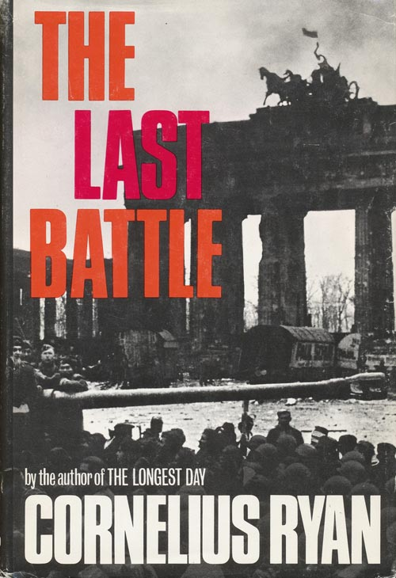

# Lời người dịch

Hồi cấp 3 mình từng đọc qua cuốn này, hồi đó có người quen mượn trong thư viện giùm, vốn chỉ định đọc để rèn tiếng Anh ai ngờ mê luôn. Về sau muốn tìm mua mà ko dc, mua trên Amazon thì ko đủ lúa. Hôm trước tình cờ tìm được ebook, chứ trước đó tìm hoài ko thấy. Mình nổi hứng lên đọc lại, dù sao cũng lâu quá rồi, cỡ 7-8 năm gì đó, nội dung chả còn nhớ bao nhiêu. Sẵn dịch lại cho các bạn ~~thím~~ cùng đọc cho vui. Mình thấy đây là một cuốn sách đề tài chiến tranh khá hay, nói về những tháng cuối cùng của WWII. Tác giả đã phỏng vấn hàng trăm binh sĩ, dân thường và tướng lĩnh để viết nên cuốn này (trừ tướng Zhukov của Liên Xô không được phép phỏng vấn). Sách kể lại diễn biến cuộc chiến chiếm Berlin và cuộc sống của thường dân và binh sĩ trong giai đoạn đó.

### Thông tin cơ bản:
* Tác giả: Cornelius Ryan
* Năm xuất bản lần đầu: 1966
* Độ dài: 576 trang 

Tác giả này còn 2 cuốn cũng về WWII cũng khá nổi tiếng là The Longest Day (viết về cuộc đổ bộ D-Day) và A Bridge Too Far (kể về cuộc chiến Arnhem, một thất bại dc quân Đồng minh lấp liếm). Mình định xong cuốn này sẽ kiếm ebook 2 cuốn này đọc thử.

Sách gồm 5 phần, cuối mỗi phần có khá nhiều ảnh về cảnh và người trong cuộc chiến. Mình rất thích mấy tấm ảnh này. Mình sẽ đăng lần lượt từng chương một. Vì trình độ có hạn nên không đảm bảo không có sai sót, đặc biệt là thuật ngữ về quân sự, vì mình ko phải các chuyên gia quân sự ~~bên f33~~. ~~Có gì các thím gạch nhẹ tay nhá. Mong các thím nhiệt tình ủng hộ, vì mình đọc eng thì cũng nhanh nhưng gõ phím chậm, thành ra dịch cũng hơi mất công tí, với lại dịch ra câu cú hẳn hoi bao giờ cũng mệt hơn đọc hiểu mà. Một lần nữa xin gạch nhè nhẹ tay thôi .~~